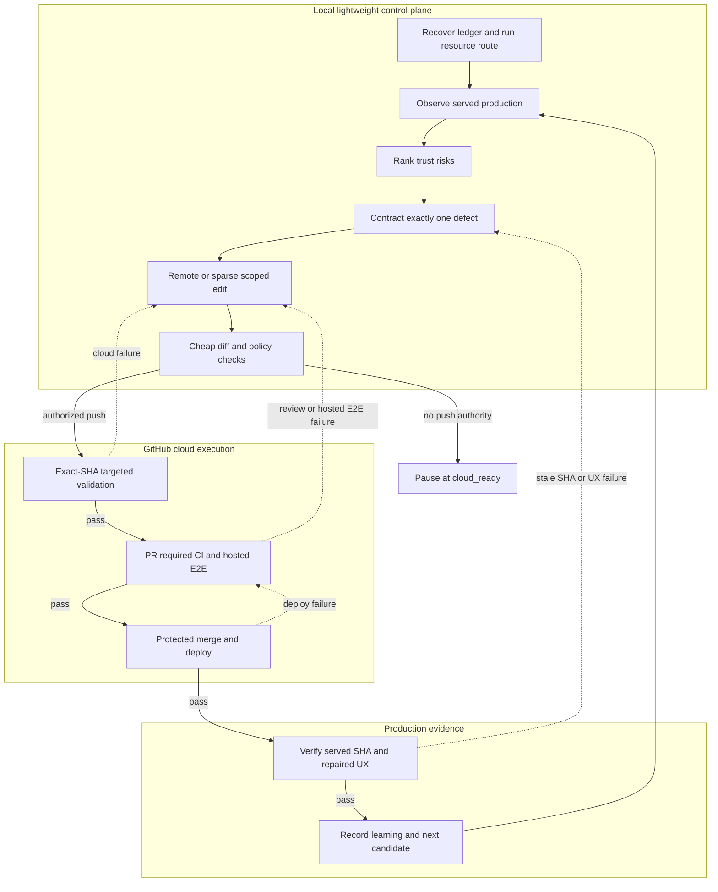

# Site trust improvement loop design

Use this contract to make repeated review, repair, release, and production
verification requests one recoverable loop instead of a series of disconnected
audits.

## 1. Control flow



The local lane never hydrates the Flutter/Dart/Deno toolchain. It owns resource
routing, evidence inspection, scoped editing, and cheap dependency-free checks.
GitHub-hosted runners own dependencies, analysis, tests, builds, browser/E2E
proof, and deployment. Every failure edge stays in the current iteration. Only
verified production evidence opens the next one.

## 2. Iteration state machine

Use these states verbatim in a task handoff, Issue, or PR:

| State | Required output | Failure or pause resumes at |
| --- | --- | --- |
| `observing` | Production revision and browser evidence | `observing` |
| `ranking` | Candidate list and selected-defect rationale | `ranking` |
| `contracted` | Expected/actual, reproduction, protected behavior, test matrix | `contracted` |
| `implementing` | Remote or sparse scoped diff and rollback approach | `contracted` |
| `cloud_ready` | Cheap diff/policy proof plus an exact commit or patch ready to push | `implementing` |
| `cloud_proven` | Exact pushed SHA, cloud run URL, focused tests, analysis/build, and hosted UX evidence | `implementing` |
| `in_review` | PR merge-ref and required-check evidence | `implementing` for code/CI failure |
| `deploying` | Merge SHA and matching deployment/readiness run | `in_review` for release failure |
| `production_verified` | Served SHA, tag target, desktop/mobile UX proof | `contracted` for production failure |
| `learned` | Residual risk and next candidate | `observing` |

Do not infer state from the latest branch or workflow alone. Resume from the
first state whose required output is missing.

## 3. Trust-risk ranking

Rank only evidenced candidates. Use the following dimensions as a decision aid;
the written evidence and user consequence remain authoritative.

| Dimension | Higher priority means |
| --- | --- |
| User impact | Money, data, identity, or the advertised core outcome is wrong or lost |
| Encounter likelihood | The defect occurs on first use, the default path, or a common recovery path |
| Opacity | The UI claims success or gives no honest explanation or recovery action |
| Irreversibility | The user may act, pay, save, share, or discard data based on the false state |
| Evidence confidence | Production reproduction, logs, network state, and source trace agree |

Resolve ties in this order: false success, irreversible consequence, core
journey, first-use frequency, then the smallest safe change. Cosmetic polish
cannot outrank a reliable misleading-success or data-loss defect.

## 4. Evidence contract

Each iteration records:

| Field | Content |
| --- | --- |
| `iteration_id` | Stable task/Issue identifier plus sequence number |
| `baseline_sha` | Commit served when production was observed |
| `trust_hypothesis` | Why the behavior can make a reasonable user distrust the site |
| `production_evidence` | URL, viewport, steps, visible result, console/network/persistence evidence |
| `selected_defect` | Exactly one defect and why it outranks the other candidates |
| `expected_actual` | Expected behavior versus observed behavior |
| `protected_behaviors` | Routes, auth, billing, data, analytics, copy, and flows that must remain intact |
| `fix_scope` | Responsible layer, changed files, and rollback approach |
| `resource_route` | `CLOUD_REQUIRED` or `CLOUD_PREFERRED`, resource triggers, and prohibited local work |
| `local_control_proof` | Diff check, dependency-free policy checks, and confirmation that no heavy local task ran |
| `cloud_proof` | Exact pushed SHA, profile, run URL, focused/failure tests, analysis/build, and hosted desktop/mobile QA |
| `release_proof` | PR, required checks, merge SHA, deploy/readiness run, release tag |
| `production_proof` | Served SHA plus successful repaired and recovery journeys |
| `residual_risk` | Next candidate or reason no remaining candidate crosses the threshold |
| `state` | One state from the state-machine table |

Keep this record in the existing task, Issue, or PR. Do not create a parallel
tracking system unless the repository has no durable handoff surface.

## 5. Cloud-first validation contract

Run `python scripts/cloud_first_route.py` before any validation. Locally, use
only checks that neither install dependencies nor create build output:

```powershell
git diff --check
python scripts/<dependency-free-targeted-policy-test>.py
```

Do not install a missing SDK or package merely to make a local check available.
Once external push authority exists, commit and push the scoped branch, then
hand the immutable SHA to GitHub Actions:

```powershell
git push -u origin HEAD
python scripts/cloud_ci_handoff.py --profile test --execute --watch
python scripts/cloud_ci_handoff.py --profile full --execute --watch
```

Choose the smallest profile that proves the current repair: `analyze` for
static-only iterations, `test` for focused behavior, `web-build` for packaging,
and `full` before review handoff. The cloud runner owns `flutter pub get`,
format/static analysis, focused and regression tests, and the release web
build. Changed Edge Functions use repository-pinned Deno checks in hosted CI.
PR CI remains required because it validates the merge ref rather than only the
branch head.

Use hosted E2E/browser workflows or a cloud preview for the repaired happy path
and failure/recovery state at desktop and 390 px, including reload,
back/forward, console errors, failed requests, and horizontal overflow. When a
provider failure cannot be forced live, inject it deterministically in a hosted
test and run the normal provider path against the deployed site. Record any
coverage limitation; never simulate production success proof or start a local
dev server while `CLOUD_REQUIRED` is active.

## 6. Release and production proof

Use the repository's protected PR workflow. Match every release artifact by the
actual merge SHA, not by `latest` or timestamp alone.

```powershell
python scripts/cloud_ci_handoff.py --profile full --execute --watch
gh pr checks <pr-number> --watch
gh pr view <pr-number> --json mergeCommit,url
gh run list --workflow "Deploy to Production" --commit <merge-sha> --json databaseId,headSha,status,conclusion,url
gh run watch <deploy-run-id> --exit-status
Invoke-RestMethod 'https://my-web-app-b67f4.web.app/version.json'
```

The returned production commit must equal the expected merge SHA. Confirm the
matching release tag resolves to the same commit, then repeat the repaired and
recovery journeys on the production URL at desktop and 390 px. A notification
failure may be tracked separately only when deployment, revision, readiness,
tag, and user-journey gates all pass.

## 7. Authority and recovery

| Boundary | Authority required |
| --- | --- |
| Inspect code, workflow state, and public production behavior | Review or diagnosis request |
| Edit remotely or in a sparse worktree; run cheap local control checks | Request to fix or implement |
| Push an exact SHA and dispatch hosted validation | Explicitly included external push/PR authority |
| Push, open/update PR, merge, deploy, or notify | Explicitly included in the request; `本番デプロイまで` covers the normal protected release path |
| Direct production data write, destructive migration, force-push, protection bypass, or existing-tag rewrite | Separate exact authorization; never infer it from deployment authority |

If authority or credentials end at a gate, preserve the ledger and report the
exact next command or action. Without push authority, stop at `cloud_ready`, not
`cloud_proven`. If CI or deployment fails, stay in the same iteration and fix
from its hosted logs; do not reproduce runner-scale work locally under resource
pressure. If `main` advances during release, match the target by SHA and rerun
only checks invalidated by the update.

## 8. Iteration completion

One iteration is closed only when all applicable gates are true:

```text
iteration_done = evidence_gate
                 and honesty_gate
                 and deterministic_gate
                 and cloud_regression_gate
                 and release_gate
                 and production_gate
```

When release is outside the authorized scope, report `cloud_ready` rather than
weakening the predicate. A new iteration starts only after
`production_verified` and `learned`, or in a later task that explicitly accepts
the recorded unpublished handoff.
