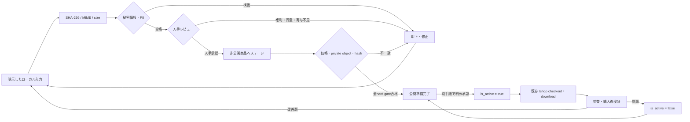

# AI支援成果物のデジタル商品公開ループ

ChatGPTの明示的なエクスポート、またはCodex・Claude Code・Antigravityの
ローカルworkspace/artifactファイルを、レビュー済みデジタル商品へ変えるための
閉ループです。ツールの画面をスクレイピングせず、候補の準備と公開権限を分離します。



## 自動ゲートと人間のゲート

| ゲート | 自動化できること | 人間が必ず判断すること |
|---|---|---|
| 取込 | 明示パスの走査、SHA-256、MIME、size、manifest内dedup | 入力範囲と出所が正しいか |
| リスク | 明白な秘密情報・メール・電話等のパターン検出 | 誤検知、文脈、完全な削除を確認 |
| 権利 | 音声・動画を同意確認対象として提示 | 第三者ライセンス、顔・声の同意、利用規約 |
| 創作寄与 | 記録欄と必須checkを用意 | 人間が構成・編集・検証した具体的内容 |
| 商品ステージ | DB価格、非公開bucket/path、hash、sizeの一致を検査 | Stripe Priceと実物、商品説明、法務表示 |
| 公開 | readinessを表示し監査eventを残す | live DB、Stripe、Storage、deployの実行承認 |

次はhard blockです。自動処理は合格に書き換えたり、迂回したりできません。

- 秘密情報または未解消のPIIリスク
- 未確認の第三者素材ライセンス
- 必要な顔・声の同意がないこと
- ChatGPT Voice Outputをstandalone音声として販売すること
- 人間の具体的な寄与記録がないこと
- 表示価格とStripe Priceの不一致
- private Storage object、実測size、SHA-256の不足・不一致

`idea` 商品は「企画brief」「非独占的な参考素材」と説明します。独占性や著作権の
成立を保証する商品説明にしません。

## ローカル取込

ヘルパーは標準ライブラリだけを使い、ネットワーク送信を行いません。入力はコマンドで
明示したファイルまたはdirectoryだけです。symlinkは走査せず、検出した値そのものを
manifestへ書きません。同じSHA-256は1候補にまとめ、複数の出所をprovenanceとして残します。

```powershell
python scripts/artifact_intake.py `
  'C:\explicit\exports\product-draft' `
  --source-tool codex `
  --intake-method local_workspace `
  --artifact-kind template `
  --output 'C:\review\artifact-manifest.json' `
  --fail-on-risk
```

ChatGPTは`--intake-method explicit_export`だけを受け付けます。標準出力で確認する場合は
`--output -`を使います。`--fail-on-risk`はfindingがあれば終了code 2を返しますが、
manifest自体はローカルへ作るため、レビューと修正に使えます。

manifestの主要fieldは`artifact_sha256`、`mime_type`、`file_size_bytes`、
保守的に推定した`artifact_kind`、
`provenance[]`、値を含まない`risk_scan.findings[]`です。importは自動送信ではありません。
画像・音声・動画・文章・template以外の曖昧な拡張子では、`--artifact-kind`に
`design`、`prompt`、`idea`、`game`、`application`、`bundle`などを明示します（defaultは`auto`）。
1回の実行では入力全体に同じ種別を適用するため、種別が異なる成果物は実行を分けます。
レビュー済みの管理者sessionから`intake_artifact_candidate` RPCへ各entryとprovenanceを
渡すと、SHA-256をkeyに候補と出所を同一transactionでatomic upsertできます。RPCは
候補を`intake`より先へ進めず、ファイル本文、findingのmatched value、秘密値は受け取りません。

## tool別の境界

- ChatGPT: ユーザーが明示的に保存・エクスポートしたファイルだけ。consumer UIや会話画面を
  スクレイピングしません。Voice Outputのstandalone販売はblockします。
- Codex / Claude Code: ユーザーが指定したworkspaceまたはartifact exportだけ。task履歴、
  認証cache、設定directory、環境変数を自動探索しません。
- Antigravity: 明示したlocal workspace/artifact exportだけ。consumer UIの操作や
  third-party OAuthでの制御を行いません。

## DB state machineと権限

管理画面は`/admin/artifact-publishing`です。`user_profiles.is_admin`の既存管理者だけが
候補、provenance、check、run、eventを読めます。anonにはtable privilegeがなく、
authenticated roleのData API accessもadmin限定RLSにより通常buyerへrowを返しません。
管理者にもeventのinsert/update/delete権限は
なく、triggerだけが監査eventを追記します。

各checkは証拠を作るstageでだけ更新できます。`secret_scan` / `pii_scan`は
`automated_checks`、権利・同意・人間の寄与は`human_review`、価格・private object・
content integrityは`staged`です。証拠を修正するときは先に該当stageへ戻すため、
承認後のcheckだけを書き換えてreadiness表示と監査状態をずらすことはできません。

通常経路は次の通りです。

```text
intake → automated_checks → human_review → approved → staged → ready
                                                             ↓ explicit live action
                                                          published
```

任意の公開前stageから理由つき`rejected`へ移動でき、`rejected → intake`で再試行します。
後退経路は自動検査・人手レビュー・stagedへ限定されています。`approved_by`と
`approved_at`は人手承認transition時の`auth.uid()`からDB triggerが設定し、clientは
指定できません。

`human_review → approved`では、人間が行った構成・選択・編集・検証を20文字以上で
記録します。`approved → staged`では、既に用意したinactive商品ID、確認済みJPY価格、
private `product-downloads` object pathを同じ更新で保存します。いずれも管理画面から入力でき、
商品をactiveにする操作は含みません。

新しいloop候補へlinkした`shop_products`だけは、`ready`、全hard gate、人手承認、
価格、private bucket/path、SHA-256、sizeが一致しない限り`is_active = true`を拒否します。
候補にlinkしていない既存商品、`/shop` checkout、購入権利、downloadの意味は変更しません。

## 公開とrollback

この機能はStripe Product/Price、charge、Storage object、商品削除、live publish、deployを
作成・実行しません。`ready`は「実行してよい」ではなく「人間が最終判断できる材料が
揃った」です。live actionには、その時点での明示承認、対象product ID、環境、実測値、
rollback手順を残します。

- 公開前の問題: 理由つきrejectまたは前stageへ戻し、同じhashのまま内容を差し替えない。
  修正ファイルは新しいSHA-256として再取込します。
- 公開後の問題: 最初に`is_active = false`として新規購入を停止し、次に
  `published → ready`へ戻します。
- 購入済み権利、`shop_purchases`、private file、Stripe Priceを削除しません。
  既存購入者の再downloadと返金監査を維持します。

販売・配信の既存運用は[デジタル商品ストア運用手順](DIGITAL_PRODUCT_STORE.md)を併用してください。
