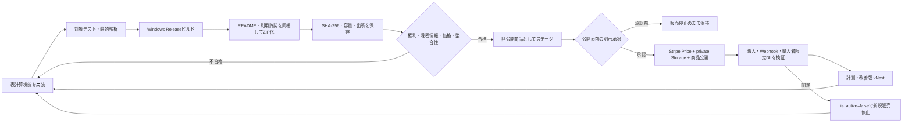

# Jibun Spreadsheet Windows 有償ダウンロード

`Jibun Spreadsheet`を自分株式会社サイトの既存デジタル商品ストアから、
買い切り商品として安全に販売するためのリリース手順です。

- 商品ID: `jibun-spreadsheet-win64`
- 版: `1.0.0`
- 価格: **税込980円・買い切り**（2026-08-23承認済み）
- 配信: 非公開Supabase Storage + 5分間の署名付きURL
- 対応OS: Windows 10 / 11（64bit）
- ビルド対象: `lib/main_spreadsheet_windows.dart`

## 承認済みの販売条件

2026-08-23に、権限者から次の条件が承認された。

- 税込980円の買い切り商品とする
- 本アプリの商用配布権限を確認済みとする
- コード署名後のバイナリだけを販売候補とする
- `codex/paid-spreadsheet-windows-20260822`のpushとPR作成を許可する

この承認には、Stripe本番Price作成、Storageアップロード、
DB/Edge Function/Webの本番反映、`is_active=true`、または販売開始は含まない。
これらは署名済み候補の検証後に、対象とロールバックを示して改めて承認を得る。

## 販売・保存・改善ループ



## Windowsビルド

```powershell
flutter build windows --release --target=lib/main_spreadsheet_windows.dart
```

Visual Studio 2026では、現行`audioplayers_windows`が参照する旧コルーチンAPIの
互換性定義が必要です。`windows/CMakeLists.txt`で警告抑制をWindowsプロジェクト全体へ
設定しています。これは表計算の実行ロジックを変更しません。

## 販売ZIPの作成

```powershell
pwsh -File scripts/package_jibun_spreadsheet_windows.ps1 -Version 1.0.0
```

生成物:

- `dist/JibunSpreadsheet-v1.0.0-win64.zip`
- `dist/JibunSpreadsheet-v1.0.0-win64.manifest.json`

ZIPは次の不変パスへ配置します。

```text
product-downloads/jibun-spreadsheet-win64/v1.0.0/JibunSpreadsheet-v1.0.0-win64.zip
```

同じ版番号のZIPを差し替えません。修正時は版番号、Storageパス、容量、SHA-256を
すべて更新します。

## 公開直前のハードゲート

1. Windows 10 / 11実機で起動、セル編集、保存、再起動復元、CSV入出力を確認
2. 販売用EXEが信頼できるコード署名証明書で署名済みであることと、
   署名と改ざん防止の検証結果を保存したことを確認
3. ZIPの実測容量・SHA-256がmanifest、Storage、DBで一致
4. Stripe本番Priceが税込表示価格・JPY・一回払いと一致
5. 未購入者の`shop-download`が403、購入者だけが5分URLを取得
6. Stripe webhook署名、冪等な権利付与、全額返金時の権利失効を確認
7. 特定商取引法表記、返品条件、動作環境、利用許諾を確認
8. `artifact_candidates`の9ゲートを通し、候補を`ready`にする
9. 対象・環境・価格・ロールバックを明記した最終承認を取得

ロールバックは商品を削除せず、最初に`shop_products.is_active = false`として
新規販売を止めます。購入記録、購入済み権利、配信ZIPは監査と再ダウンロードのため
保持します。
