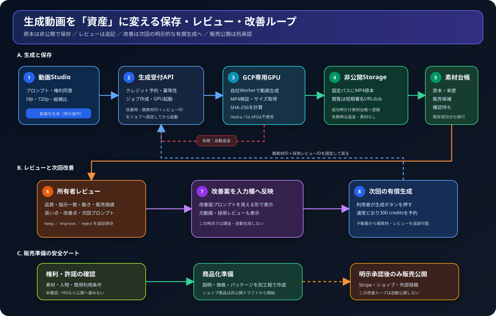

# 動画素材・販売候補・レビュー改善ループ

編集可能な原本は
[`video-artifact-improvement-loop.drawio`](diagrams/video-artifact-improvement-loop.drawio)
です。

## 利用者から見える流れ

1. 動画生成が成功すると、MP4は非公開Storageへ保存されたまま、動画素材台帳へ自動登録されます。既存の成功動画も移行時に登録されます。
2. 生成履歴には「素材として保存済み」「販売候補」「権利・プライバシー確認待ち」が表示されます。
3. 「レビュー・次回改善」で品質、指示一致、動き、販売価値を1〜5点で評価し、良かった点、改善点、次回プロンプトを保存します。
4. `improve` の具体的な指摘を次回プロンプトへ反映し、有効な継続承認の残高・回数内で300 creditsを予約して自社GPUへ再生成します。元動画と採用レビューはexact IDで固定します。
5. 改善版を同じ4指標で再レビューします。`improve` が残る場合は承認上限まで反復し、`keep` になったexact artifact/reviewだけを公開候補にします。
6. 価格、ライセンス、地域、権利確認、rollback方法まで固定した公開承認パケットがある場合、クラウド内で非公開配信ファイルとStripe Product/Priceを冪等作成します。商品は検証完了まで非公開です。
7. 価格・SHA-256・非公開配信・公開カタログを検証した後だけ`/shop`を有効化します。検証失敗時は販売を停止し、原本と監査履歴は保持します。

## 保存と販売の境界

- 完成動画は短時間の署名URLではなく、非公開Storageの固定パスを原本として管理します。
- 原本の生成条件、モデル版、プロンプト、ファイルサイズ、SHA-256、親動画は改変できない来歴として残します。
- `sale_candidate` は「販売準備に使える候補」であり、それだけでは公開しません。
- 権利・許諾と人物・プライバシーが`allowed` / `cleared`で、最新レビューが`keep`の成果物だけを商品化できます。
- Stripe商品とショップ公開は`video_publication_authorizations`に保存した完全な明示承認がある場合だけ実行します。マーケティング投稿と第三者マーケットは別承認です。
- `video-commerce-hub`は原本をローカルへ保存せず、Supabase Storage内で非公開配信物を準備し、Stripeと`/shop`を冪等に更新します。

## 主なデータ

| データ | 役割 |
|---|---|
| `video_generation_jobs` | 有償生成ジョブ、クレジット、親素材と採用レビュー |
| `video_artifacts` | 非公開の原本素材と販売準備状態 |
| `video_artifact_reviews` | 追記型レビューと次回プロンプト |
| `video_artifact_events` | 保存、レビュー、改善適用、商品化の監査履歴 |
| `video_improvement_authorizations` | 再生成の期限、回数、credits上限、exact source |
| `video_publication_authorizations` | exact source、価格、ライセンス、権利確認、Stripe・配信・公開・rollback状態 |

ブラウザから各台帳へ直接書き込む権限は与えず、認証済みEdge Functionとサーバー側RPCだけが更新します。所有者はRLSを通じて自分のデータだけを取得します。
