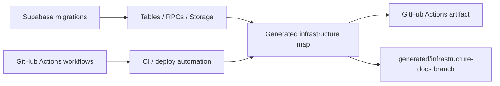
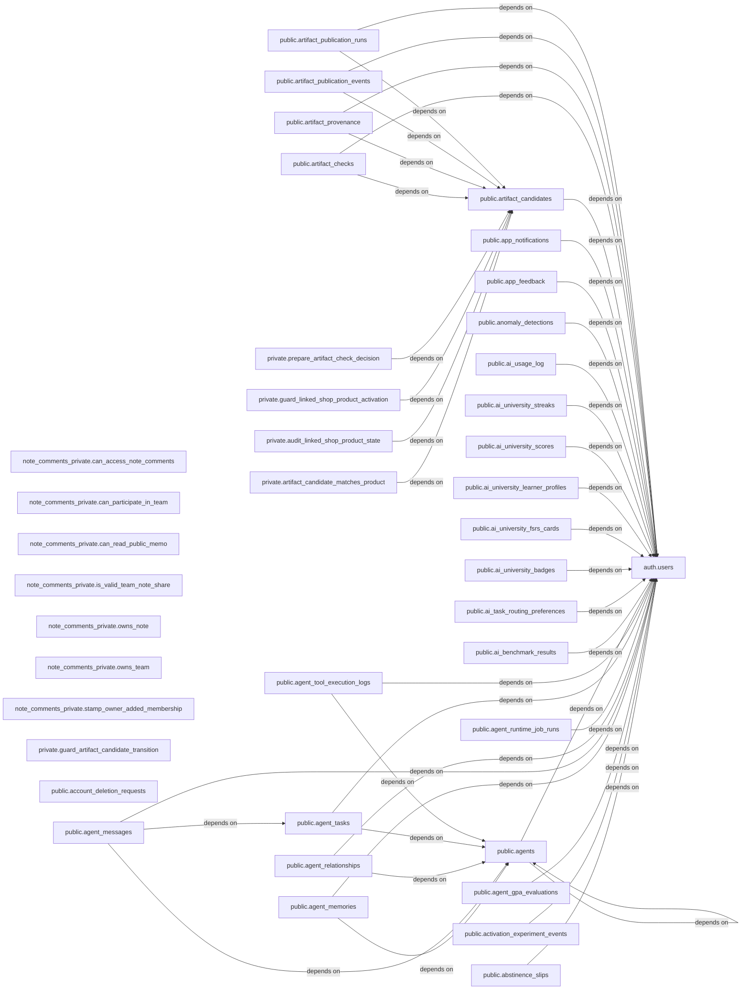

# Infrastructure Map

> This file is generated by `scripts/generate_infrastructure_map.py`; do not edit it manually.

- Source revision: `185ba602e5ad518043e87bfe1c94951909f628ef`
- Source commit time: `2026-09-07T01:59:03+09:00`
- Inputs: `supabase/migrations/**/*.sql`, `.github/workflows/*.{yml,yaml}`

## System overview

The arrows identify source-to-output relationships. In the dependency graph below, changing a node on the right can affect the nodes pointing to it.

## Blast-radius dependency graph

The graph is capped at 40 nodes and 100 edges, prioritizing resources with the most dependants. Treat conservative RPC read/write edges as review leads.

## Highest-impact resources

| Resource | Direct dependants |
|---|---:|
| `auth.users` | 164 |
| `public.notes` | 16 |
| `public.video_artifacts` | 14 |
| `public.video_generation_jobs` | 14 |
| `.github/workflows/shared-secret-environment-migration.yml#guard` | 13 |
| `public.shop_products` | 12 |
| `public.agents` | 11 |
| `public.agent_tasks` | 9 |
| `public.artifact_candidates` | 9 |
| `public.musubi_profiles` | 8 |
| `public.video_artifact_reviews` | 8 |
| `public.teams` | 7 |
| `public.video_artifact_events` | 7 |
| `public.account_deletion_requests` | 6 |
| `public.video_credit_accounts` | 6 |
| `public.video_credit_ledger` | 6 |
| `public.video_publication_authorizations` | 6 |
| `public.artifact_publication_events` | 5 |
| `public.company_agent_runtime_controls` | 5 |
| `public.horse_races` | 5 |
| `public.hub_data` | 5 |
| `public.musubi_threads` | 5 |
| `public.note_search_index` | 5 |
| `public.wbs_tasks` | 5 |
| `storage.objects` | 5 |

## Supabase resource inventory

| Resource | Type | Source |
|---|---|---|
| `note_comments_private.can_access_note_comments` | RPC/function | [`supabase/migrations/20260827032000_harden_note_comments_authorization.sql`](../../supabase/migrations/20260827032000_harden_note_comments_authorization.sql) |
| `note_comments_private.can_participate_in_team` | RPC/function | [`supabase/migrations/20260827032000_harden_note_comments_authorization.sql`](../../supabase/migrations/20260827032000_harden_note_comments_authorization.sql) |
| `note_comments_private.can_read_public_memo` | RPC/function | [`supabase/migrations/20260827032000_harden_note_comments_authorization.sql`](../../supabase/migrations/20260827032000_harden_note_comments_authorization.sql) [`supabase/migrations/20260830063839_fix_public_memo_returning_rls.sql`](../../supabase/migrations/20260830063839_fix_public_memo_returning_rls.sql) |
| `note_comments_private.is_valid_team_note_share` | RPC/function | [`supabase/migrations/20260827032000_harden_note_comments_authorization.sql`](../../supabase/migrations/20260827032000_harden_note_comments_authorization.sql) |
| `note_comments_private.owns_note` | RPC/function | [`supabase/migrations/20260827032000_harden_note_comments_authorization.sql`](../../supabase/migrations/20260827032000_harden_note_comments_authorization.sql) |
| `note_comments_private.owns_team` | RPC/function | [`supabase/migrations/20260827032000_harden_note_comments_authorization.sql`](../../supabase/migrations/20260827032000_harden_note_comments_authorization.sql) |
| `note_comments_private.stamp_owner_added_membership` | RPC/function | [`supabase/migrations/20260827032000_harden_note_comments_authorization.sql`](../../supabase/migrations/20260827032000_harden_note_comments_authorization.sql) |
| `private.artifact_candidate_hard_gates_pass` | RPC/function | [`supabase/migrations/20260822074004_create_artifact_publishing_loop.sql`](../../supabase/migrations/20260822074004_create_artifact_publishing_loop.sql) |
| `private.artifact_candidate_matches_product` | RPC/function | [`supabase/migrations/20260822074004_create_artifact_publishing_loop.sql`](../../supabase/migrations/20260822074004_create_artifact_publishing_loop.sql) |
| `private.artifact_private_object_exists` | RPC/function | [`supabase/migrations/20260822074004_create_artifact_publishing_loop.sql`](../../supabase/migrations/20260822074004_create_artifact_publishing_loop.sql) |
| `private.artifact_trigger_actor_authorized` | RPC/function | [`supabase/migrations/20260822074004_create_artifact_publishing_loop.sql`](../../supabase/migrations/20260822074004_create_artifact_publishing_loop.sql) |
| `private.audit_artifact_candidate_transition` | RPC/function | [`supabase/migrations/20260822074004_create_artifact_publishing_loop.sql`](../../supabase/migrations/20260822074004_create_artifact_publishing_loop.sql) |
| `private.audit_artifact_check_update` | RPC/function | [`supabase/migrations/20260822074004_create_artifact_publishing_loop.sql`](../../supabase/migrations/20260822074004_create_artifact_publishing_loop.sql) |
| `private.audit_artifact_publication_run` | RPC/function | [`supabase/migrations/20260822074004_create_artifact_publishing_loop.sql`](../../supabase/migrations/20260822074004_create_artifact_publishing_loop.sql) |
| `private.audit_linked_shop_product_state` | RPC/function | [`supabase/migrations/20260822074004_create_artifact_publishing_loop.sql`](../../supabase/migrations/20260822074004_create_artifact_publishing_loop.sql) |
| `private.guard_artifact_candidate_transition` | RPC/function | [`supabase/migrations/20260822074004_create_artifact_publishing_loop.sql`](../../supabase/migrations/20260822074004_create_artifact_publishing_loop.sql) |
| `private.guard_artifact_publication_run` | RPC/function | [`supabase/migrations/20260822074004_create_artifact_publishing_loop.sql`](../../supabase/migrations/20260822074004_create_artifact_publishing_loop.sql) |
| `private.guard_linked_shop_product_activation` | RPC/function | [`supabase/migrations/20260822074004_create_artifact_publishing_loop.sql`](../../supabase/migrations/20260822074004_create_artifact_publishing_loop.sql) |
| `private.prepare_artifact_check_decision` | RPC/function | [`supabase/migrations/20260822074004_create_artifact_publishing_loop.sql`](../../supabase/migrations/20260822074004_create_artifact_publishing_loop.sql) |
| `private.seed_and_audit_artifact_candidate` | RPC/function | [`supabase/migrations/20260822074004_create_artifact_publishing_loop.sql`](../../supabase/migrations/20260822074004_create_artifact_publishing_loop.sql) |
| `public.account_deletion_dependency_inventory` | RPC/function | [`supabase/migrations/20260829095836_account_retention_and_deletion.sql`](../../supabase/migrations/20260829095836_account_retention_and_deletion.sql) [`supabase/migrations/20260830054326_account_deletion_rollout_preflight.sql`](../../supabase/migrations/20260830054326_account_deletion_rollout_preflight.sql) |
| `public.account_deletion_storage_objects` | RPC/function | [`supabase/migrations/20260829095836_account_retention_and_deletion.sql`](../../supabase/migrations/20260829095836_account_retention_and_deletion.sql) |
| `public.analyze_habit_resource_efficiency` | RPC/function | [`supabase/migrations/20260721235500_add_habit_resource_optimization.sql`](../../supabase/migrations/20260721235500_add_habit_resource_optimization.sql) |
| `public.append_decision_event` | RPC/function | [`supabase/migrations/20260829170000_create_decision_event_chain.sql`](../../supabase/migrations/20260829170000_create_decision_event_chain.sql) |
| `public.apply_recurring_fixed_cost_tombstones` | RPC/function | [`supabase/migrations/20260828164000_atomic_recurring_fixed_cost_tombstones.sql`](../../supabase/migrations/20260828164000_atomic_recurring_fixed_cost_tombstones.sql) |
| `public.archive_company_agent_runtime` | RPC/function | [`supabase/migrations/20260815165819_company_agent_runtime.sql`](../../supabase/migrations/20260815165819_company_agent_runtime.sql) |
| `public.asset_management_recent_cfo_assets` | RPC/function | [`supabase/migrations/20260721183000_bound_asset_management_history_reads.sql`](../../supabase/migrations/20260721183000_bound_asset_management_history_reads.sql) |
| `public.auto_record_growth_metrics` | RPC/function | [`supabase/migrations/20251106000000_add_growth_metrics.sql`](../../supabase/migrations/20251106000000_add_growth_metrics.sql) |
| `public.award_ai_university_badge` | RPC/function | [`supabase/migrations/20260411004000_create_ai_university_badges.sql`](../../supabase/migrations/20260411004000_create_ai_university_badges.sql) |
| `public.calculate_profile_completeness` | RPC/function | [`supabase/migrations/20260330000003_add_admin_flag_to_user_profiles.sql`](../../supabase/migrations/20260330000003_add_admin_flag_to_user_profiles.sql) [`supabase/migrations/20260530203000_extend_user_profiles_for_asset_ai.sql`](../../supabase/migrations/20260530203000_extend_user_profiles_for_asset_ai.sql) |
| `public.capture_investment_portfolio_history` | RPC/function | [`supabase/migrations/20260721160000_create_investment_portfolio_history.sql`](../../supabase/migrations/20260721160000_create_investment_portfolio_history.sql) |
| `public.claim_company_agent_task` | RPC/function | [`supabase/migrations/20260815165819_company_agent_runtime.sql`](../../supabase/migrations/20260815165819_company_agent_runtime.sql) |
| `public.claim_due_account_deletion` | RPC/function | [`supabase/migrations/20260829095836_account_retention_and_deletion.sql`](../../supabase/migrations/20260829095836_account_retention_and_deletion.sql) |
| `public.claim_due_account_deletion_by_id` | RPC/function | [`supabase/migrations/20260830054326_account_deletion_rollout_preflight.sql`](../../supabase/migrations/20260830054326_account_deletion_rollout_preflight.sql) |
| `public.claim_landing_trial_ai_quota` | RPC/function | [`supabase/migrations/20260722133000_landing_trial_ai_quota.sql`](../../supabase/migrations/20260722133000_landing_trial_ai_quota.sql) |
| `public.claim_micro_survey_prompt` | RPC/function | [`supabase/migrations/20260830130000_create_contextual_micro_surveys.sql`](../../supabase/migrations/20260830130000_create_contextual_micro_surveys.sql) |
| `public.claim_next_referral_credit_grant` | RPC/function | [`supabase/migrations/20260815162827_referral_stripe_credit_grants.sql`](../../supabase/migrations/20260815162827_referral_stripe_credit_grants.sql) |
| `public.claim_stripe_webhook_event` | RPC/function | [`supabase/migrations/20260712100000_harden_stripe_webhook_idempotency.sql`](../../supabase/migrations/20260712100000_harden_stripe_webhook_idempotency.sql) |
| `public.claim_voice_character_quota` | RPC/function | [`supabase/migrations/20260814160000_add_voice_dubbing_usage.sql`](../../supabase/migrations/20260814160000_add_voice_dubbing_usage.sql) |
| `public.cleanup_old_presence` | RPC/function | [`supabase/migrations/20251106120000_growth_features.sql`](../../supabase/migrations/20251106120000_growth_features.sql) [`supabase/migrations/20251106130000_fix_site_statistics_rls.sql`](../../supabase/migrations/20251106130000_fix_site_statistics_rls.sql) |
| `public.company_vector_cosine_similarity` | RPC/function | [`supabase/migrations/20260815202000_company_research_a2a_routing.sql`](../../supabase/migrations/20260815202000_company_research_a2a_routing.sql) |
| `public.complete_account_deletion` | RPC/function | [`supabase/migrations/20260829095836_account_retention_and_deletion.sql`](../../supabase/migrations/20260829095836_account_retention_and_deletion.sql) |
| `public.complete_referral_activation` | RPC/function | [`supabase/migrations/20260717100000_complete_referral_activation.sql`](../../supabase/migrations/20260717100000_complete_referral_activation.sql) [`supabase/migrations/20260815162827_referral_stripe_credit_grants.sql`](../../supabase/migrations/20260815162827_referral_stripe_credit_grants.sql) |
| `public.complete_referral_credit_grant` | RPC/function | [`supabase/migrations/20260815162827_referral_stripe_credit_grants.sql`](../../supabase/migrations/20260815162827_referral_stripe_credit_grants.sql) |
| `public.complete_stripe_webhook_event` | RPC/function | [`supabase/migrations/20260712100000_harden_stripe_webhook_idempotency.sql`](../../supabase/migrations/20260712100000_harden_stripe_webhook_idempotency.sql) |
| `public.consume_resource_optimizer_ai_quota` | RPC/function | [`supabase/migrations/20260827040000_resource_optimizer_ai_quota.sql`](../../supabase/migrations/20260827040000_resource_optimizer_ai_quota.sql) |
| `public.create_default_user_profile` | RPC/function | [`supabase/migrations/20251107000000_ai_features.sql`](../../supabase/migrations/20251107000000_ai_features.sql) |
| `public.create_user_referral_code` | RPC/function | [`supabase/migrations/20251106120000_growth_features.sql`](../../supabase/migrations/20251106120000_growth_features.sql) [`supabase/migrations/20251109000000_fix_auth_trigger.sql`](../../supabase/migrations/20251109000000_fix_auth_trigger.sql) [`supabase/migrations/20251109000001_emergency_auth_fix.sql`](../../supabase/migrations/20251109000001_emergency_auth_fix.sql) |
| `public.defer_account_deletion_finalization` | RPC/function | [`supabase/migrations/20260829095836_account_retention_and_deletion.sql`](../../supabase/migrations/20260829095836_account_retention_and_deletion.sql) |
| `public.delete_account_deletion_direct_rows` | RPC/function | [`supabase/migrations/20260829095836_account_retention_and_deletion.sql`](../../supabase/migrations/20260829095836_account_retention_and_deletion.sql) |
| `public.dispatch_company_agent_runtime_worker` | RPC/function | [`supabase/migrations/20260815165819_company_agent_runtime.sql`](../../supabase/migrations/20260815165819_company_agent_runtime.sql) |
| `public.display_mode_experiment_summary` | RPC/function | [`supabase/migrations/20260612190000_display_mode_summary_and_inflow_mirror.sql`](../../supabase/migrations/20260612190000_display_mode_summary_and_inflow_mirror.sql) [`supabase/migrations/20260612210000_display_mode_weekly_trend.sql`](../../supabase/migrations/20260612210000_display_mode_weekly_trend.sql) [`supabase/migrations/20260613110000_display_mode_summary_first_event.sql`](../../supabase/migrations/20260613110000_display_mode_summary_first_event.sql) [`supabase/migrations/20260613150000_display_mode_weekly_retention.sql`](../../supabase/migrations/20260613150000_display_mode_weekly_retention.sql) |
| `public.enqueue_company_agent_runtime` | RPC/function | [`supabase/migrations/20260815165819_company_agent_runtime.sql`](../../supabase/migrations/20260815165819_company_agent_runtime.sql) |
| `public.evernote_commit_note` | RPC/function | [`supabase/migrations/20260823050803_evernote_lossless_commit.sql`](../../supabase/migrations/20260823050803_evernote_lossless_commit.sql) |
| `public.evernote_verify_note` | RPC/function | [`supabase/migrations/20260823050803_evernote_lossless_commit.sql`](../../supabase/migrations/20260823050803_evernote_lossless_commit.sql) |
| `public.fail_account_deletion` | RPC/function | [`supabase/migrations/20260829095836_account_retention_and_deletion.sql`](../../supabase/migrations/20260829095836_account_retention_and_deletion.sql) |
| `public.fail_referral_credit_grant` | RPC/function | [`supabase/migrations/20260815162827_referral_stripe_credit_grants.sql`](../../supabase/migrations/20260815162827_referral_stripe_credit_grants.sql) |
| `public.fail_stripe_webhook_event` | RPC/function | [`supabase/migrations/20260712100000_harden_stripe_webhook_idempotency.sql`](../../supabase/migrations/20260712100000_harden_stripe_webhook_idempotency.sql) |
| `public.finish_company_agent_task` | RPC/function | [`supabase/migrations/20260815165819_company_agent_runtime.sql`](../../supabase/migrations/20260815165819_company_agent_runtime.sql) |
| `public.finish_voice_dubbing_job` | RPC/function | [`supabase/migrations/20260814160000_add_voice_dubbing_usage.sql`](../../supabase/migrations/20260814160000_add_voice_dubbing_usage.sql) |
| `public.generate_referral_code` | RPC/function | [`supabase/migrations/20251106120000_growth_features.sql`](../../supabase/migrations/20251106120000_growth_features.sql) |
| `public.get_attachment_stats` | RPC/function | [`supabase/migrations/20251108120000_attachments_complete_setup.sql`](../../supabase/migrations/20251108120000_attachments_complete_setup.sql) |
| `public.get_billing_paid_conversion_summary` | RPC/function | [`supabase/migrations/20260627210000_admin_read_billing_subscriptions.sql`](../../supabase/migrations/20260627210000_admin_read_billing_subscriptions.sql) |
| `public.get_tiger_growth_evidence_summary` | RPC/function | [`supabase/migrations/20260830190000_tiger_growth_evidence_summary.sql`](../../supabase/migrations/20260830190000_tiger_growth_evidence_summary.sql) |
| `public.get_tiger_plan_economics_summary` | RPC/function | [`supabase/migrations/20260831090000_tiger_plan_economics_summary.sql`](../../supabase/migrations/20260831090000_tiger_plan_economics_summary.sql) |
| `public.get_wasteful_category_label` | RPC/function | [`supabase/migrations/20260327000045_create_wasteful_spending.sql`](../../supabase/migrations/20260327000045_create_wasteful_spending.sql) |
| `public.guard_recurring_fixed_cost_tombstone_writes` | RPC/function | [`supabase/migrations/20260828164000_atomic_recurring_fixed_cost_tombstones.sql`](../../supabase/migrations/20260828164000_atomic_recurring_fixed_cost_tombstones.sql) |
| `public.guard_user_profile_admin_flag` | RPC/function | [`supabase/migrations/20260712144000_lock_user_profile_admin_flag.sql`](../../supabase/migrations/20260712144000_lock_user_profile_admin_flag.sql) |
| `public.has_recent_account_deletion_session` | RPC/function | [`supabase/migrations/20260829095836_account_retention_and_deletion.sql`](../../supabase/migrations/20260829095836_account_retention_and_deletion.sql) |
| `public.increment_app_analytics_source_detail` | RPC/function | [`supabase/migrations/20260722113000_atomic_landing_funnel_source_details.sql`](../../supabase/migrations/20260722113000_atomic_landing_funnel_source_details.sql) [`supabase/migrations/20260722211500_create_landing_experiment_events.sql`](../../supabase/migrations/20260722211500_create_landing_experiment_events.sql) [`supabase/migrations/20260723150000_landing_experiment_primary_metrics.sql`](../../supabase/migrations/20260723150000_landing_experiment_primary_metrics.sql) [`supabase/migrations/20260819193000_landing_auth_funnel_diagnostics.sql`](../../supabase/migrations/20260819193000_landing_auth_funnel_diagnostics.sql) [`supabase/migrations/20260827003000_harden_app_analytics_writes.sql`](../../supabase/migrations/20260827003000_harden_app_analytics_writes.sql) |
| `public.increment_edge_function_call_count` | RPC/function | [`supabase/migrations/20260331000092_add_increment_rpc_and_session423_seeds.sql`](../../supabase/migrations/20260331000092_add_increment_rpc_and_session423_seeds.sql) |
| `public.increment_share_count` | RPC/function | [`supabase/migrations/20260827003000_harden_app_analytics_writes.sql`](../../supabase/migrations/20260827003000_harden_app_analytics_writes.sql) |
| `public.increment_wbs_rebalance_count` | RPC/function | [`supabase/migrations/20260425223000_increment_wbs_rebalance_count.sql`](../../supabase/migrations/20260425223000_increment_wbs_rebalance_count.sql) |
| `public.intake_artifact_candidate` | RPC/function | [`supabase/migrations/20260822074004_create_artifact_publishing_loop.sql`](../../supabase/migrations/20260822074004_create_artifact_publishing_loop.sql) |
| `public.is_app_analytics_source_key_allowed` | RPC/function | [`supabase/migrations/20260827003000_harden_app_analytics_writes.sql`](../../supabase/migrations/20260827003000_harden_app_analytics_writes.sql) |
| `public.is_musubi_thread_member` | RPC/function | [`supabase/migrations/20260810090000_create_musubi_social_platform.sql`](../../supabase/migrations/20260810090000_create_musubi_social_platform.sql) |
| `public.is_user_admin` | RPC/function | [`supabase/migrations/20260331000060_fix_user_profiles_schema_and_rls.sql`](../../supabase/migrations/20260331000060_fix_user_profiles_schema_and_rls.sql) [`supabase/migrations/20260712144000_lock_user_profile_admin_flag.sql`](../../supabase/migrations/20260712144000_lock_user_profile_admin_flag.sql) |
| `public.join_team_with_invite_code` | RPC/function | [`supabase/migrations/20260827032000_harden_note_comments_authorization.sql`](../../supabase/migrations/20260827032000_harden_note_comments_authorization.sql) |
| `public.match_company_research_chunks` | RPC/function | [`supabase/migrations/20260815202000_company_research_a2a_routing.sql`](../../supabase/migrations/20260815202000_company_research_a2a_routing.sql) |
| `public.match_documents` | RPC/function | [`supabase/migrations/20260425171500_seed_flowise_ai_university.sql`](../../supabase/migrations/20260425171500_seed_flowise_ai_university.sql) |
| `public.match_kg_embeddings` | RPC/function | [`supabase/migrations/20260507013000_create_kg_embeddings.sql`](../../supabase/migrations/20260507013000_create_kg_embeddings.sql) |
| `public.match_memory_index` | RPC/function | [`supabase/migrations/20260429100000_create_memory_index.sql`](../../supabase/migrations/20260429100000_create_memory_index.sql) |
| `public.musubi_list_threads` | RPC/function | [`supabase/migrations/20260810090000_create_musubi_social_platform.sql`](../../supabase/migrations/20260810090000_create_musubi_social_platform.sql) |
| `public.musubi_refresh_post_search_vector` | RPC/function | [`supabase/migrations/20260810090000_create_musubi_social_platform.sql`](../../supabase/migrations/20260810090000_create_musubi_social_platform.sql) |
| `public.musubi_start_direct_thread` | RPC/function | [`supabase/migrations/20260810090000_create_musubi_social_platform.sql`](../../supabase/migrations/20260810090000_create_musubi_social_platform.sql) |
| `public.musubi_touch_thread` | RPC/function | [`supabase/migrations/20260810090000_create_musubi_social_platform.sql`](../../supabase/migrations/20260810090000_create_musubi_social_platform.sql) |
| `public.normalize_blog_platform` | RPC/function | [`supabase/migrations/20260503190200_sync_blog_posts_to_tech_blog_posts.sql`](../../supabase/migrations/20260503190200_sync_blog_posts_to_tech_blog_posts.sql) |
| `public.notify_ai_circuit_breaker_open` | RPC/function | [`supabase/migrations/20260426253000_ai_circuit_breaker_slack_trigger.sql`](../../supabase/migrations/20260426253000_ai_circuit_breaker_slack_trigger.sql) |
| `public.notion_migration_guard_batch_completion` | RPC/function | [`supabase/migrations/20260823032746_create_notion_migration_control_plane.sql`](../../supabase/migrations/20260823032746_create_notion_migration_control_plane.sql) |
| `public.notion_migration_guard_item_status` | RPC/function | [`supabase/migrations/20260823032746_create_notion_migration_control_plane.sql`](../../supabase/migrations/20260823032746_create_notion_migration_control_plane.sql) |
| `public.notion_migration_seed_capabilities` | RPC/function | [`supabase/migrations/20260823032746_create_notion_migration_control_plane.sql`](../../supabase/migrations/20260823032746_create_notion_migration_control_plane.sql) |
| `public.notion_migration_strip_retired_site_routes` | RPC/function | [`supabase/migrations/20260826233134_remove_retired_app_analytics_route.sql`](../../supabase/migrations/20260826233134_remove_retired_app_analytics_route.sql) |
| `public.notion_migration_touch_updated_at` | RPC/function | [`supabase/migrations/20260823032746_create_notion_migration_control_plane.sql`](../../supabase/migrations/20260823032746_create_notion_migration_control_plane.sql) |
| `public.preflight_due_account_deletion` | RPC/function | [`supabase/migrations/20260830054326_account_deletion_rollout_preflight.sql`](../../supabase/migrations/20260830054326_account_deletion_rollout_preflight.sql) |
| `public.purge_expired_micro_survey_responses` | RPC/function | [`supabase/migrations/20260830130000_create_contextual_micro_surveys.sql`](../../supabase/migrations/20260830130000_create_contextual_micro_surveys.sql) |
| `public.purge_mcp_audit_log` | RPC/function | [`supabase/migrations/20260509093100_extend_mcp_audit_log.sql`](../../supabase/migrations/20260509093100_extend_mcp_audit_log.sql) |
| `public.purge_user_api_audit_log` | RPC/function | [`supabase/migrations/20260712013000_create_jibun_api_platform.sql`](../../supabase/migrations/20260712013000_create_jibun_api_platform.sql) |
| `public.read_company_agent_runtime` | RPC/function | [`supabase/migrations/20260815165819_company_agent_runtime.sql`](../../supabase/migrations/20260815165819_company_agent_runtime.sql) |
| `public.reconcile_voice_dubbing_quota` | RPC/function | [`supabase/migrations/20260814160000_add_voice_dubbing_usage.sql`](../../supabase/migrations/20260814160000_add_voice_dubbing_usage.sql) |
| `public.record_activation_experiment_event` | RPC/function | [`supabase/migrations/20260724100000_activation_experiment_unique_metrics.sql`](../../supabase/migrations/20260724100000_activation_experiment_unique_metrics.sql) |
| `public.record_app_analytics_event` | RPC/function | [`supabase/migrations/20260827003000_harden_app_analytics_writes.sql`](../../supabase/migrations/20260827003000_harden_app_analytics_writes.sql) |
| `public.record_daily_growth_metrics` | RPC/function | [`supabase/migrations/20251106000000_add_growth_metrics.sql`](../../supabase/migrations/20251106000000_add_growth_metrics.sql) |
| `public.record_landing_experiment_event` | RPC/function | [`supabase/migrations/20260722211500_create_landing_experiment_events.sql`](../../supabase/migrations/20260722211500_create_landing_experiment_events.sql) [`supabase/migrations/20260723150000_landing_experiment_primary_metrics.sql`](../../supabase/migrations/20260723150000_landing_experiment_primary_metrics.sql) |
| `public.record_task_budget_spend` | RPC/function | [`supabase/migrations/20260429110500_create_task_budget.sql`](../../supabase/migrations/20260429110500_create_task_budget.sql) |
| `public.refresh_note_search_index_row` | RPC/function | [`supabase/migrations/20260807100000_optimize_note_semantic_search_index.sql`](../../supabase/migrations/20260807100000_optimize_note_semantic_search_index.sql) [`supabase/migrations/20260823040700_fix_note_search_index_trigger_bigint.sql`](../../supabase/migrations/20260823040700_fix_note_search_index_trigger_bigint.sql) |
| `public.reject_decision_chain_mutation` | RPC/function | [`supabase/migrations/20260829170000_create_decision_event_chain.sql`](../../supabase/migrations/20260829170000_create_decision_event_chain.sql) |
| `public.run_agent_heartbeat` | RPC/function | [`supabase/migrations/20260306000000_agent_runtime_and_tool_guard.sql`](../../supabase/migrations/20260306000000_agent_runtime_and_tool_guard.sql) |
| `public.run_agent_memory_forgetting` | RPC/function | [`supabase/migrations/20260306000000_agent_runtime_and_tool_guard.sql`](../../supabase/migrations/20260306000000_agent_runtime_and_tool_guard.sql) |
| `public.run_agent_nightly_consolidation` | RPC/function | [`supabase/migrations/20260306000000_agent_runtime_and_tool_guard.sql`](../../supabase/migrations/20260306000000_agent_runtime_and_tool_guard.sql) |
| `public.run_agent_runtime_cycle` | RPC/function | [`supabase/migrations/20260306000000_agent_runtime_and_tool_guard.sql`](../../supabase/migrations/20260306000000_agent_runtime_and_tool_guard.sql) |
| `public.search_musubi` | RPC/function | [`supabase/migrations/20260810090000_create_musubi_social_platform.sql`](../../supabase/migrations/20260810090000_create_musubi_social_platform.sql) |
| `public.search_note_index_hybrid` | RPC/function | [`supabase/migrations/20260424100000_wbs_codex_supabase_note_search.sql`](../../supabase/migrations/20260424100000_wbs_codex_supabase_note_search.sql) |
| `public.seed_12dept_20agents` | RPC/function | [`supabase/migrations/20260328000001_seed_12dept_20agents.sql`](../../supabase/migrations/20260328000001_seed_12dept_20agents.sql) |
| `public.set_account_deletion_updated_at` | RPC/function | [`supabase/migrations/20260829095836_account_retention_and_deletion.sql`](../../supabase/migrations/20260829095836_account_retention_and_deletion.sql) |
| `public.set_agent_org_updated_at` | RPC/function | [`supabase/migrations/20260304000000_create_agent_org_tables.sql`](../../supabase/migrations/20260304000000_create_agent_org_tables.sql) [`supabase/migrations/20260305000000_add_agent_messages_and_relationships.sql`](../../supabase/migrations/20260305000000_add_agent_messages_and_relationships.sql) |
| `public.set_anomaly_detections_updated_at` | RPC/function | [`supabase/migrations/20260721120000_create_anomaly_detections.sql`](../../supabase/migrations/20260721120000_create_anomaly_detections.sql) |
| `public.set_asset_liability_updated_at` | RPC/function | [`supabase/migrations/20260514040900_create_asset_liability_supabase_schema.sql`](../../supabase/migrations/20260514040900_create_asset_liability_supabase_schema.sql) |
| `public.set_asset_management_ai_analysis_history_updated_at` | RPC/function | [`supabase/migrations/20260601060000_create_asset_management_ai_analysis_history.sql`](../../supabase/migrations/20260601060000_create_asset_management_ai_analysis_history.sql) |
| `public.set_billing_updated_at` | RPC/function | [`supabase/migrations/20260505203000_create_billing_tables.sql`](../../supabase/migrations/20260505203000_create_billing_tables.sql) |
| `public.set_cfo_cost_ledger_updated_at` | RPC/function | [`supabase/migrations/20260503103000_create_cfo_cost_ledger.sql`](../../supabase/migrations/20260503103000_create_cfo_cost_ledger.sql) |
| `public.set_company_agent_global_kill_switch` | RPC/function | [`supabase/migrations/20260815165819_company_agent_runtime.sql`](../../supabase/migrations/20260815165819_company_agent_runtime.sql) |
| `public.set_company_agent_runtime_state` | RPC/function | [`supabase/migrations/20260815165819_company_agent_runtime.sql`](../../supabase/migrations/20260815165819_company_agent_runtime.sql) |
| `public.set_corporate_bank_fee_plans_updated_at` | RPC/function | [`supabase/migrations/20260606110000_create_corporate_bank_fee_plans.sql`](../../supabase/migrations/20260606110000_create_corporate_bank_fee_plans.sql) |
| `public.set_debt_safety_guidance_master_updated_at` | RPC/function | [`supabase/migrations/20260606103000_create_debt_safety_guidance_master.sql`](../../supabase/migrations/20260606103000_create_debt_safety_guidance_master.sql) |
| `public.set_department_kpi_links_updated_at` | RPC/function | [`supabase/migrations/20260816040645_create_department_kpi_links.sql`](../../supabase/migrations/20260816040645_create_department_kpi_links.sql) |
| `public.set_finance_ai_updated_at` | RPC/function | [`supabase/migrations/20260525060000_create_payslip_ai_balance_tables.sql`](../../supabase/migrations/20260525060000_create_payslip_ai_balance_tables.sql) |
| `public.set_investment_assets_updated_at` | RPC/function | [`supabase/migrations/20260522020000_create_investment_assets.sql`](../../supabase/migrations/20260522020000_create_investment_assets.sql) |
| `public.set_investment_market_price_cache_updated_at` | RPC/function | [`supabase/migrations/20260523090000_create_investment_market_price_cache.sql`](../../supabase/migrations/20260523090000_create_investment_market_price_cache.sql) |
| `public.set_maintenance_windows_updated_at` | RPC/function | [`supabase/migrations/20260505211500_create_maintenance_windows.sql`](../../supabase/migrations/20260505211500_create_maintenance_windows.sql) |
| `public.set_micro_survey_opt_out` | RPC/function | [`supabase/migrations/20260830130000_create_contextual_micro_surveys.sql`](../../supabase/migrations/20260830130000_create_contextual_micro_surveys.sql) |
| `public.set_monthly_asset_reports_updated_at` | RPC/function | [`supabase/migrations/20260516000000_monthly_asset_reports_schema.sql`](../../supabase/migrations/20260516000000_monthly_asset_reports_schema.sql) |
| `public.set_tax_records_updated_at` | RPC/function | [`supabase/migrations/20260820023000_create_tax_records.sql`](../../supabase/migrations/20260820023000_create_tax_records.sql) |
| `public.shop_touch_updated_at` | RPC/function | [`supabase/migrations/20260728010000_create_shop_product_downloads.sql`](../../supabase/migrations/20260728010000_create_shop_product_downloads.sql) |
| `public.start_voice_dubbing_chunk` | RPC/function | [`supabase/migrations/20260814160000_add_voice_dubbing_usage.sql`](../../supabase/migrations/20260814160000_add_voice_dubbing_usage.sql) |
| `public.sync_blog_post_to_tech_blog_posts` | RPC/function | [`supabase/migrations/20260503190200_sync_blog_posts_to_tech_blog_posts.sql`](../../supabase/migrations/20260503190200_sync_blog_posts_to_tech_blog_posts.sql) |
| `public.sync_note_search_index_note` | RPC/function | [`supabase/migrations/20260807100000_optimize_note_semantic_search_index.sql`](../../supabase/migrations/20260807100000_optimize_note_semantic_search_index.sql) |
| `public.sync_note_search_index_text` | RPC/function | [`supabase/migrations/20260424100000_wbs_codex_supabase_note_search.sql`](../../supabase/migrations/20260424100000_wbs_codex_supabase_note_search.sql) |
| `public.sync_salary_income_from_payslip` | RPC/function | [`supabase/migrations/20260525060000_create_payslip_ai_balance_tables.sql`](../../supabase/migrations/20260525060000_create_payslip_ai_balance_tables.sql) |
| `public.trg_auto_award_badges` | RPC/function | [`supabase/migrations/20260411004000_create_ai_university_badges.sql`](../../supabase/migrations/20260411004000_create_ai_university_badges.sql) |
| `public.update_ai_university_streak` | RPC/function | [`supabase/migrations/20260411003800_create_ai_university_streaks.sql`](../../supabase/migrations/20260411003800_create_ai_university_streaks.sql) |
| `public.update_ai_university_updated_at` | RPC/function | [`supabase/migrations/20260411003000_create_ai_university_content.sql`](../../supabase/migrations/20260411003000_create_ai_university_content.sql) |
| `public.update_app_feedback_updated_at` | RPC/function | [`supabase/migrations/20260331000070_create_app_feedback.sql`](../../supabase/migrations/20260331000070_create_app_feedback.sql) |
| `public.update_app_theme_updated_at` | RPC/function | [`supabase/migrations/20260430080000_create_app_themes.sql`](../../supabase/migrations/20260430080000_create_app_themes.sql) |
| `public.update_attachments_updated_at` | RPC/function | [`supabase/migrations/20251108120000_attachments_complete_setup.sql`](../../supabase/migrations/20251108120000_attachments_complete_setup.sql) |
| `public.update_blog_posts_updated_at` | RPC/function | [`supabase/migrations/20260326000018_create_blog_posts.sql`](../../supabase/migrations/20260326000018_create_blog_posts.sql) |
| `public.update_conversation_updated_at` | RPC/function | [`supabase/migrations/20260416140000_create_conversation_messages.sql`](../../supabase/migrations/20260416140000_create_conversation_messages.sql) |
| `public.update_edge_function_ui_status_updated_at` | RPC/function | [`supabase/migrations/20260328000008_create_edge_function_ui_status.sql`](../../supabase/migrations/20260328000008_create_edge_function_ui_status.sql) |
| `public.update_english_reading_lessons_updated_at` | RPC/function | [`supabase/migrations/20260620090000_create_english_reading_curriculum.sql`](../../supabase/migrations/20260620090000_create_english_reading_curriculum.sql) |
| `public.update_guitar_recordings_updated_at` | RPC/function | [`supabase/migrations/20260403000500_create_guitar_recordings_table.sql`](../../supabase/migrations/20260403000500_create_guitar_recordings_table.sql) [`supabase/migrations/20260408040000_fix_guitar_recordings_schema.sql`](../../supabase/migrations/20260408040000_fix_guitar_recordings_schema.sql) |
| `public.update_prefecture_election_news_updated_at` | RPC/function | [`supabase/migrations/20260501030000_create_prefecture_election_news.sql`](../../supabase/migrations/20260501030000_create_prefecture_election_news.sql) |
| `public.update_profile_completeness` | RPC/function | [`supabase/migrations/20260330000003_add_admin_flag_to_user_profiles.sql`](../../supabase/migrations/20260330000003_add_admin_flag_to_user_profiles.sql) |
| `public.update_site_statistics` | RPC/function | [`supabase/migrations/20251106120000_growth_features.sql`](../../supabase/migrations/20251106120000_growth_features.sql) [`supabase/migrations/20251106130000_fix_site_statistics_rls.sql`](../../supabase/migrations/20251106130000_fix_site_statistics_rls.sql) |
| `public.update_timers_updated_at` | RPC/function | [`supabase/migrations/20251111120000_create_timers_table.sql`](../../supabase/migrations/20251111120000_create_timers_table.sql) |
| `public.update_tracked_product_on_price_log` | RPC/function | [`supabase/migrations/20260420020000_create_price_tracker.sql`](../../supabase/migrations/20260420020000_create_price_tracker.sql) |
| `public.update_university_faculty_updated_at` | RPC/function | [`supabase/migrations/20260430020000_create_university_faculties_departments.sql`](../../supabase/migrations/20260430020000_create_university_faculties_departments.sql) |
| `public.update_updated_at_column` | RPC/function | [`supabase/migrations/20251106120000_growth_features.sql`](../../supabase/migrations/20251106120000_growth_features.sql) [`supabase/migrations/20260422193000_create_life_capital_daily_snapshots.sql`](../../supabase/migrations/20260422193000_create_life_capital_daily_snapshots.sql) [`supabase/migrations/20260423143000_feature_strategy_focus_actions_cloud_sync.sql`](../../supabase/migrations/20260423143000_feature_strategy_focus_actions_cloud_sync.sql) [`supabase/migrations/20260423153000_feature_strategy_daily_snapshots.sql`](../../supabase/migrations/20260423153000_feature_strategy_daily_snapshots.sql) |
| `public.update_user_skills_updated_at` | RPC/function | [`supabase/migrations/20260411001500_user_skills_ai_assistant.sql`](../../supabase/migrations/20260411001500_user_skills_ai_assistant.sql) |
| `public.update_wbs_tasks_updated_at` | RPC/function | [`supabase/migrations/20260417180000_create_wbs_tables.sql`](../../supabase/migrations/20260417180000_create_wbs_tables.sql) |
| `public.upsert_note_search_embedding` | RPC/function | [`supabase/migrations/20260424100000_wbs_codex_supabase_note_search.sql`](../../supabase/migrations/20260424100000_wbs_codex_supabase_note_search.sql) |
| `public.validate_resource_optimizer_ai_quota_write` | RPC/function | [`supabase/migrations/20260827040000_resource_optimizer_ai_quota.sql`](../../supabase/migrations/20260827040000_resource_optimizer_ai_quota.sql) |
| `public.video_artifact_keep_original_immutable` | RPC/function | [`supabase/migrations/20260822084126_add_video_artifact_review_loop.sql`](../../supabase/migrations/20260822084126_add_video_artifact_review_loop.sql) |
| `public.video_artifact_touch_updated_at` | RPC/function | [`supabase/migrations/20260822084126_add_video_artifact_review_loop.sql`](../../supabase/migrations/20260822084126_add_video_artifact_review_loop.sql) |
| `public.video_authorize_and_reserve_improvement` | RPC/function | [`supabase/migrations/20260830053403_video_improvement_authorization_envelopes.sql`](../../supabase/migrations/20260830053403_video_improvement_authorization_envelopes.sql) [`supabase/migrations/20260830162041_persist_pending_video_improvement_authorizations.sql`](../../supabase/migrations/20260830162041_persist_pending_video_improvement_authorizations.sql) |
| `public.video_cancel_queued_generation` | RPC/function | [`supabase/migrations/20260819165405_create_first_party_video_service.sql`](../../supabase/migrations/20260819165405_create_first_party_video_service.sql) |
| `public.video_capture_completed_artifact` | RPC/function | [`supabase/migrations/20260822084126_add_video_artifact_review_loop.sql`](../../supabase/migrations/20260822084126_add_video_artifact_review_loop.sql) |
| `public.video_claim_generation` | RPC/function | [`supabase/migrations/20260819165405_create_first_party_video_service.sql`](../../supabase/migrations/20260819165405_create_first_party_video_service.sql) |
| `public.video_claim_publication_authorization` | RPC/function | [`supabase/migrations/20260830151707_create_video_publication_authorizations.sql`](../../supabase/migrations/20260830151707_create_video_publication_authorizations.sql) |
| `public.video_complete_claimed_generation` | RPC/function | [`supabase/migrations/20260819165405_create_first_party_video_service.sql`](../../supabase/migrations/20260819165405_create_first_party_video_service.sql) |
| `public.video_fail_claimed_generation` | RPC/function | [`supabase/migrations/20260819165405_create_first_party_video_service.sql`](../../supabase/migrations/20260819165405_create_first_party_video_service.sql) |
| `public.video_finalize_generation` | RPC/function | [`supabase/migrations/20260819165405_create_first_party_video_service.sql`](../../supabase/migrations/20260819165405_create_first_party_video_service.sql) |
| `public.video_finalize_publication` | RPC/function | [`supabase/migrations/20260830151707_create_video_publication_authorizations.sql`](../../supabase/migrations/20260830151707_create_video_publication_authorizations.sql) |
| `public.video_grant_credit_pack` | RPC/function | [`supabase/migrations/20260819165405_create_first_party_video_service.sql`](../../supabase/migrations/20260819165405_create_first_party_video_service.sql) |
| `public.video_heartbeat_generation` | RPC/function | [`supabase/migrations/20260819165405_create_first_party_video_service.sql`](../../supabase/migrations/20260819165405_create_first_party_video_service.sql) |
| `public.video_link_generation_iteration` | RPC/function | [`supabase/migrations/20260822084126_add_video_artifact_review_loop.sql`](../../supabase/migrations/20260822084126_add_video_artifact_review_loop.sql) |
| `public.video_publication_keep_packet_immutable` | RPC/function | [`supabase/migrations/20260830151707_create_video_publication_authorizations.sql`](../../supabase/migrations/20260830151707_create_video_publication_authorizations.sql) |
| `public.video_publication_touch_updated_at` | RPC/function | [`supabase/migrations/20260830151707_create_video_publication_authorizations.sql`](../../supabase/migrations/20260830151707_create_video_publication_authorizations.sql) |
| `public.video_record_artifact_review` | RPC/function | [`supabase/migrations/20260822084126_add_video_artifact_review_loop.sql`](../../supabase/migrations/20260822084126_add_video_artifact_review_loop.sql) |
| `public.video_record_authorized_artifact_review` | RPC/function | [`supabase/migrations/20260902090000_add_authorized_video_review_rpc.sql`](../../supabase/migrations/20260902090000_add_authorized_video_review_rpc.sql) |
| `public.video_register_publication_authorization` | RPC/function | [`supabase/migrations/20260830151707_create_video_publication_authorizations.sql`](../../supabase/migrations/20260830151707_create_video_publication_authorizations.sql) |
| `public.video_release_publication_authorization` | RPC/function | [`supabase/migrations/20260830151707_create_video_publication_authorizations.sql`](../../supabase/migrations/20260830151707_create_video_publication_authorizations.sql) |
| `public.video_reserve_authorized_improvement` | RPC/function | [`supabase/migrations/20260830053403_video_improvement_authorization_envelopes.sql`](../../supabase/migrations/20260830053403_video_improvement_authorization_envelopes.sql) [`supabase/migrations/20260830162041_persist_pending_video_improvement_authorizations.sql`](../../supabase/migrations/20260830162041_persist_pending_video_improvement_authorizations.sql) |
| `public.video_reserve_generation` | RPC/function | [`supabase/migrations/20260819165405_create_first_party_video_service.sql`](../../supabase/migrations/20260819165405_create_first_party_video_service.sql) |
| `public.video_revoke_refunded_pack` | RPC/function | [`supabase/migrations/20260819165405_create_first_party_video_service.sql`](../../supabase/migrations/20260819165405_create_first_party_video_service.sql) |
| `public.video_rollback_publication` | RPC/function | [`supabase/migrations/20260830151707_create_video_publication_authorizations.sql`](../../supabase/migrations/20260830151707_create_video_publication_authorizations.sql) |
| `public.video_settle_improvement_authorization` | RPC/function | [`supabase/migrations/20260830053403_video_improvement_authorization_envelopes.sql`](../../supabase/migrations/20260830053403_video_improvement_authorization_envelopes.sql) [`supabase/migrations/20260830162041_persist_pending_video_improvement_authorizations.sql`](../../supabase/migrations/20260830162041_persist_pending_video_improvement_authorizations.sql) |
| `public.video_stage_publication_product` | RPC/function | [`supabase/migrations/20260830151707_create_video_publication_authorizations.sql`](../../supabase/migrations/20260830151707_create_video_publication_authorizations.sql) |
| `public.video_validate_generation_lease` | RPC/function | [`supabase/migrations/20260819165405_create_first_party_video_service.sql`](../../supabase/migrations/20260819165405_create_first_party_video_service.sql) |
| `public.wbs_auto_repair_dependencies` | RPC/function | [`supabase/migrations/20260420190000_wbs_progress_remaining_dependencies.sql`](../../supabase/migrations/20260420190000_wbs_progress_remaining_dependencies.sql) [`supabase/migrations/20260502181500_repair_wbs_overview_runtime_objects.sql`](../../supabase/migrations/20260502181500_repair_wbs_overview_runtime_objects.sql) |
| `public.wbs_enforce_recovery_plan` | RPC/function | [`supabase/migrations/20260421020000_wbs_planned_vs_actual.sql`](../../supabase/migrations/20260421020000_wbs_planned_vs_actual.sql) |
| `public.wbs_guard_open_github_issue_completion` | RPC/function | [`supabase/migrations/20260426004000_wbs_guard_open_github_issue_completion.sql`](../../supabase/migrations/20260426004000_wbs_guard_open_github_issue_completion.sql) [`supabase/migrations/20260828153722_repair_wbs_admin_review_contract.sql`](../../supabase/migrations/20260828153722_repair_wbs_admin_review_contract.sql) |
| `public.wbs_request_ai_review_on_complete` | RPC/function | [`supabase/migrations/20260425170000_business_wbs_phase1.sql`](../../supabase/migrations/20260425170000_business_wbs_phase1.sql) |
| `storage.bucket:ai-generated-images` | storage bucket | [`supabase/migrations/20260510143000_create_ai_generated_images_bucket.sql`](../../supabase/migrations/20260510143000_create_ai_generated_images_bucket.sql) |
| `storage.bucket:attachments` | storage bucket | [`supabase/migrations/20251108120000_attachments_complete_setup.sql`](../../supabase/migrations/20251108120000_attachments_complete_setup.sql) [`supabase/migrations/20260606023000_harden_attachment_direct_upload.sql`](../../supabase/migrations/20260606023000_harden_attachment_direct_upload.sql) [`supabase/migrations/20260823050803_evernote_lossless_commit.sql`](../../supabase/migrations/20260823050803_evernote_lossless_commit.sql) |
| `storage.bucket:debt-progress-cards` | storage bucket | [`supabase/migrations/20260731090000_create_debt_progress_cards_bucket.sql`](../../supabase/migrations/20260731090000_create_debt_progress_cards_bucket.sql) |
| `storage.bucket:evernote-migration-archives` | storage bucket | [`supabase/migrations/20260823050803_evernote_lossless_commit.sql`](../../supabase/migrations/20260823050803_evernote_lossless_commit.sql) |
| `storage.bucket:guitar-recordings` | storage bucket | [`supabase/migrations/20260404083000_add_guitar_recording_storage.sql`](../../supabase/migrations/20260404083000_add_guitar_recording_storage.sql) [`supabase/migrations/20260408000902_fix_guitar_recordings_schema_cache.sql`](../../supabase/migrations/20260408000902_fix_guitar_recordings_schema_cache.sql) [`supabase/migrations/20260408040000_fix_guitar_recordings_schema.sql`](../../supabase/migrations/20260408040000_fix_guitar_recordings_schema.sql) |
| `storage.bucket:payslips` | storage bucket | [`supabase/migrations/20260525060000_create_payslip_ai_balance_tables.sql`](../../supabase/migrations/20260525060000_create_payslip_ai_balance_tables.sql) |
| `storage.bucket:product-downloads` | storage bucket | [`supabase/migrations/20260728010000_create_shop_product_downloads.sql`](../../supabase/migrations/20260728010000_create_shop_product_downloads.sql) |
| `storage.bucket:video-generations` | storage bucket | [`supabase/migrations/20260819165405_create_first_party_video_service.sql`](../../supabase/migrations/20260819165405_create_first_party_video_service.sql) |
| `storage.bucket:voice-dubbing` | storage bucket | [`supabase/migrations/20260814160000_add_voice_dubbing_usage.sql`](../../supabase/migrations/20260814160000_add_voice_dubbing_usage.sql) |
| `note_comments_private.team_invite_attempts` | table | [`supabase/migrations/20260827032000_harden_note_comments_authorization.sql`](../../supabase/migrations/20260827032000_harden_note_comments_authorization.sql) |
| `public.ab_assignments` | table | [`supabase/migrations/20260331000098_create_ab_testing_and_data_export.sql`](../../supabase/migrations/20260331000098_create_ab_testing_and_data_export.sql) |
| `public.ab_experiments` | table | [`supabase/migrations/20260331000098_create_ab_testing_and_data_export.sql`](../../supabase/migrations/20260331000098_create_ab_testing_and_data_export.sql) |
| `public.abstinence_slips` | table | [`supabase/migrations/20260327000008_create_abstinence_slips.sql`](../../supabase/migrations/20260327000008_create_abstinence_slips.sql) [`supabase/migrations/20260411002400_create_abstinence_slips.sql`](../../supabase/migrations/20260411002400_create_abstinence_slips.sql) |
| `public.account_deletion_direct_delete_adapters` | table | [`supabase/migrations/20260829095836_account_retention_and_deletion.sql`](../../supabase/migrations/20260829095836_account_retention_and_deletion.sql) |
| `public.account_deletion_requests` | table | [`supabase/migrations/20260829095836_account_retention_and_deletion.sql`](../../supabase/migrations/20260829095836_account_retention_and_deletion.sql) [`supabase/migrations/20260830054326_account_deletion_rollout_preflight.sql`](../../supabase/migrations/20260830054326_account_deletion_rollout_preflight.sql) |
| `public.activation_experiment_events` | table | [`supabase/migrations/20260724100000_activation_experiment_unique_metrics.sql`](../../supabase/migrations/20260724100000_activation_experiment_unique_metrics.sql) |
| `public.agent_gpa_evaluations` | table | [`supabase/migrations/20260509133000_create_agent_gpa_evaluations.sql`](../../supabase/migrations/20260509133000_create_agent_gpa_evaluations.sql) |
| `public.agent_memories` | table | [`supabase/migrations/20260304000000_create_agent_org_tables.sql`](../../supabase/migrations/20260304000000_create_agent_org_tables.sql) [`supabase/migrations/20260306000000_agent_runtime_and_tool_guard.sql`](../../supabase/migrations/20260306000000_agent_runtime_and_tool_guard.sql) |
| `public.agent_messages` | table | [`supabase/migrations/20260305000000_add_agent_messages_and_relationships.sql`](../../supabase/migrations/20260305000000_add_agent_messages_and_relationships.sql) |
| `public.agent_relationships` | table | [`supabase/migrations/20260305000000_add_agent_messages_and_relationships.sql`](../../supabase/migrations/20260305000000_add_agent_messages_and_relationships.sql) |
| `public.agent_runtime_job_runs` | table | [`supabase/migrations/20260306000000_agent_runtime_and_tool_guard.sql`](../../supabase/migrations/20260306000000_agent_runtime_and_tool_guard.sql) |
| `public.agent_tasks` | table | [`supabase/migrations/20260304000000_create_agent_org_tables.sql`](../../supabase/migrations/20260304000000_create_agent_org_tables.sql) [`supabase/migrations/20260305000000_add_agent_messages_and_relationships.sql`](../../supabase/migrations/20260305000000_add_agent_messages_and_relationships.sql) [`supabase/migrations/20260306000000_agent_runtime_and_tool_guard.sql`](../../supabase/migrations/20260306000000_agent_runtime_and_tool_guard.sql) [`supabase/migrations/20260815165819_company_agent_runtime.sql`](../../supabase/migrations/20260815165819_company_agent_runtime.sql) |
| `public.agent_tool_execution_logs` | table | [`supabase/migrations/20260306000000_agent_runtime_and_tool_guard.sql`](../../supabase/migrations/20260306000000_agent_runtime_and_tool_guard.sql) |
| `public.agents` | table | [`supabase/migrations/20260304000000_create_agent_org_tables.sql`](../../supabase/migrations/20260304000000_create_agent_org_tables.sql) [`supabase/migrations/20260305000000_add_agent_messages_and_relationships.sql`](../../supabase/migrations/20260305000000_add_agent_messages_and_relationships.sql) [`supabase/migrations/20260306000000_agent_runtime_and_tool_guard.sql`](../../supabase/migrations/20260306000000_agent_runtime_and_tool_guard.sql) [`supabase/migrations/20260328000001_seed_12dept_20agents.sql`](../../supabase/migrations/20260328000001_seed_12dept_20agents.sql) [`supabase/migrations/20260815165819_company_agent_runtime.sql`](../../supabase/migrations/20260815165819_company_agent_runtime.sql) |
| `public.ai_benchmark_results` | table | [`supabase/migrations/20260815124052_fail_closed_rls_issue_2773.sql`](../../supabase/migrations/20260815124052_fail_closed_rls_issue_2773.sql) |
| `public.ai_circuit_breaker` | table | [`supabase/migrations/20260424210000_create_ai_circuit_breaker.sql`](../../supabase/migrations/20260424210000_create_ai_circuit_breaker.sql) |
| `public.ai_hub_chat_logs` | table | [`supabase/migrations/20260418130000_create_ai_hub_chat_logs.sql`](../../supabase/migrations/20260418130000_create_ai_hub_chat_logs.sql) |
| `public.ai_quota_usage` | table | [`supabase/migrations/20260416130000_create_ai_quota_usage.sql`](../../supabase/migrations/20260416130000_create_ai_quota_usage.sql) |
| `public.ai_task_budget_job_steps` | table | [`supabase/migrations/20260709093000_create_ai_task_budget_assistant_jobs.sql`](../../supabase/migrations/20260709093000_create_ai_task_budget_assistant_jobs.sql) |
| `public.ai_task_budget_jobs` | table | [`supabase/migrations/20260709093000_create_ai_task_budget_assistant_jobs.sql`](../../supabase/migrations/20260709093000_create_ai_task_budget_assistant_jobs.sql) |
| `public.ai_task_routing_preferences` | table | [`supabase/migrations/20260707090000_ai_router_cost_dashboard_preferences.sql`](../../supabase/migrations/20260707090000_ai_router_cost_dashboard_preferences.sql) |
| `public.ai_university_agentless_lab_events` | table | [`supabase/migrations/20260830120000_remediate_agentless_course.sql`](../../supabase/migrations/20260830120000_remediate_agentless_course.sql) |
| `public.ai_university_agentverse_lab_events` | table | [`supabase/migrations/20260903113000_remediate_agentverse_course.sql`](../../supabase/migrations/20260903113000_remediate_agentverse_course.sql) |
| `public.ai_university_badges` | table | [`supabase/migrations/20260411004000_create_ai_university_badges.sql`](../../supabase/migrations/20260411004000_create_ai_university_badges.sql) |
| `public.ai_university_content` | table | [`supabase/migrations/20260411003000_create_ai_university_content.sql`](../../supabase/migrations/20260411003000_create_ai_university_content.sql) |
| `public.ai_university_content_events` | table | [`supabase/migrations/20260824135127_add_ai_university_evidence_and_content_analytics.sql`](../../supabase/migrations/20260824135127_add_ai_university_evidence_and_content_analytics.sql) |
| `public.ai_university_fsrs_cards` | table | [`supabase/migrations/20260417000001_create_ai_university_fsrs_cards.sql`](../../supabase/migrations/20260417000001_create_ai_university_fsrs_cards.sql) |
| `public.ai_university_fuyu_lab_events` | table | [`supabase/migrations/20260830040000_remediate_adept_fuyu_course_evidence.sql`](../../supabase/migrations/20260830040000_remediate_adept_fuyu_course_evidence.sql) |
| `public.ai_university_learner_profiles` | table | [`supabase/migrations/20260417000002_create_ai_university_learner_profiles.sql`](../../supabase/migrations/20260417000002_create_ai_university_learner_profiles.sql) |
| `public.ai_university_learning_outcome_events` | table | [`supabase/migrations/20260828120213_remediate_01ai_latest_info_course.sql`](../../supabase/migrations/20260828120213_remediate_01ai_latest_info_course.sql) |
| `public.ai_university_scores` | table | [`supabase/migrations/20260411003600_create_ai_university_scores.sql`](../../supabase/migrations/20260411003600_create_ai_university_scores.sql) [`supabase/migrations/20260411004000_create_ai_university_badges.sql`](../../supabase/migrations/20260411004000_create_ai_university_badges.sql) |
| `public.ai_university_streaks` | table | [`supabase/migrations/20260411003800_create_ai_university_streaks.sql`](../../supabase/migrations/20260411003800_create_ai_university_streaks.sql) |
| `public.ai_usage_log` | table | [`supabase/migrations/20251107000000_ai_features.sql`](../../supabase/migrations/20251107000000_ai_features.sql) [`supabase/migrations/20260831090000_tiger_plan_economics_summary.sql`](../../supabase/migrations/20260831090000_tiger_plan_economics_summary.sql) |
| `public.anomaly_detections` | table | [`supabase/migrations/20260721120000_create_anomaly_detections.sql`](../../supabase/migrations/20260721120000_create_anomaly_detections.sql) |
| `public.app_analytics_event_receipts` | table | [`supabase/migrations/20260827003000_harden_app_analytics_writes.sql`](../../supabase/migrations/20260827003000_harden_app_analytics_writes.sql) |
| `public.app_feedback` | table | [`supabase/migrations/20260331000070_create_app_feedback.sql`](../../supabase/migrations/20260331000070_create_app_feedback.sql) |
| `public.app_notifications` | table | [`supabase/migrations/20260331000094_create_notifications_and_onboarding.sql`](../../supabase/migrations/20260331000094_create_notifications_and_onboarding.sql) |
| `public.app_themes` | table | [`supabase/migrations/20260430080000_create_app_themes.sql`](../../supabase/migrations/20260430080000_create_app_themes.sql) |
| `public.artifact_candidates` | table | [`supabase/migrations/20260822074004_create_artifact_publishing_loop.sql`](../../supabase/migrations/20260822074004_create_artifact_publishing_loop.sql) |
| `public.artifact_checks` | table | [`supabase/migrations/20260822074004_create_artifact_publishing_loop.sql`](../../supabase/migrations/20260822074004_create_artifact_publishing_loop.sql) |
| `public.artifact_provenance` | table | [`supabase/migrations/20260822074004_create_artifact_publishing_loop.sql`](../../supabase/migrations/20260822074004_create_artifact_publishing_loop.sql) |
| `public.artifact_publication_events` | table | [`supabase/migrations/20260822074004_create_artifact_publishing_loop.sql`](../../supabase/migrations/20260822074004_create_artifact_publishing_loop.sql) |
| `public.artifact_publication_runs` | table | [`supabase/migrations/20260822074004_create_artifact_publishing_loop.sql`](../../supabase/migrations/20260822074004_create_artifact_publishing_loop.sql) |
| `public.asset_chat_messages` | table | [`supabase/migrations/20260817151738_create_asset_chat_tables.sql`](../../supabase/migrations/20260817151738_create_asset_chat_tables.sql) |
| `public.asset_chat_threads` | table | [`supabase/migrations/20260817151738_create_asset_chat_tables.sql`](../../supabase/migrations/20260817151738_create_asset_chat_tables.sql) |
| `public.asset_expected_inflow_items` | table | [`supabase/migrations/20260612190000_display_mode_summary_and_inflow_mirror.sql`](../../supabase/migrations/20260612190000_display_mode_summary_and_inflow_mirror.sql) |
| `public.asset_liability_income_plans` | table | [`supabase/migrations/20260514040900_create_asset_liability_supabase_schema.sql`](../../supabase/migrations/20260514040900_create_asset_liability_supabase_schema.sql) |
| `public.asset_liability_monthly_snapshots` | table | [`supabase/migrations/20260514040900_create_asset_liability_supabase_schema.sql`](../../supabase/migrations/20260514040900_create_asset_liability_supabase_schema.sql) |
| `public.asset_liability_monthly_states` | table | [`supabase/migrations/20260514040900_create_asset_liability_supabase_schema.sql`](../../supabase/migrations/20260514040900_create_asset_liability_supabase_schema.sql) |
| `public.asset_liability_payment_source_settings` | table | [`supabase/migrations/20260514040900_create_asset_liability_supabase_schema.sql`](../../supabase/migrations/20260514040900_create_asset_liability_supabase_schema.sql) |
| `public.asset_liability_recurring_income_templates` | table | [`supabase/migrations/20260514040900_create_asset_liability_supabase_schema.sql`](../../supabase/migrations/20260514040900_create_asset_liability_supabase_schema.sql) |
| `public.asset_management_ai_analysis_history` | table | [`supabase/migrations/20260601060000_create_asset_management_ai_analysis_history.sql`](../../supabase/migrations/20260601060000_create_asset_management_ai_analysis_history.sql) |
| `public.asset_pref_mirror` | table | [`supabase/migrations/20260612230000_asset_pref_mirror.sql`](../../supabase/migrations/20260612230000_asset_pref_mirror.sql) [`supabase/migrations/20260828164000_atomic_recurring_fixed_cost_tombstones.sql`](../../supabase/migrations/20260828164000_atomic_recurring_fixed_cost_tombstones.sql) |
| `public.attachments` | table | [`supabase/migrations/20251108120000_attachments_complete_setup.sql`](../../supabase/migrations/20251108120000_attachments_complete_setup.sql) [`supabase/migrations/20260823050803_evernote_lossless_commit.sql`](../../supabase/migrations/20260823050803_evernote_lossless_commit.sql) |
| `public.behavior_log` | table | [`supabase/migrations/20260327000018_create_behavior_log.sql`](../../supabase/migrations/20260327000018_create_behavior_log.sql) |
| `public.billing_subscriptions` | table | [`supabase/migrations/20260505203000_create_billing_tables.sql`](../../supabase/migrations/20260505203000_create_billing_tables.sql) [`supabase/migrations/20260627210000_admin_read_billing_subscriptions.sql`](../../supabase/migrations/20260627210000_admin_read_billing_subscriptions.sql) [`supabase/migrations/20260814160000_add_voice_dubbing_usage.sql`](../../supabase/migrations/20260814160000_add_voice_dubbing_usage.sql) [`supabase/migrations/20260830190000_tiger_growth_evidence_summary.sql`](../../supabase/migrations/20260830190000_tiger_growth_evidence_summary.sql) [`supabase/migrations/20260831090000_tiger_plan_economics_summary.sql`](../../supabase/migrations/20260831090000_tiger_plan_economics_summary.sql) |
| `public.billing_usage_counters` | table | [`supabase/migrations/20260505203000_create_billing_tables.sql`](../../supabase/migrations/20260505203000_create_billing_tables.sql) [`supabase/migrations/20260814160000_add_voice_dubbing_usage.sql`](../../supabase/migrations/20260814160000_add_voice_dubbing_usage.sql) |
| `public.blog_comments` | table | [`supabase/migrations/20260417120000_create_blog_engagement.sql`](../../supabase/migrations/20260417120000_create_blog_engagement.sql) |
| `public.blog_corrections` | table | [`supabase/migrations/20260417130000_create_blog_corrections.sql`](../../supabase/migrations/20260417130000_create_blog_corrections.sql) |
| `public.blog_engagement` | table | [`supabase/migrations/20260417120000_create_blog_engagement.sql`](../../supabase/migrations/20260417120000_create_blog_engagement.sql) |
| `public.blog_likers` | table | [`supabase/migrations/20260417120000_create_blog_engagement.sql`](../../supabase/migrations/20260417120000_create_blog_engagement.sql) |
| `public.blog_posts` | table | [`supabase/migrations/20260326000018_create_blog_posts.sql`](../../supabase/migrations/20260326000018_create_blog_posts.sql) [`supabase/migrations/20260503190200_sync_blog_posts_to_tech_blog_posts.sql`](../../supabase/migrations/20260503190200_sync_blog_posts_to_tech_blog_posts.sql) |
| `public.bookmark_folders` | table | [`supabase/migrations/20260327000016_create_bookmark_folders.sql`](../../supabase/migrations/20260327000016_create_bookmark_folders.sql) |
| `public.bookmarks` | table | [`supabase/migrations/20260404090000_create_bookmarks_table.sql`](../../supabase/migrations/20260404090000_create_bookmarks_table.sql) |
| `public.business_intelligence` | table | [`supabase/migrations/20260331000080_create_business_intelligence_table.sql`](../../supabase/migrations/20260331000080_create_business_intelligence_table.sql) |
| `public.categories` | table | [`supabase/migrations/20260331000090_create_categories_table.sql`](../../supabase/migrations/20260331000090_create_categories_table.sql) |
| `public.cfo_cost_entries` | table | [`supabase/migrations/20260503103000_create_cfo_cost_ledger.sql`](../../supabase/migrations/20260503103000_create_cfo_cost_ledger.sql) |
| `public.cfo_monthly_budgets` | table | [`supabase/migrations/20260503103000_create_cfo_cost_ledger.sql`](../../supabase/migrations/20260503103000_create_cfo_cost_ledger.sql) |
| `public.company_agent_events` | table | [`supabase/migrations/20260815165819_company_agent_runtime.sql`](../../supabase/migrations/20260815165819_company_agent_runtime.sql) |
| `public.company_agent_runtime_controls` | table | [`supabase/migrations/20260815165819_company_agent_runtime.sql`](../../supabase/migrations/20260815165819_company_agent_runtime.sql) |
| `public.company_agent_runtime_master_controls` | table | [`supabase/migrations/20260815165819_company_agent_runtime.sql`](../../supabase/migrations/20260815165819_company_agent_runtime.sql) |
| `public.company_research_chunks` | table | [`supabase/migrations/20260815202000_company_research_a2a_routing.sql`](../../supabase/migrations/20260815202000_company_research_a2a_routing.sql) |
| `public.company_research_sources` | table | [`supabase/migrations/20260815202000_company_research_a2a_routing.sql`](../../supabase/migrations/20260815202000_company_research_a2a_routing.sql) |
| `public.company_runtime_routing_profiles` | table | [`supabase/migrations/20260815202000_company_research_a2a_routing.sql`](../../supabase/migrations/20260815202000_company_research_a2a_routing.sql) |
| `public.competitor_candidates` | table | [`supabase/migrations/20260426070000_create_competitor_candidates.sql`](../../supabase/migrations/20260426070000_create_competitor_candidates.sql) |
| `public.competitor_claim_evidence` | table | [`supabase/migrations/20260826090000_create_competitor_claim_evidence.sql`](../../supabase/migrations/20260826090000_create_competitor_claim_evidence.sql) |
| `public.competitor_feature_status` | table | [`supabase/migrations/20260331000097_create_competitor_feature_status.sql`](../../supabase/migrations/20260331000097_create_competitor_feature_status.sql) |
| `public.competitor_features` | table | [`supabase/migrations/20260425160000_create_competitors_phase1.sql`](../../supabase/migrations/20260425160000_create_competitors_phase1.sql) |
| `public.competitor_monitoring` | table | [`supabase/migrations/20260326000017_create_competitor_monitoring.sql`](../../supabase/migrations/20260326000017_create_competitor_monitoring.sql) |
| `public.competitors` | table | [`supabase/migrations/20260425160000_create_competitors_phase1.sql`](../../supabase/migrations/20260425160000_create_competitors_phase1.sql) [`supabase/migrations/20260826090000_create_competitor_claim_evidence.sql`](../../supabase/migrations/20260826090000_create_competitor_claim_evidence.sql) |
| `public.conveni_daily_reports` | table | [`supabase/migrations/20260327000039_create_convenience_store_sim.sql`](../../supabase/migrations/20260327000039_create_convenience_store_sim.sql) |
| `public.conveni_inventory` | table | [`supabase/migrations/20260327000039_create_convenience_store_sim.sql`](../../supabase/migrations/20260327000039_create_convenience_store_sim.sql) |
| `public.conveni_products` | table | [`supabase/migrations/20260327000039_create_convenience_store_sim.sql`](../../supabase/migrations/20260327000039_create_convenience_store_sim.sql) |
| `public.conveni_stores` | table | [`supabase/migrations/20260327000039_create_convenience_store_sim.sql`](../../supabase/migrations/20260327000039_create_convenience_store_sim.sql) |
| `public.conversation_messages` | table | [`supabase/migrations/20260416140000_create_conversation_messages.sql`](../../supabase/migrations/20260416140000_create_conversation_messages.sql) |
| `public.corporate_bank_fee_plans` | table | [`supabase/migrations/20260606110000_create_corporate_bank_fee_plans.sql`](../../supabase/migrations/20260606110000_create_corporate_bank_fee_plans.sql) |
| `public.custom_memory_packs` | table | [`supabase/migrations/20260327000017_create_custom_memory_packs.sql`](../../supabase/migrations/20260327000017_create_custom_memory_packs.sql) |
| `public.daily_challenges` | table | [`supabase/migrations/20251106120000_growth_features.sql`](../../supabase/migrations/20251106120000_growth_features.sql) |
| `public.daily_habit_logs` | table | [`supabase/migrations/20260327000012_create_daily_habits.sql`](../../supabase/migrations/20260327000012_create_daily_habits.sql) [`supabase/migrations/20260721235500_add_habit_resource_optimization.sql`](../../supabase/migrations/20260721235500_add_habit_resource_optimization.sql) |
| `public.daily_habits` | table | [`supabase/migrations/20260327000012_create_daily_habits.sql`](../../supabase/migrations/20260327000012_create_daily_habits.sql) [`supabase/migrations/20260721235500_add_habit_resource_optimization.sql`](../../supabase/migrations/20260721235500_add_habit_resource_optimization.sql) |
| `public.daily_login_rewards` | table | [`supabase/migrations/20251106120000_growth_features.sql`](../../supabase/migrations/20251106120000_growth_features.sql) |
| `public.debt_safety_guidance_master` | table | [`supabase/migrations/20260606103000_create_debt_safety_guidance_master.sql`](../../supabase/migrations/20260606103000_create_debt_safety_guidance_master.sql) |
| `public.debts` | table | [`supabase/migrations/20260525060000_create_payslip_ai_balance_tables.sql`](../../supabase/migrations/20260525060000_create_payslip_ai_balance_tables.sql) |
| `public.decision_checks` | table | [`supabase/migrations/20260327000038_create_logical_decision_guard.sql`](../../supabase/migrations/20260327000038_create_logical_decision_guard.sql) |
| `public.decision_events` | table | [`supabase/migrations/20260829170000_create_decision_event_chain.sql`](../../supabase/migrations/20260829170000_create_decision_event_chain.sql) |
| `public.department_kpi_links` | table | [`supabase/migrations/20260816040645_create_department_kpi_links.sql`](../../supabase/migrations/20260816040645_create_department_kpi_links.sql) |
| `public.deploy_prod_function_list` | table | [`supabase/migrations/20260428190200_create_stale_ef_runtime_view.sql`](../../supabase/migrations/20260428190200_create_stale_ef_runtime_view.sql) |
| `public.design_rollout` | table | [`supabase/migrations/20260420000010_create_design_audit_tables.sql`](../../supabase/migrations/20260420000010_create_design_audit_tables.sql) |
| `public.design_screens` | table | [`supabase/migrations/20260420000010_create_design_audit_tables.sql`](../../supabase/migrations/20260420000010_create_design_audit_tables.sql) |
| `public.development_achievements` | table | [`supabase/migrations/20260325000000_create_growth_tables.sql`](../../supabase/migrations/20260325000000_create_growth_tables.sql) |
| `public.display_mode_events` | table | [`supabase/migrations/20260612153000_create_display_mode_events.sql`](../../supabase/migrations/20260612153000_create_display_mode_events.sql) [`supabase/migrations/20260612190000_display_mode_summary_and_inflow_mirror.sql`](../../supabase/migrations/20260612190000_display_mode_summary_and_inflow_mirror.sql) [`supabase/migrations/20260612210000_display_mode_weekly_trend.sql`](../../supabase/migrations/20260612210000_display_mode_weekly_trend.sql) [`supabase/migrations/20260613110000_display_mode_summary_first_event.sql`](../../supabase/migrations/20260613110000_display_mode_summary_first_event.sql) [`supabase/migrations/20260613150000_display_mode_weekly_retention.sql`](../../supabase/migrations/20260613150000_display_mode_weekly_retention.sql) |
| `public.disposable_balance_action_feedback` | table | [`supabase/migrations/20260525060000_create_payslip_ai_balance_tables.sql`](../../supabase/migrations/20260525060000_create_payslip_ai_balance_tables.sql) |
| `public.disposable_balance_failures` | table | [`supabase/migrations/20260525060000_create_payslip_ai_balance_tables.sql`](../../supabase/migrations/20260525060000_create_payslip_ai_balance_tables.sql) |
| `public.disposable_balance_runs` | table | [`supabase/migrations/20260525060000_create_payslip_ai_balance_tables.sql`](../../supabase/migrations/20260525060000_create_payslip_ai_balance_tables.sql) |
| `public.documents` | table | [`supabase/migrations/20260425171500_seed_flowise_ai_university.sql`](../../supabase/migrations/20260425171500_seed_flowise_ai_university.sql) |
| `public.edge_function_runtime_invocations` | table | [`supabase/migrations/20260428190200_create_stale_ef_runtime_view.sql`](../../supabase/migrations/20260428190200_create_stale_ef_runtime_view.sql) |
| `public.edge_function_ui_status` | table | [`supabase/migrations/20260328000008_create_edge_function_ui_status.sql`](../../supabase/migrations/20260328000008_create_edge_function_ui_status.sql) [`supabase/migrations/20260331000092_add_increment_rpc_and_session423_seeds.sql`](../../supabase/migrations/20260331000092_add_increment_rpc_and_session423_seeds.sql) |
| `public.effort_config` | table | [`supabase/migrations/20260429120000_create_effort_config.sql`](../../supabase/migrations/20260429120000_create_effort_config.sql) |
| `public.email_accounts` | table | [`supabase/migrations/20260327000009_create_email_accounts_and_reminders.sql`](../../supabase/migrations/20260327000009_create_email_accounts_and_reminders.sql) [`supabase/migrations/20260327000013_create_email_subscriptions.sql`](../../supabase/migrations/20260327000013_create_email_subscriptions.sql) |
| `public.email_clean_logs` | table | [`supabase/migrations/20260327000009_create_email_accounts_and_reminders.sql`](../../supabase/migrations/20260327000009_create_email_accounts_and_reminders.sql) |
| `public.email_cleanup_routines` | table | [`supabase/migrations/20260327000013_create_email_subscriptions.sql`](../../supabase/migrations/20260327000013_create_email_subscriptions.sql) |
| `public.email_subscriptions` | table | [`supabase/migrations/20260327000013_create_email_subscriptions.sql`](../../supabase/migrations/20260327000013_create_email_subscriptions.sql) |
| `public.english_reading_attempts` | table | [`supabase/migrations/20260620090000_create_english_reading_curriculum.sql`](../../supabase/migrations/20260620090000_create_english_reading_curriculum.sql) |
| `public.english_reading_lessons` | table | [`supabase/migrations/20260620090000_create_english_reading_curriculum.sql`](../../supabase/migrations/20260620090000_create_english_reading_curriculum.sql) |
| `public.enterprise_inquiries` | table | [`supabase/migrations/20260330000001_create_enterprise_inquiries.sql`](../../supabase/migrations/20260330000001_create_enterprise_inquiries.sql) |
| `public.evernote_migration_batches` | table | [`supabase/migrations/20260823043327_create_evernote_migration_ledger.sql`](../../supabase/migrations/20260823043327_create_evernote_migration_ledger.sql) [`supabase/migrations/20260823050803_evernote_lossless_commit.sql`](../../supabase/migrations/20260823050803_evernote_lossless_commit.sql) |
| `public.evernote_migration_items` | table | [`supabase/migrations/20260823043327_create_evernote_migration_ledger.sql`](../../supabase/migrations/20260823043327_create_evernote_migration_ledger.sql) [`supabase/migrations/20260823050803_evernote_lossless_commit.sql`](../../supabase/migrations/20260823050803_evernote_lossless_commit.sql) |
| `public.expense_classification_examples` | table | [`supabase/migrations/20260525060000_create_payslip_ai_balance_tables.sql`](../../supabase/migrations/20260525060000_create_payslip_ai_balance_tables.sql) |
| `public.expense_classification_failures` | table | [`supabase/migrations/20260525060000_create_payslip_ai_balance_tables.sql`](../../supabase/migrations/20260525060000_create_payslip_ai_balance_tables.sql) |
| `public.expense_classifications` | table | [`supabase/migrations/20260525060000_create_payslip_ai_balance_tables.sql`](../../supabase/migrations/20260525060000_create_payslip_ai_balance_tables.sql) |
| `public.feature_releases` | table | [`supabase/migrations/20260418160000_create_feature_releases.sql`](../../supabase/migrations/20260418160000_create_feature_releases.sql) |
| `public.feature_requests` | table | [`supabase/migrations/20260325000012_create_waitlist_and_feature_requests.sql`](../../supabase/migrations/20260325000012_create_waitlist_and_feature_requests.sql) |
| `public.feature_strategy_daily_snapshots` | table | [`supabase/migrations/20260423153000_feature_strategy_daily_snapshots.sql`](../../supabase/migrations/20260423153000_feature_strategy_daily_snapshots.sql) |
| `public.feature_strategy_focus_actions` | table | [`supabase/migrations/20260423143000_feature_strategy_focus_actions_cloud_sync.sql`](../../supabase/migrations/20260423143000_feature_strategy_focus_actions_cloud_sync.sql) |
| `public.first_user_acquisition_events` | table | [`supabase/migrations/20260724120000_first_user_acquisition_events.sql`](../../supabase/migrations/20260724120000_first_user_acquisition_events.sql) [`supabase/migrations/20260830190000_tiger_growth_evidence_summary.sql`](../../supabase/migrations/20260830190000_tiger_growth_evidence_summary.sql) |
| `public.focus_sessions` | table | [`supabase/migrations/20260409000010_create_focus_sessions.sql`](../../supabase/migrations/20260409000010_create_focus_sessions.sql) |
| `public.generated_ui_sandbox_capability_grants` | table | [`supabase/migrations/20260707003000_generated_ui_sandbox_capability_boundary.sql`](../../supabase/migrations/20260707003000_generated_ui_sandbox_capability_boundary.sql) |
| `public.growth_metrics` | table | [`supabase/migrations/20251106000000_add_growth_metrics.sql`](../../supabase/migrations/20251106000000_add_growth_metrics.sql) |
| `public.growth_plans` | table | [`supabase/migrations/20260325000000_create_growth_tables.sql`](../../supabase/migrations/20260325000000_create_growth_tables.sql) |
| `public.guest_presence` | table | [`supabase/migrations/20251106000000_add_growth_metrics.sql`](../../supabase/migrations/20251106000000_add_growth_metrics.sql) [`supabase/migrations/20251106120000_growth_features.sql`](../../supabase/migrations/20251106120000_growth_features.sql) [`supabase/migrations/20251106130000_fix_site_statistics_rls.sql`](../../supabase/migrations/20251106130000_fix_site_statistics_rls.sql) |
| `public.guitar_recordings` | table | [`supabase/migrations/20260403000500_create_guitar_recordings_table.sql`](../../supabase/migrations/20260403000500_create_guitar_recordings_table.sql) [`supabase/migrations/20260408000902_fix_guitar_recordings_schema_cache.sql`](../../supabase/migrations/20260408000902_fix_guitar_recordings_schema_cache.sql) [`supabase/migrations/20260408040000_fix_guitar_recordings_schema.sql`](../../supabase/migrations/20260408040000_fix_guitar_recordings_schema.sql) |
| `public.home_daily_status` | table | [`supabase/migrations/20260325000000_create_growth_tables.sql`](../../supabase/migrations/20260325000000_create_growth_tables.sql) |
| `public.horse_entries` | table | [`supabase/migrations/20260412028000_create_horse_racing_tables.sql`](../../supabase/migrations/20260412028000_create_horse_racing_tables.sql) |
| `public.horse_prediction_accuracy` | table | [`supabase/migrations/20260418170000_horse_race_ensemble_predictions.sql`](../../supabase/migrations/20260418170000_horse_race_ensemble_predictions.sql) |
| `public.horse_predictions` | table | [`supabase/migrations/20260412028000_create_horse_racing_tables.sql`](../../supabase/migrations/20260412028000_create_horse_racing_tables.sql) |
| `public.horse_race_predictions_ensemble` | table | [`supabase/migrations/20260418170000_horse_race_ensemble_predictions.sql`](../../supabase/migrations/20260418170000_horse_race_ensemble_predictions.sql) |
| `public.horse_races` | table | [`supabase/migrations/20260412028000_create_horse_racing_tables.sql`](../../supabase/migrations/20260412028000_create_horse_racing_tables.sql) [`supabase/migrations/20260418170000_horse_race_ensemble_predictions.sql`](../../supabase/migrations/20260418170000_horse_race_ensemble_predictions.sql) |
| `public.horse_results` | table | [`supabase/migrations/20260412028000_create_horse_racing_tables.sql`](../../supabase/migrations/20260412028000_create_horse_racing_tables.sql) |
| `public.hub_data` | table | [`supabase/migrations/20260412025000_create_hub_data_table.sql`](../../supabase/migrations/20260412025000_create_hub_data_table.sql) [`supabase/migrations/20260815165819_company_agent_runtime.sql`](../../supabase/migrations/20260815165819_company_agent_runtime.sql) [`supabase/migrations/20260815202000_company_research_a2a_routing.sql`](../../supabase/migrations/20260815202000_company_research_a2a_routing.sql) |
| `public.investment_assets` | table | [`supabase/migrations/20260522020000_create_investment_assets.sql`](../../supabase/migrations/20260522020000_create_investment_assets.sql) [`supabase/migrations/20260721160000_create_investment_portfolio_history.sql`](../../supabase/migrations/20260721160000_create_investment_portfolio_history.sql) |
| `public.investment_market_price_cache` | table | [`supabase/migrations/20260523090000_create_investment_market_price_cache.sql`](../../supabase/migrations/20260523090000_create_investment_market_price_cache.sql) |
| `public.investment_portfolio_history` | table | [`supabase/migrations/20260721160000_create_investment_portfolio_history.sql`](../../supabase/migrations/20260721160000_create_investment_portfolio_history.sql) |
| `public.iq_answers` | table | [`supabase/migrations/20260727120000_create_iq_test_tables.sql`](../../supabase/migrations/20260727120000_create_iq_test_tables.sql) |
| `public.iq_category_scores` | table | [`supabase/migrations/20260727120000_create_iq_test_tables.sql`](../../supabase/migrations/20260727120000_create_iq_test_tables.sql) |
| `public.iq_tests` | table | [`supabase/migrations/20260727120000_create_iq_test_tables.sql`](../../supabase/migrations/20260727120000_create_iq_test_tables.sql) |
| `public.iq_training_plans` | table | [`supabase/migrations/20260727120000_create_iq_test_tables.sql`](../../supabase/migrations/20260727120000_create_iq_test_tables.sql) |
| `public.iq_training_sessions` | table | [`supabase/migrations/20260727120000_create_iq_test_tables.sql`](../../supabase/migrations/20260727120000_create_iq_test_tables.sql) |
| `public.kg_embeddings` | table | [`supabase/migrations/20260507013000_create_kg_embeddings.sql`](../../supabase/migrations/20260507013000_create_kg_embeddings.sql) |
| `public.kg_indexer_failures` | table | [`supabase/migrations/20260507013000_create_kg_embeddings.sql`](../../supabase/migrations/20260507013000_create_kg_embeddings.sql) |
| `public.kg_query_logs` | table | [`supabase/migrations/20260507013000_create_kg_embeddings.sql`](../../supabase/migrations/20260507013000_create_kg_embeddings.sql) |
| `public.landing_experiment_events` | table | [`supabase/migrations/20260722211500_create_landing_experiment_events.sql`](../../supabase/migrations/20260722211500_create_landing_experiment_events.sql) [`supabase/migrations/20260723150000_landing_experiment_primary_metrics.sql`](../../supabase/migrations/20260723150000_landing_experiment_primary_metrics.sql) |
| `public.landing_trial_ai_quota` | table | [`supabase/migrations/20260722133000_landing_trial_ai_quota.sql`](../../supabase/migrations/20260722133000_landing_trial_ai_quota.sql) |
| `public.life_capital_daily_snapshots` | table | [`supabase/migrations/20260422193000_create_life_capital_daily_snapshots.sql`](../../supabase/migrations/20260422193000_create_life_capital_daily_snapshots.sql) |
| `public.life_goal_milestones` | table | [`supabase/migrations/20260327000035_create_life_goals.sql`](../../supabase/migrations/20260327000035_create_life_goals.sql) |
| `public.life_goal_reviews` | table | [`supabase/migrations/20260327000035_create_life_goals.sql`](../../supabase/migrations/20260327000035_create_life_goals.sql) |
| `public.life_goals` | table | [`supabase/migrations/20260327000035_create_life_goals.sql`](../../supabase/migrations/20260327000035_create_life_goals.sql) [`supabase/migrations/20260327000036_create_thought_capture.sql`](../../supabase/migrations/20260327000036_create_thought_capture.sql) |
| `public.logical_fallacy_patterns` | table | [`supabase/migrations/20260327000038_create_logical_decision_guard.sql`](../../supabase/migrations/20260327000038_create_logical_decision_guard.sql) |
| `public.magi_judgment_logs` | table | [`supabase/migrations/20260327000037_create_magi_judgment_log.sql`](../../supabase/migrations/20260327000037_create_magi_judgment_log.sql) |
| `public.magi_system_config` | table | [`supabase/migrations/20260327000037_create_magi_judgment_log.sql`](../../supabase/migrations/20260327000037_create_magi_judgment_log.sql) |
| `public.maintenance_windows` | table | [`supabase/migrations/20260505211500_create_maintenance_windows.sql`](../../supabase/migrations/20260505211500_create_maintenance_windows.sql) |
| `public.mcp_audit_log` | table | [`supabase/migrations/20260428074500_create_mcp_audit_log.sql`](../../supabase/migrations/20260428074500_create_mcp_audit_log.sql) [`supabase/migrations/20260509093100_extend_mcp_audit_log.sql`](../../supabase/migrations/20260509093100_extend_mcp_audit_log.sql) |
| `public.mcp_oauth_clients` | table | [`supabase/migrations/20260428073000_create_mcp_oauth_clients.sql`](../../supabase/migrations/20260428073000_create_mcp_oauth_clients.sql) |
| `public.meal_logs` | table | [`supabase/migrations/20260507102000_create_meal_logs.sql`](../../supabase/migrations/20260507102000_create_meal_logs.sql) |
| `public.memo_likes` | table | [`supabase/migrations/20251106120000_growth_features.sql`](../../supabase/migrations/20251106120000_growth_features.sql) |
| `public.memo_reactions` | table | [`supabase/migrations/20260328000017_memo_reactions.sql`](../../supabase/migrations/20260328000017_memo_reactions.sql) |
| `public.memory_index` | table | [`supabase/migrations/20260429100000_create_memory_index.sql`](../../supabase/migrations/20260429100000_create_memory_index.sql) |
| `public.mental_health_records` | table | [`supabase/migrations/20260502213000_create_journal_ai_analysis.sql`](../../supabase/migrations/20260502213000_create_journal_ai_analysis.sql) |
| `public.micro_survey_preferences` | table | [`supabase/migrations/20260830130000_create_contextual_micro_surveys.sql`](../../supabase/migrations/20260830130000_create_contextual_micro_surveys.sql) |
| `public.micro_survey_responses` | table | [`supabase/migrations/20260830130000_create_contextual_micro_surveys.sql`](../../supabase/migrations/20260830130000_create_contextual_micro_surveys.sql) |
| `public.monthly_asset_reports` | table | [`supabase/migrations/20260516000000_monthly_asset_reports_schema.sql`](../../supabase/migrations/20260516000000_monthly_asset_reports_schema.sql) |
| `public.musubi_messages` | table | [`supabase/migrations/20260810090000_create_musubi_social_platform.sql`](../../supabase/migrations/20260810090000_create_musubi_social_platform.sql) |
| `public.musubi_posts` | table | [`supabase/migrations/20260810090000_create_musubi_social_platform.sql`](../../supabase/migrations/20260810090000_create_musubi_social_platform.sql) |
| `public.musubi_profiles` | table | [`supabase/migrations/20260810090000_create_musubi_social_platform.sql`](../../supabase/migrations/20260810090000_create_musubi_social_platform.sql) |
| `public.musubi_reports` | table | [`supabase/migrations/20260810090000_create_musubi_social_platform.sql`](../../supabase/migrations/20260810090000_create_musubi_social_platform.sql) |
| `public.musubi_research_events` | table | [`supabase/migrations/20260810090000_create_musubi_social_platform.sql`](../../supabase/migrations/20260810090000_create_musubi_social_platform.sql) |
| `public.musubi_research_feedback` | table | [`supabase/migrations/20260810090000_create_musubi_social_platform.sql`](../../supabase/migrations/20260810090000_create_musubi_social_platform.sql) |
| `public.musubi_thread_members` | table | [`supabase/migrations/20260810090000_create_musubi_social_platform.sql`](../../supabase/migrations/20260810090000_create_musubi_social_platform.sql) |
| `public.musubi_threads` | table | [`supabase/migrations/20260810090000_create_musubi_social_platform.sql`](../../supabase/migrations/20260810090000_create_musubi_social_platform.sql) |
| `public.my_struggle_columns` | table | [`supabase/migrations/20260327000014_create_my_struggle_columns.sql`](../../supabase/migrations/20260327000014_create_my_struggle_columns.sql) |
| `public.newsletter_waitlist` | table | [`supabase/migrations/20260325000012_create_waitlist_and_feature_requests.sql`](../../supabase/migrations/20260325000012_create_waitlist_and_feature_requests.sql) |
| `public.note_comments` | table | [`supabase/migrations/20251107000000_ai_features.sql`](../../supabase/migrations/20251107000000_ai_features.sql) [`supabase/migrations/20260328000019_create_note_comments.sql`](../../supabase/migrations/20260328000019_create_note_comments.sql) |
| `public.note_likes` | table | [`supabase/migrations/20251107000000_ai_features.sql`](../../supabase/migrations/20251107000000_ai_features.sql) |
| `public.note_search_index` | table | [`supabase/migrations/20260424100000_wbs_codex_supabase_note_search.sql`](../../supabase/migrations/20260424100000_wbs_codex_supabase_note_search.sql) [`supabase/migrations/20260807100000_optimize_note_semantic_search_index.sql`](../../supabase/migrations/20260807100000_optimize_note_semantic_search_index.sql) [`supabase/migrations/20260823040700_fix_note_search_index_trigger_bigint.sql`](../../supabase/migrations/20260823040700_fix_note_search_index_trigger_bigint.sql) |
| `public.note_versions` | table | [`supabase/migrations/20260328000003_create_note_versions.sql`](../../supabase/migrations/20260328000003_create_note_versions.sql) |
| `public.notion_migration_batches` | table | [`supabase/migrations/20260823032746_create_notion_migration_control_plane.sql`](../../supabase/migrations/20260823032746_create_notion_migration_control_plane.sql) [`supabase/migrations/20260827025642_add_notion_vault_manifest_staging.sql`](../../supabase/migrations/20260827025642_add_notion_vault_manifest_staging.sql) |
| `public.notion_migration_capabilities` | table | [`supabase/migrations/20260823032746_create_notion_migration_control_plane.sql`](../../supabase/migrations/20260823032746_create_notion_migration_control_plane.sql) |
| `public.notion_migration_checks` | table | [`supabase/migrations/20260823032746_create_notion_migration_control_plane.sql`](../../supabase/migrations/20260823032746_create_notion_migration_control_plane.sql) |
| `public.notion_migration_items` | table | [`supabase/migrations/20260823032746_create_notion_migration_control_plane.sql`](../../supabase/migrations/20260823032746_create_notion_migration_control_plane.sql) |
| `public.notion_migration_vault_entries` | table | [`supabase/migrations/20260827025642_add_notion_vault_manifest_staging.sql`](../../supabase/migrations/20260827025642_add_notion_vault_manifest_staging.sql) |
| `public.notion_migration_vault_manifests` | table | [`supabase/migrations/20260827025642_add_notion_vault_manifest_staging.sql`](../../supabase/migrations/20260827025642_add_notion_vault_manifest_staging.sql) |
| `public.notion_migration_wbs_staging` | table | [`supabase/migrations/20260823032746_create_notion_migration_control_plane.sql`](../../supabase/migrations/20260823032746_create_notion_migration_control_plane.sql) |
| `public.og_assets` | table | [`supabase/migrations/20260425181500_create_og_assets.sql`](../../supabase/migrations/20260425181500_create_og_assets.sql) |
| `public.page_shares` | table | [`supabase/migrations/20260425183000_create_page_shares.sql`](../../supabase/migrations/20260425183000_create_page_shares.sql) |
| `public.payment_logs` | table | [`supabase/migrations/20260327000010_create_payment_reminders.sql`](../../supabase/migrations/20260327000010_create_payment_reminders.sql) |
| `public.payment_reminders` | table | [`supabase/migrations/20260327000010_create_payment_reminders.sql`](../../supabase/migrations/20260327000010_create_payment_reminders.sql) |
| `public.payment_sources` | table | [`supabase/migrations/20260402002000_create_payment_sources.sql`](../../supabase/migrations/20260402002000_create_payment_sources.sql) |
| `public.payslips` | table | [`supabase/migrations/20260525060000_create_payslip_ai_balance_tables.sql`](../../supabase/migrations/20260525060000_create_payslip_ai_balance_tables.sql) |
| `public.personality_answers` | table | [`supabase/migrations/20251111000000_create_personality_test_tables.sql`](../../supabase/migrations/20251111000000_create_personality_test_tables.sql) |
| `public.personality_questions` | table | [`supabase/migrations/20251111000000_create_personality_test_tables.sql`](../../supabase/migrations/20251111000000_create_personality_test_tables.sql) |
| `public.personality_scores` | table | [`supabase/migrations/20251111000000_create_personality_test_tables.sql`](../../supabase/migrations/20251111000000_create_personality_test_tables.sql) |
| `public.personality_tests` | table | [`supabase/migrations/20251111000000_create_personality_test_tables.sql`](../../supabase/migrations/20251111000000_create_personality_test_tables.sql) |
| `public.prefecture_election_news` | table | [`supabase/migrations/20260501030000_create_prefecture_election_news.sql`](../../supabase/migrations/20260501030000_create_prefecture_election_news.sql) |
| `public.price_logs` | table | [`supabase/migrations/20260420020000_create_price_tracker.sql`](../../supabase/migrations/20260420020000_create_price_tracker.sql) |
| `public.prison_debts` | table | [`supabase/migrations/20260327000015_create_prison_mode.sql`](../../supabase/migrations/20260327000015_create_prison_mode.sql) |
| `public.prison_mode` | table | [`supabase/migrations/20260327000015_create_prison_mode.sql`](../../supabase/migrations/20260327000015_create_prison_mode.sql) |
| `public.prison_rule_events` | table | [`supabase/migrations/20260822035059_create_prison_rule_events.sql`](../../supabase/migrations/20260822035059_create_prison_rule_events.sql) |
| `public.prison_schedule_logs` | table | [`supabase/migrations/20260327000015_create_prison_mode.sql`](../../supabase/migrations/20260327000015_create_prison_mode.sql) |
| `public.projects` | table | [`supabase/migrations/20260424200000_create_projects_table.sql`](../../supabase/migrations/20260424200000_create_projects_table.sql) |
| `public.public_memos` | table | [`supabase/migrations/20251106120000_growth_features.sql`](../../supabase/migrations/20251106120000_growth_features.sql) [`supabase/migrations/20260328000017_memo_reactions.sql`](../../supabase/migrations/20260328000017_memo_reactions.sql) [`supabase/migrations/20260827032000_harden_note_comments_authorization.sql`](../../supabase/migrations/20260827032000_harden_note_comments_authorization.sql) |
| `public.purchase_favorites` | table | [`supabase/migrations/20260327000041_create_purchase_log.sql`](../../supabase/migrations/20260327000041_create_purchase_log.sql) |
| `public.purchase_items` | table | [`supabase/migrations/20260327000041_create_purchase_log.sql`](../../supabase/migrations/20260327000041_create_purchase_log.sql) |
| `public.purchase_sessions` | table | [`supabase/migrations/20260327000041_create_purchase_log.sql`](../../supabase/migrations/20260327000041_create_purchase_log.sql) |
| `public.reality_notes` | table | [`supabase/migrations/20260327000030_create_reality_notes.sql`](../../supabase/migrations/20260327000030_create_reality_notes.sql) |
| `public.recurring_expenses` | table | [`supabase/migrations/20260525060000_create_payslip_ai_balance_tables.sql`](../../supabase/migrations/20260525060000_create_payslip_ai_balance_tables.sql) |
| `public.referral_codes` | table | [`supabase/migrations/20251106120000_growth_features.sql`](../../supabase/migrations/20251106120000_growth_features.sql) [`supabase/migrations/20251109000000_fix_auth_trigger.sql`](../../supabase/migrations/20251109000000_fix_auth_trigger.sql) [`supabase/migrations/20251109000001_emergency_auth_fix.sql`](../../supabase/migrations/20251109000001_emergency_auth_fix.sql) [`supabase/migrations/20260402000010_viral_ad_tables.sql`](../../supabase/migrations/20260402000010_viral_ad_tables.sql) [`supabase/migrations/20260717100000_complete_referral_activation.sql`](../../supabase/migrations/20260717100000_complete_referral_activation.sql) [`supabase/migrations/20260815162827_referral_stripe_credit_grants.sql`](../../supabase/migrations/20260815162827_referral_stripe_credit_grants.sql) |
| `public.referral_credit_grants` | table | [`supabase/migrations/20260815162827_referral_stripe_credit_grants.sql`](../../supabase/migrations/20260815162827_referral_stripe_credit_grants.sql) |
| `public.referral_tracking` | table | [`supabase/migrations/20260402000010_viral_ad_tables.sql`](../../supabase/migrations/20260402000010_viral_ad_tables.sql) |
| `public.referrals` | table | [`supabase/migrations/20251106120000_growth_features.sql`](../../supabase/migrations/20251106120000_growth_features.sql) [`supabase/migrations/20260717100000_complete_referral_activation.sql`](../../supabase/migrations/20260717100000_complete_referral_activation.sql) [`supabase/migrations/20260815162827_referral_stripe_credit_grants.sql`](../../supabase/migrations/20260815162827_referral_stripe_credit_grants.sql) |
| `public.resource_optimizer_ai_quota` | table | [`supabase/migrations/20260827040000_resource_optimizer_ai_quota.sql`](../../supabase/migrations/20260827040000_resource_optimizer_ai_quota.sql) |
| `public.review_evidence` | table | [`supabase/migrations/20260829170000_create_decision_event_chain.sql`](../../supabase/migrations/20260829170000_create_decision_event_chain.sql) |
| `public.salary_incomes` | table | [`supabase/migrations/20260525060000_create_payslip_ai_balance_tables.sql`](../../supabase/migrations/20260525060000_create_payslip_ai_balance_tables.sql) |
| `public.schedule_task_runs` | table | [`supabase/migrations/20260327000001_create_schedule_task_runs.sql`](../../supabase/migrations/20260327000001_create_schedule_task_runs.sql) |
| `public.shop_download_events` | table | [`supabase/migrations/20260728010000_create_shop_product_downloads.sql`](../../supabase/migrations/20260728010000_create_shop_product_downloads.sql) |
| `public.shop_funnel_events` | table | [`supabase/migrations/20260729020000_create_shop_funnel_events.sql`](../../supabase/migrations/20260729020000_create_shop_funnel_events.sql) |
| `public.shop_products` | table | [`supabase/migrations/20260728010000_create_shop_product_downloads.sql`](../../supabase/migrations/20260728010000_create_shop_product_downloads.sql) [`supabase/migrations/20260729020000_create_shop_funnel_events.sql`](../../supabase/migrations/20260729020000_create_shop_funnel_events.sql) [`supabase/migrations/20260822074004_create_artifact_publishing_loop.sql`](../../supabase/migrations/20260822074004_create_artifact_publishing_loop.sql) [`supabase/migrations/20260822084126_add_video_artifact_review_loop.sql`](../../supabase/migrations/20260822084126_add_video_artifact_review_loop.sql) [`supabase/migrations/20260830151707_create_video_publication_authorizations.sql`](../../supabase/migrations/20260830151707_create_video_publication_authorizations.sql) |
| `public.shop_purchases` | table | [`supabase/migrations/20260728010000_create_shop_product_downloads.sql`](../../supabase/migrations/20260728010000_create_shop_product_downloads.sql) |
| `public.shopping_items` | table | [`supabase/migrations/20260327000011_create_shopping_list.sql`](../../supabase/migrations/20260327000011_create_shopping_list.sql) |
| `public.shopping_purchase_logs` | table | [`supabase/migrations/20260327000011_create_shopping_list.sql`](../../supabase/migrations/20260327000011_create_shopping_list.sql) |
| `public.site_statistics` | table | [`supabase/migrations/20251106120000_growth_features.sql`](../../supabase/migrations/20251106120000_growth_features.sql) [`supabase/migrations/20251106130000_fix_site_statistics_rls.sql`](../../supabase/migrations/20251106130000_fix_site_statistics_rls.sql) |
| `public.stripe_webhook_events` | table | [`supabase/migrations/20260712100000_harden_stripe_webhook_idempotency.sql`](../../supabase/migrations/20260712100000_harden_stripe_webhook_idempotency.sql) |
| `public.task_budget` | table | [`supabase/migrations/20260429110500_create_task_budget.sql`](../../supabase/migrations/20260429110500_create_task_budget.sql) |
| `public.tax_records` | table | [`supabase/migrations/20260820023000_create_tax_records.sql`](../../supabase/migrations/20260820023000_create_tax_records.sql) |
| `public.team_memberships` | table | [`supabase/migrations/20260330000005_create_team_workspace.sql`](../../supabase/migrations/20260330000005_create_team_workspace.sql) [`supabase/migrations/20260827032000_harden_note_comments_authorization.sql`](../../supabase/migrations/20260827032000_harden_note_comments_authorization.sql) |
| `public.team_shared_notes` | table | [`supabase/migrations/20260330000005_create_team_workspace.sql`](../../supabase/migrations/20260330000005_create_team_workspace.sql) [`supabase/migrations/20260827032000_harden_note_comments_authorization.sql`](../../supabase/migrations/20260827032000_harden_note_comments_authorization.sql) |
| `public.teams` | table | [`supabase/migrations/20260330000005_create_team_workspace.sql`](../../supabase/migrations/20260330000005_create_team_workspace.sql) [`supabase/migrations/20260827032000_harden_note_comments_authorization.sql`](../../supabase/migrations/20260827032000_harden_note_comments_authorization.sql) |
| `public.tech_blog_posts` | table | [`supabase/migrations/20260325000005_create_tech_blog_posts.sql`](../../supabase/migrations/20260325000005_create_tech_blog_posts.sql) [`supabase/migrations/20260503190200_sync_blog_posts_to_tech_blog_posts.sql`](../../supabase/migrations/20260503190200_sync_blog_posts_to_tech_blog_posts.sql) |
| `public.thought_captures` | table | [`supabase/migrations/20260327000036_create_thought_capture.sql`](../../supabase/migrations/20260327000036_create_thought_capture.sql) |
| `public.thought_connections` | table | [`supabase/migrations/20260327000036_create_thought_capture.sql`](../../supabase/migrations/20260327000036_create_thought_capture.sql) |
| `public.timers` | table | [`supabase/migrations/20251111120000_create_timers_table.sql`](../../supabase/migrations/20251111120000_create_timers_table.sql) |
| `public.todos` | table | [`supabase/migrations/20260118000000_create_todos_table.sql`](../../supabase/migrations/20260118000000_create_todos_table.sql) |
| `public.tracked_products` | table | [`supabase/migrations/20260420020000_create_price_tracker.sql`](../../supabase/migrations/20260420020000_create_price_tracker.sql) |
| `public.university_departments` | table | [`supabase/migrations/20260430020000_create_university_faculties_departments.sql`](../../supabase/migrations/20260430020000_create_university_faculties_departments.sql) |
| `public.university_faculties` | table | [`supabase/migrations/20260430020000_create_university_faculties_departments.sql`](../../supabase/migrations/20260430020000_create_university_faculties_departments.sql) |
| `public.user_agent_workers` | table | [`supabase/migrations/20260712013000_create_jibun_api_platform.sql`](../../supabase/migrations/20260712013000_create_jibun_api_platform.sql) |
| `public.user_api_audit_log` | table | [`supabase/migrations/20260712013000_create_jibun_api_platform.sql`](../../supabase/migrations/20260712013000_create_jibun_api_platform.sql) |
| `public.user_api_keys` | table | [`supabase/migrations/20260712013000_create_jibun_api_platform.sql`](../../supabase/migrations/20260712013000_create_jibun_api_platform.sql) |
| `public.user_api_webhooks` | table | [`supabase/migrations/20260713114218_jibun_api_v2_webhooks_and_notes_crud.sql`](../../supabase/migrations/20260713114218_jibun_api_v2_webhooks_and_notes_crud.sql) |
| `public.user_challenge_progress` | table | [`supabase/migrations/20251106120000_growth_features.sql`](../../supabase/migrations/20251106120000_growth_features.sql) |
| `public.user_conversations` | table | [`supabase/migrations/20260416140000_create_conversation_messages.sql`](../../supabase/migrations/20260416140000_create_conversation_messages.sql) |
| `public.user_feature_usage` | table | [`supabase/migrations/20260418140000_create_user_feature_usage.sql`](../../supabase/migrations/20260418140000_create_user_feature_usage.sql) [`supabase/migrations/20260830190000_tiger_growth_evidence_summary.sql`](../../supabase/migrations/20260830190000_tiger_growth_evidence_summary.sql) |
| `public.user_follows` | table | [`supabase/migrations/20251107000000_ai_features.sql`](../../supabase/migrations/20251107000000_ai_features.sql) |
| `public.user_onboarding` | table | [`supabase/migrations/20251106120000_growth_features.sql`](../../supabase/migrations/20251106120000_growth_features.sql) [`supabase/migrations/20251109000000_fix_auth_trigger.sql`](../../supabase/migrations/20251109000000_fix_auth_trigger.sql) [`supabase/migrations/20251109000001_emergency_auth_fix.sql`](../../supabase/migrations/20251109000001_emergency_auth_fix.sql) |
| `public.user_pinned_features` | table | [`supabase/migrations/20260418150000_create_user_pinned_features.sql`](../../supabase/migrations/20260418150000_create_user_pinned_features.sql) |
| `public.user_presence` | table | [`supabase/migrations/20251106000000_add_growth_metrics.sql`](../../supabase/migrations/20251106000000_add_growth_metrics.sql) [`supabase/migrations/20251106120000_growth_features.sql`](../../supabase/migrations/20251106120000_growth_features.sql) [`supabase/migrations/20251106130000_fix_site_statistics_rls.sql`](../../supabase/migrations/20251106130000_fix_site_statistics_rls.sql) |
| `public.user_profiles` | table | [`supabase/migrations/20251107000000_ai_features.sql`](../../supabase/migrations/20251107000000_ai_features.sql) [`supabase/migrations/20260325000012_create_waitlist_and_feature_requests.sql`](../../supabase/migrations/20260325000012_create_waitlist_and_feature_requests.sql) [`supabase/migrations/20260331000060_fix_user_profiles_schema_and_rls.sql`](../../supabase/migrations/20260331000060_fix_user_profiles_schema_and_rls.sql) [`supabase/migrations/20260503190200_sync_blog_posts_to_tech_blog_posts.sql`](../../supabase/migrations/20260503190200_sync_blog_posts_to_tech_blog_posts.sql) [`supabase/migrations/20260712144000_lock_user_profile_admin_flag.sql`](../../supabase/migrations/20260712144000_lock_user_profile_admin_flag.sql) |
| `public.user_skills` | table | [`supabase/migrations/20260411001500_user_skills_ai_assistant.sql`](../../supabase/migrations/20260411001500_user_skills_ai_assistant.sql) |
| `public.user_table_rows` | table | [`supabase/migrations/20260328000006_create_user_tables.sql`](../../supabase/migrations/20260328000006_create_user_tables.sql) |
| `public.user_tables` | table | [`supabase/migrations/20260328000006_create_user_tables.sql`](../../supabase/migrations/20260328000006_create_user_tables.sql) |
| `public.user_task_reports` | table | [`supabase/migrations/20260425231500_create_user_task_reports.sql`](../../supabase/migrations/20260425231500_create_user_task_reports.sql) |
| `public.user_theme_preferences` | table | [`supabase/migrations/20260430080000_create_app_themes.sql`](../../supabase/migrations/20260430080000_create_app_themes.sql) |
| `public.user_writer_knowledge_graph_documents` | table | [`supabase/migrations/20260823181844_create_user_writer_knowledge_graphs.sql`](../../supabase/migrations/20260823181844_create_user_writer_knowledge_graphs.sql) |
| `public.user_writer_knowledge_graphs` | table | [`supabase/migrations/20260823181844_create_user_writer_knowledge_graphs.sql`](../../supabase/migrations/20260823181844_create_user_writer_knowledge_graphs.sql) |
| `public.vanity_guard_log` | table | [`supabase/migrations/20260327000046_create_vanity_guard.sql`](../../supabase/migrations/20260327000046_create_vanity_guard.sql) |
| `public.vanity_guard_rules` | table | [`supabase/migrations/20260327000046_create_vanity_guard.sql`](../../supabase/migrations/20260327000046_create_vanity_guard.sql) |
| `public.video_artifact_events` | table | [`supabase/migrations/20260822084126_add_video_artifact_review_loop.sql`](../../supabase/migrations/20260822084126_add_video_artifact_review_loop.sql) [`supabase/migrations/20260830151707_create_video_publication_authorizations.sql`](../../supabase/migrations/20260830151707_create_video_publication_authorizations.sql) |
| `public.video_artifact_reviews` | table | [`supabase/migrations/20260822084126_add_video_artifact_review_loop.sql`](../../supabase/migrations/20260822084126_add_video_artifact_review_loop.sql) [`supabase/migrations/20260830053403_video_improvement_authorization_envelopes.sql`](../../supabase/migrations/20260830053403_video_improvement_authorization_envelopes.sql) [`supabase/migrations/20260830151707_create_video_publication_authorizations.sql`](../../supabase/migrations/20260830151707_create_video_publication_authorizations.sql) [`supabase/migrations/20260830162041_persist_pending_video_improvement_authorizations.sql`](../../supabase/migrations/20260830162041_persist_pending_video_improvement_authorizations.sql) |
| `public.video_artifacts` | table | [`supabase/migrations/20260822084126_add_video_artifact_review_loop.sql`](../../supabase/migrations/20260822084126_add_video_artifact_review_loop.sql) [`supabase/migrations/20260830053403_video_improvement_authorization_envelopes.sql`](../../supabase/migrations/20260830053403_video_improvement_authorization_envelopes.sql) [`supabase/migrations/20260830151707_create_video_publication_authorizations.sql`](../../supabase/migrations/20260830151707_create_video_publication_authorizations.sql) [`supabase/migrations/20260830162041_persist_pending_video_improvement_authorizations.sql`](../../supabase/migrations/20260830162041_persist_pending_video_improvement_authorizations.sql) [`supabase/migrations/20260902090000_add_authorized_video_review_rpc.sql`](../../supabase/migrations/20260902090000_add_authorized_video_review_rpc.sql) |
| `public.video_credit_accounts` | table | [`supabase/migrations/20260819165405_create_first_party_video_service.sql`](../../supabase/migrations/20260819165405_create_first_party_video_service.sql) [`supabase/migrations/20260830053403_video_improvement_authorization_envelopes.sql`](../../supabase/migrations/20260830053403_video_improvement_authorization_envelopes.sql) [`supabase/migrations/20260830162041_persist_pending_video_improvement_authorizations.sql`](../../supabase/migrations/20260830162041_persist_pending_video_improvement_authorizations.sql) |
| `public.video_credit_ledger` | table | [`supabase/migrations/20260819165405_create_first_party_video_service.sql`](../../supabase/migrations/20260819165405_create_first_party_video_service.sql) [`supabase/migrations/20260830053403_video_improvement_authorization_envelopes.sql`](../../supabase/migrations/20260830053403_video_improvement_authorization_envelopes.sql) [`supabase/migrations/20260830162041_persist_pending_video_improvement_authorizations.sql`](../../supabase/migrations/20260830162041_persist_pending_video_improvement_authorizations.sql) |
| `public.video_credit_purchases` | table | [`supabase/migrations/20260819165405_create_first_party_video_service.sql`](../../supabase/migrations/20260819165405_create_first_party_video_service.sql) |
| `public.video_generation_jobs` | table | [`supabase/migrations/20260819165405_create_first_party_video_service.sql`](../../supabase/migrations/20260819165405_create_first_party_video_service.sql) [`supabase/migrations/20260822084126_add_video_artifact_review_loop.sql`](../../supabase/migrations/20260822084126_add_video_artifact_review_loop.sql) [`supabase/migrations/20260830053403_video_improvement_authorization_envelopes.sql`](../../supabase/migrations/20260830053403_video_improvement_authorization_envelopes.sql) [`supabase/migrations/20260830162041_persist_pending_video_improvement_authorizations.sql`](../../supabase/migrations/20260830162041_persist_pending_video_improvement_authorizations.sql) [`supabase/migrations/20260902090000_add_authorized_video_review_rpc.sql`](../../supabase/migrations/20260902090000_add_authorized_video_review_rpc.sql) |
| `public.video_improvement_authorizations` | table | [`supabase/migrations/20260830053403_video_improvement_authorization_envelopes.sql`](../../supabase/migrations/20260830053403_video_improvement_authorization_envelopes.sql) [`supabase/migrations/20260830162041_persist_pending_video_improvement_authorizations.sql`](../../supabase/migrations/20260830162041_persist_pending_video_improvement_authorizations.sql) [`supabase/migrations/20260902090000_add_authorized_video_review_rpc.sql`](../../supabase/migrations/20260902090000_add_authorized_video_review_rpc.sql) |
| `public.video_publication_authorizations` | table | [`supabase/migrations/20260830151707_create_video_publication_authorizations.sql`](../../supabase/migrations/20260830151707_create_video_publication_authorizations.sql) |
| `public.viral_ad_generations` | table | [`supabase/migrations/20260402000010_viral_ad_tables.sql`](../../supabase/migrations/20260402000010_viral_ad_tables.sql) |
| `public.viral_pipeline_runs` | table | [`supabase/migrations/20260402000900_create_viral_pipeline_runs.sql`](../../supabase/migrations/20260402000900_create_viral_pipeline_runs.sql) |
| `public.voice_dubbing_jobs` | table | [`supabase/migrations/20260814160000_add_voice_dubbing_usage.sql`](../../supabase/migrations/20260814160000_add_voice_dubbing_usage.sql) |
| `public.wasteful_spending` | table | [`supabase/migrations/20260327000045_create_wasteful_spending.sql`](../../supabase/migrations/20260327000045_create_wasteful_spending.sql) |
| `public.wbs_dedup_v2_audit` | table | [`supabase/migrations/20260511211500_wbs_dedup_v2_active_issue_unique.sql`](../../supabase/migrations/20260511211500_wbs_dedup_v2_active_issue_unique.sql) |
| `public.wbs_milestones` | table | [`supabase/migrations/20260417180000_create_wbs_tables.sql`](../../supabase/migrations/20260417180000_create_wbs_tables.sql) |
| `public.wbs_rebalance_log` | table | [`supabase/migrations/20260425220000_wbs_rebalance_log.sql`](../../supabase/migrations/20260425220000_wbs_rebalance_log.sql) |
| `public.wbs_tasks` | table | [`supabase/migrations/20260417180000_create_wbs_tables.sql`](../../supabase/migrations/20260417180000_create_wbs_tables.sql) [`supabase/migrations/20260420190000_wbs_progress_remaining_dependencies.sql`](../../supabase/migrations/20260420190000_wbs_progress_remaining_dependencies.sql) [`supabase/migrations/20260425220000_wbs_rebalance_log.sql`](../../supabase/migrations/20260425220000_wbs_rebalance_log.sql) [`supabase/migrations/20260425223000_increment_wbs_rebalance_count.sql`](../../supabase/migrations/20260425223000_increment_wbs_rebalance_count.sql) [`supabase/migrations/20260425231500_create_user_task_reports.sql`](../../supabase/migrations/20260425231500_create_user_task_reports.sql) [`supabase/migrations/20260426000000_wbs_user_task_reports.sql`](../../supabase/migrations/20260426000000_wbs_user_task_reports.sql) [`supabase/migrations/20260502181500_repair_wbs_overview_runtime_objects.sql`](../../supabase/migrations/20260502181500_repair_wbs_overview_runtime_objects.sql) |
| `public.wbs_user_task_reports` | table | [`supabase/migrations/20260426000000_wbs_user_task_reports.sql`](../../supabase/migrations/20260426000000_wbs_user_task_reports.sql) |
| `public.weekly_spending_coaching_cards` | table | [`supabase/migrations/20260525060000_create_payslip_ai_balance_tables.sql`](../../supabase/migrations/20260525060000_create_payslip_ai_balance_tables.sql) |
| `public.wip_items` | table | [`supabase/migrations/20260327000019_create_wip_items.sql`](../../supabase/migrations/20260327000019_create_wip_items.sql) |
| `public.workos_user_link` | table | [`supabase/migrations/20260509093200_create_workos_user_link.sql`](../../supabase/migrations/20260509093200_create_workos_user_link.sql) |
| `auth.sessions` | table (referenced) | [`supabase/migrations/20260829095836_account_retention_and_deletion.sql`](../../supabase/migrations/20260829095836_account_retention_and_deletion.sql) |
| `auth.users` | table (referenced) | [`supabase/migrations/20251106000000_add_growth_metrics.sql`](../../supabase/migrations/20251106000000_add_growth_metrics.sql) [`supabase/migrations/20251106120000_growth_features.sql`](../../supabase/migrations/20251106120000_growth_features.sql) [`supabase/migrations/20251106130000_fix_site_statistics_rls.sql`](../../supabase/migrations/20251106130000_fix_site_statistics_rls.sql) [`supabase/migrations/20251107000000_ai_features.sql`](../../supabase/migrations/20251107000000_ai_features.sql) [`supabase/migrations/20251108120000_attachments_complete_setup.sql`](../../supabase/migrations/20251108120000_attachments_complete_setup.sql) [`supabase/migrations/20251111000000_create_personality_test_tables.sql`](../../supabase/migrations/20251111000000_create_personality_test_tables.sql) [`supabase/migrations/20251111120000_create_timers_table.sql`](../../supabase/migrations/20251111120000_create_timers_table.sql) [`supabase/migrations/20260118000000_create_todos_table.sql`](../../supabase/migrations/20260118000000_create_todos_table.sql) [`supabase/migrations/20260304000000_create_agent_org_tables.sql`](../../supabase/migrations/20260304000000_create_agent_org_tables.sql) [`supabase/migrations/20260305000000_add_agent_messages_and_relationships.sql`](../../supabase/migrations/20260305000000_add_agent_messages_and_relationships.sql) [`supabase/migrations/20260306000000_agent_runtime_and_tool_guard.sql`](../../supabase/migrations/20260306000000_agent_runtime_and_tool_guard.sql) [`supabase/migrations/20260325000000_create_growth_tables.sql`](../../supabase/migrations/20260325000000_create_growth_tables.sql) [`supabase/migrations/20260325000005_create_tech_blog_posts.sql`](../../supabase/migrations/20260325000005_create_tech_blog_posts.sql) [`supabase/migrations/20260327000014_create_my_struggle_columns.sql`](../../supabase/migrations/20260327000014_create_my_struggle_columns.sql) [`supabase/migrations/20260327000015_create_prison_mode.sql`](../../supabase/migrations/20260327000015_create_prison_mode.sql) [`supabase/migrations/20260327000016_create_bookmark_folders.sql`](../../supabase/migrations/20260327000016_create_bookmark_folders.sql) [`supabase/migrations/20260327000017_create_custom_memory_packs.sql`](../../supabase/migrations/20260327000017_create_custom_memory_packs.sql) [`supabase/migrations/20260327000018_create_behavior_log.sql`](../../supabase/migrations/20260327000018_create_behavior_log.sql) [`supabase/migrations/20260327000019_create_wip_items.sql`](../../supabase/migrations/20260327000019_create_wip_items.sql) [`supabase/migrations/20260327000030_create_reality_notes.sql`](../../supabase/migrations/20260327000030_create_reality_notes.sql) [`supabase/migrations/20260327000035_create_life_goals.sql`](../../supabase/migrations/20260327000035_create_life_goals.sql) [`supabase/migrations/20260327000036_create_thought_capture.sql`](../../supabase/migrations/20260327000036_create_thought_capture.sql) [`supabase/migrations/20260327000037_create_magi_judgment_log.sql`](../../supabase/migrations/20260327000037_create_magi_judgment_log.sql) [`supabase/migrations/20260327000038_create_logical_decision_guard.sql`](../../supabase/migrations/20260327000038_create_logical_decision_guard.sql) [`supabase/migrations/20260327000039_create_convenience_store_sim.sql`](../../supabase/migrations/20260327000039_create_convenience_store_sim.sql) [`supabase/migrations/20260327000041_create_purchase_log.sql`](../../supabase/migrations/20260327000041_create_purchase_log.sql) [`supabase/migrations/20260327000045_create_wasteful_spending.sql`](../../supabase/migrations/20260327000045_create_wasteful_spending.sql) [`supabase/migrations/20260327000046_create_vanity_guard.sql`](../../supabase/migrations/20260327000046_create_vanity_guard.sql) [`supabase/migrations/20260328000003_create_note_versions.sql`](../../supabase/migrations/20260328000003_create_note_versions.sql) [`supabase/migrations/20260328000006_create_user_tables.sql`](../../supabase/migrations/20260328000006_create_user_tables.sql) [`supabase/migrations/20260328000019_create_note_comments.sql`](../../supabase/migrations/20260328000019_create_note_comments.sql) [`supabase/migrations/20260330000005_create_team_workspace.sql`](../../supabase/migrations/20260330000005_create_team_workspace.sql) [`supabase/migrations/20260331000070_create_app_feedback.sql`](../../supabase/migrations/20260331000070_create_app_feedback.sql) [`supabase/migrations/20260331000090_create_categories_table.sql`](../../supabase/migrations/20260331000090_create_categories_table.sql) [`supabase/migrations/20260331000094_create_notifications_and_onboarding.sql`](../../supabase/migrations/20260331000094_create_notifications_and_onboarding.sql) [`supabase/migrations/20260402002000_create_payment_sources.sql`](../../supabase/migrations/20260402002000_create_payment_sources.sql) [`supabase/migrations/20260403000500_create_guitar_recordings_table.sql`](../../supabase/migrations/20260403000500_create_guitar_recordings_table.sql) [`supabase/migrations/20260404090000_create_bookmarks_table.sql`](../../supabase/migrations/20260404090000_create_bookmarks_table.sql) [`supabase/migrations/20260408000902_fix_guitar_recordings_schema_cache.sql`](../../supabase/migrations/20260408000902_fix_guitar_recordings_schema_cache.sql) [`supabase/migrations/20260408040000_fix_guitar_recordings_schema.sql`](../../supabase/migrations/20260408040000_fix_guitar_recordings_schema.sql) [`supabase/migrations/20260409000010_create_focus_sessions.sql`](../../supabase/migrations/20260409000010_create_focus_sessions.sql) [`supabase/migrations/20260411001500_user_skills_ai_assistant.sql`](../../supabase/migrations/20260411001500_user_skills_ai_assistant.sql) [`supabase/migrations/20260411002400_create_abstinence_slips.sql`](../../supabase/migrations/20260411002400_create_abstinence_slips.sql) [`supabase/migrations/20260411003600_create_ai_university_scores.sql`](../../supabase/migrations/20260411003600_create_ai_university_scores.sql) [`supabase/migrations/20260411003800_create_ai_university_streaks.sql`](../../supabase/migrations/20260411003800_create_ai_university_streaks.sql) [`supabase/migrations/20260411004000_create_ai_university_badges.sql`](../../supabase/migrations/20260411004000_create_ai_university_badges.sql) [`supabase/migrations/20260416140000_create_conversation_messages.sql`](../../supabase/migrations/20260416140000_create_conversation_messages.sql) [`supabase/migrations/20260417000001_create_ai_university_fsrs_cards.sql`](../../supabase/migrations/20260417000001_create_ai_university_fsrs_cards.sql) [`supabase/migrations/20260417000002_create_ai_university_learner_profiles.sql`](../../supabase/migrations/20260417000002_create_ai_university_learner_profiles.sql) [`supabase/migrations/20260418140000_create_user_feature_usage.sql`](../../supabase/migrations/20260418140000_create_user_feature_usage.sql) [`supabase/migrations/20260418150000_create_user_pinned_features.sql`](../../supabase/migrations/20260418150000_create_user_pinned_features.sql) [`supabase/migrations/20260420020000_create_price_tracker.sql`](../../supabase/migrations/20260420020000_create_price_tracker.sql) [`supabase/migrations/20260422193000_create_life_capital_daily_snapshots.sql`](../../supabase/migrations/20260422193000_create_life_capital_daily_snapshots.sql) [`supabase/migrations/20260423143000_feature_strategy_focus_actions_cloud_sync.sql`](../../supabase/migrations/20260423143000_feature_strategy_focus_actions_cloud_sync.sql) [`supabase/migrations/20260423153000_feature_strategy_daily_snapshots.sql`](../../supabase/migrations/20260423153000_feature_strategy_daily_snapshots.sql) [`supabase/migrations/20260424200000_create_projects_table.sql`](../../supabase/migrations/20260424200000_create_projects_table.sql) [`supabase/migrations/20260502213000_create_journal_ai_analysis.sql`](../../supabase/migrations/20260502213000_create_journal_ai_analysis.sql) [`supabase/migrations/20260503103000_create_cfo_cost_ledger.sql`](../../supabase/migrations/20260503103000_create_cfo_cost_ledger.sql) [`supabase/migrations/20260505203000_create_billing_tables.sql`](../../supabase/migrations/20260505203000_create_billing_tables.sql) [`supabase/migrations/20260505211500_create_maintenance_windows.sql`](../../supabase/migrations/20260505211500_create_maintenance_windows.sql) [`supabase/migrations/20260507013000_create_kg_embeddings.sql`](../../supabase/migrations/20260507013000_create_kg_embeddings.sql) [`supabase/migrations/20260507102000_create_meal_logs.sql`](../../supabase/migrations/20260507102000_create_meal_logs.sql) [`supabase/migrations/20260509093200_create_workos_user_link.sql`](../../supabase/migrations/20260509093200_create_workos_user_link.sql) [`supabase/migrations/20260509133000_create_agent_gpa_evaluations.sql`](../../supabase/migrations/20260509133000_create_agent_gpa_evaluations.sql) [`supabase/migrations/20260514040900_create_asset_liability_supabase_schema.sql`](../../supabase/migrations/20260514040900_create_asset_liability_supabase_schema.sql) [`supabase/migrations/20260516000000_monthly_asset_reports_schema.sql`](../../supabase/migrations/20260516000000_monthly_asset_reports_schema.sql) [`supabase/migrations/20260522020000_create_investment_assets.sql`](../../supabase/migrations/20260522020000_create_investment_assets.sql) [`supabase/migrations/20260525060000_create_payslip_ai_balance_tables.sql`](../../supabase/migrations/20260525060000_create_payslip_ai_balance_tables.sql) [`supabase/migrations/20260601060000_create_asset_management_ai_analysis_history.sql`](../../supabase/migrations/20260601060000_create_asset_management_ai_analysis_history.sql) [`supabase/migrations/20260612153000_create_display_mode_events.sql`](../../supabase/migrations/20260612153000_create_display_mode_events.sql) [`supabase/migrations/20260612190000_display_mode_summary_and_inflow_mirror.sql`](../../supabase/migrations/20260612190000_display_mode_summary_and_inflow_mirror.sql) [`supabase/migrations/20260612230000_asset_pref_mirror.sql`](../../supabase/migrations/20260612230000_asset_pref_mirror.sql) [`supabase/migrations/20260620090000_create_english_reading_curriculum.sql`](../../supabase/migrations/20260620090000_create_english_reading_curriculum.sql) [`supabase/migrations/20260707003000_generated_ui_sandbox_capability_boundary.sql`](../../supabase/migrations/20260707003000_generated_ui_sandbox_capability_boundary.sql) [`supabase/migrations/20260707090000_ai_router_cost_dashboard_preferences.sql`](../../supabase/migrations/20260707090000_ai_router_cost_dashboard_preferences.sql) [`supabase/migrations/20260712013000_create_jibun_api_platform.sql`](../../supabase/migrations/20260712013000_create_jibun_api_platform.sql) [`supabase/migrations/20260713114218_jibun_api_v2_webhooks_and_notes_crud.sql`](../../supabase/migrations/20260713114218_jibun_api_v2_webhooks_and_notes_crud.sql) [`supabase/migrations/20260721120000_create_anomaly_detections.sql`](../../supabase/migrations/20260721120000_create_anomaly_detections.sql) [`supabase/migrations/20260721160000_create_investment_portfolio_history.sql`](../../supabase/migrations/20260721160000_create_investment_portfolio_history.sql) [`supabase/migrations/20260724100000_activation_experiment_unique_metrics.sql`](../../supabase/migrations/20260724100000_activation_experiment_unique_metrics.sql) [`supabase/migrations/20260724120000_first_user_acquisition_events.sql`](../../supabase/migrations/20260724120000_first_user_acquisition_events.sql) [`supabase/migrations/20260727120000_create_iq_test_tables.sql`](../../supabase/migrations/20260727120000_create_iq_test_tables.sql) [`supabase/migrations/20260728010000_create_shop_product_downloads.sql`](../../supabase/migrations/20260728010000_create_shop_product_downloads.sql) [`supabase/migrations/20260729020000_create_shop_funnel_events.sql`](../../supabase/migrations/20260729020000_create_shop_funnel_events.sql) [`supabase/migrations/20260810090000_create_musubi_social_platform.sql`](../../supabase/migrations/20260810090000_create_musubi_social_platform.sql) [`supabase/migrations/20260814160000_add_voice_dubbing_usage.sql`](../../supabase/migrations/20260814160000_add_voice_dubbing_usage.sql) [`supabase/migrations/20260815124052_fail_closed_rls_issue_2773.sql`](../../supabase/migrations/20260815124052_fail_closed_rls_issue_2773.sql) [`supabase/migrations/20260815162827_referral_stripe_credit_grants.sql`](../../supabase/migrations/20260815162827_referral_stripe_credit_grants.sql) [`supabase/migrations/20260815165819_company_agent_runtime.sql`](../../supabase/migrations/20260815165819_company_agent_runtime.sql) [`supabase/migrations/20260815202000_company_research_a2a_routing.sql`](../../supabase/migrations/20260815202000_company_research_a2a_routing.sql) [`supabase/migrations/20260817151738_create_asset_chat_tables.sql`](../../supabase/migrations/20260817151738_create_asset_chat_tables.sql) [`supabase/migrations/20260819165405_create_first_party_video_service.sql`](../../supabase/migrations/20260819165405_create_first_party_video_service.sql) [`supabase/migrations/20260820023000_create_tax_records.sql`](../../supabase/migrations/20260820023000_create_tax_records.sql) [`supabase/migrations/20260822035059_create_prison_rule_events.sql`](../../supabase/migrations/20260822035059_create_prison_rule_events.sql) [`supabase/migrations/20260822074004_create_artifact_publishing_loop.sql`](../../supabase/migrations/20260822074004_create_artifact_publishing_loop.sql) [`supabase/migrations/20260822084126_add_video_artifact_review_loop.sql`](../../supabase/migrations/20260822084126_add_video_artifact_review_loop.sql) [`supabase/migrations/20260823032746_create_notion_migration_control_plane.sql`](../../supabase/migrations/20260823032746_create_notion_migration_control_plane.sql) [`supabase/migrations/20260823043327_create_evernote_migration_ledger.sql`](../../supabase/migrations/20260823043327_create_evernote_migration_ledger.sql) [`supabase/migrations/20260823181844_create_user_writer_knowledge_graphs.sql`](../../supabase/migrations/20260823181844_create_user_writer_knowledge_graphs.sql) [`supabase/migrations/20260827040000_resource_optimizer_ai_quota.sql`](../../supabase/migrations/20260827040000_resource_optimizer_ai_quota.sql) [`supabase/migrations/20260830053403_video_improvement_authorization_envelopes.sql`](../../supabase/migrations/20260830053403_video_improvement_authorization_envelopes.sql) [`supabase/migrations/20260830130000_create_contextual_micro_surveys.sql`](../../supabase/migrations/20260830130000_create_contextual_micro_surveys.sql) [`supabase/migrations/20260830151707_create_video_publication_authorizations.sql`](../../supabase/migrations/20260830151707_create_video_publication_authorizations.sql) |
| `pg_catalog.jsonb_array_elements` | table (referenced) | [`supabase/migrations/20260828164000_atomic_recurring_fixed_cost_tombstones.sql`](../../supabase/migrations/20260828164000_atomic_recurring_fixed_cost_tombstones.sql) |
| `pg_catalog.pg_attribute` | table (referenced) | [`supabase/migrations/20260829095836_account_retention_and_deletion.sql`](../../supabase/migrations/20260829095836_account_retention_and_deletion.sql) |
| `pg_catalog.pg_class` | table (referenced) | [`supabase/migrations/20260829095836_account_retention_and_deletion.sql`](../../supabase/migrations/20260829095836_account_retention_and_deletion.sql) |
| `pg_catalog.pg_constraint` | table (referenced) | [`supabase/migrations/20260829095836_account_retention_and_deletion.sql`](../../supabase/migrations/20260829095836_account_retention_and_deletion.sql) |
| `pg_catalog.pg_namespace` | table (referenced) | [`supabase/migrations/20260829095836_account_retention_and_deletion.sql`](../../supabase/migrations/20260829095836_account_retention_and_deletion.sql) |
| `pg_catalog.pg_proc` | table (referenced) | [`supabase/migrations/20260828164000_atomic_recurring_fixed_cost_tombstones.sql`](../../supabase/migrations/20260828164000_atomic_recurring_fixed_cost_tombstones.sql) |
| `pgmq.q_company_agent_runtime` | table (referenced) | [`supabase/migrations/20260815165819_company_agent_runtime.sql`](../../supabase/migrations/20260815165819_company_agent_runtime.sql) |
| `pgmq.read` | table (referenced) | [`supabase/migrations/20260815165819_company_agent_runtime.sql`](../../supabase/migrations/20260815165819_company_agent_runtime.sql) |
| `pgmq.send` | table (referenced) | [`supabase/migrations/20260815165819_company_agent_runtime.sql`](../../supabase/migrations/20260815165819_company_agent_runtime.sql) |
| `public.app_analytics` | table (referenced) | [`supabase/migrations/20260722113000_atomic_landing_funnel_source_details.sql`](../../supabase/migrations/20260722113000_atomic_landing_funnel_source_details.sql) [`supabase/migrations/20260722211500_create_landing_experiment_events.sql`](../../supabase/migrations/20260722211500_create_landing_experiment_events.sql) [`supabase/migrations/20260723150000_landing_experiment_primary_metrics.sql`](../../supabase/migrations/20260723150000_landing_experiment_primary_metrics.sql) [`supabase/migrations/20260819193000_landing_auth_funnel_diagnostics.sql`](../../supabase/migrations/20260819193000_landing_auth_funnel_diagnostics.sql) [`supabase/migrations/20260827003000_harden_app_analytics_writes.sql`](../../supabase/migrations/20260827003000_harden_app_analytics_writes.sql) |
| `public.cfo_assets` | table (referenced) | [`supabase/migrations/20260721183000_bound_asset_management_history_reads.sql`](../../supabase/migrations/20260721183000_bound_asset_management_history_reads.sql) |
| `public.notes` | table (referenced) | [`supabase/migrations/20251106000000_add_growth_metrics.sql`](../../supabase/migrations/20251106000000_add_growth_metrics.sql) [`supabase/migrations/20251107000000_ai_features.sql`](../../supabase/migrations/20251107000000_ai_features.sql) [`supabase/migrations/20251108120000_attachments_complete_setup.sql`](../../supabase/migrations/20251108120000_attachments_complete_setup.sql) [`supabase/migrations/20251111120000_create_timers_table.sql`](../../supabase/migrations/20251111120000_create_timers_table.sql) [`supabase/migrations/20260328000003_create_note_versions.sql`](../../supabase/migrations/20260328000003_create_note_versions.sql) [`supabase/migrations/20260328000019_create_note_comments.sql`](../../supabase/migrations/20260328000019_create_note_comments.sql) [`supabase/migrations/20260330000005_create_team_workspace.sql`](../../supabase/migrations/20260330000005_create_team_workspace.sql) [`supabase/migrations/20260424100000_wbs_codex_supabase_note_search.sql`](../../supabase/migrations/20260424100000_wbs_codex_supabase_note_search.sql) [`supabase/migrations/20260807100000_optimize_note_semantic_search_index.sql`](../../supabase/migrations/20260807100000_optimize_note_semantic_search_index.sql) [`supabase/migrations/20260823050803_evernote_lossless_commit.sql`](../../supabase/migrations/20260823050803_evernote_lossless_commit.sql) [`supabase/migrations/20260827032000_harden_note_comments_authorization.sql`](../../supabase/migrations/20260827032000_harden_note_comments_authorization.sql) [`supabase/migrations/20260830063839_fix_public_memo_returning_rls.sql`](../../supabase/migrations/20260830063839_fix_public_memo_returning_rls.sql) |
| `storage.buckets` | table (referenced) | [`supabase/migrations/20260822074004_create_artifact_publishing_loop.sql`](../../supabase/migrations/20260822074004_create_artifact_publishing_loop.sql) |
| `storage.objects` | table (referenced) | [`supabase/migrations/20260822074004_create_artifact_publishing_loop.sql`](../../supabase/migrations/20260822074004_create_artifact_publishing_loop.sql) [`supabase/migrations/20260823050803_evernote_lossless_commit.sql`](../../supabase/migrations/20260823050803_evernote_lossless_commit.sql) [`supabase/migrations/20260829095836_account_retention_and_deletion.sql`](../../supabase/migrations/20260829095836_account_retention_and_deletion.sql) [`supabase/migrations/20260830054326_account_deletion_rollout_preflight.sql`](../../supabase/migrations/20260830054326_account_deletion_rollout_preflight.sql) |
| `v_authorization.price_jpy` | table (referenced) | [`supabase/migrations/20260830151707_create_video_publication_authorizations.sql`](../../supabase/migrations/20260830151707_create_video_publication_authorizations.sql) |
| `vault.decrypted_secrets` | table (referenced) | [`supabase/migrations/20260426253000_ai_circuit_breaker_slack_trigger.sql`](../../supabase/migrations/20260426253000_ai_circuit_breaker_slack_trigger.sql) [`supabase/migrations/20260815165819_company_agent_runtime.sql`](../../supabase/migrations/20260815165819_company_agent_runtime.sql) |

## GitHub Actions inventory

| Workflow | Triggers | Jobs | Infrastructure touched | Source |
|---|---|---:|---|---|
| Account deletion retention worker | schedule workflow_dispatch | 1 | Supabase platform | [`.github/workflows/account-deletion-retention.yml`](../../.github/workflows/account-deletion-retention.yml) |
| Account retention production config audit | pull_request workflow_dispatch | 1 | Supabase platform | [`.github/workflows/account-retention-config-audit.yml`](../../.github/workflows/account-retention-config-audit.yml) |
| Activation Experiment Report | schedule workflow_dispatch | 1 | Supabase platform | [`.github/workflows/activation-experiment-report.yml`](../../.github/workflows/activation-experiment-report.yml) |
| AERO LAB checks | pull_request workflow_dispatch | 2 | - | [`.github/workflows/aero-lab-checks.yml`](../../.github/workflows/aero-lab-checks.yml) |
| AI Bench Source Recheck | schedule workflow_dispatch | 1 | - | [`.github/workflows/ai-bench-source-recheck.yml`](../../.github/workflows/ai-bench-source-recheck.yml) |
| AI Context Snapshot | pull_request push | 1 | - | [`.github/workflows/ai-context-snapshot.yml`](../../.github/workflows/ai-context-snapshot.yml) |
| AI Model Telemetry Monthly Review | schedule workflow_dispatch | 1 | - | [`.github/workflows/ai-model-telemetry-review.yml`](../../.github/workflows/ai-model-telemetry-review.yml) |
| AI Tool Monthly Changelog Watch | schedule workflow_dispatch | 1 | - | [`.github/workflows/ai-tool-changelog-watch.yml`](../../.github/workflows/ai-tool-changelog-watch.yml) |
| AI Tool Changelog Watch | schedule workflow_dispatch | 1 | - | [`.github/workflows/ai-tool-watch.yml`](../../.github/workflows/ai-tool-watch.yml) |
| AI大学 学習リマインダー (毎日09:00 JST) | schedule workflow_dispatch | 1 | Supabase platform | [`.github/workflows/ai-university-reminder.yml`](../../.github/workflows/ai-university-reminder.yml) |
| AI大学コンテンツ更新 (4時間毎) | schedule workflow_dispatch | 2 | Supabase platform | [`.github/workflows/ai-university-update.yml`](../../.github/workflows/ai-university-update.yml) |
| Blog Backfill from APIs (one-shot) | workflow_dispatch | 1 | Supabase platform | [`.github/workflows/blog-backfill-from-apis.yml`](../../.github/workflows/blog-backfill-from-apis.yml) |
| Blog Backfill (未投稿ドラフトの一括処理) | workflow_dispatch | 1 | - | [`.github/workflows/blog-backfill.yml`](../../.github/workflows/blog-backfill.yml) |
| Blog Batch Publish (未投稿ドラフト全件一括) | workflow_dispatch | 1 | Supabase platform | [`.github/workflows/blog-batch-publish.yml`](../../.github/workflows/blog-batch-publish.yml) |
| Blog Draft Register (blog_posts テーブル自動登録) | push | 1 | Supabase platform | [`.github/workflows/blog-draft-register.yml`](../../.github/workflows/blog-draft-register.yml) |
| Blog Draft (AI自動生成・毎日) | schedule workflow_dispatch | 1 | Supabase platform | [`.github/workflows/blog-draft.yml`](../../.github/workflows/blog-draft.yml) |
| Blog Engagement (毎日・分析同期 read-only) | schedule workflow_dispatch | 1 | Supabase platform | [`.github/workflows/blog-engagement.yml`](../../.github/workflows/blog-engagement.yml) |
| Blog News Production Smoke | workflow_dispatch workflow_run | 1 | Supabase platform | [`.github/workflows/blog-news-prod-smoke.yml`](../../.github/workflows/blog-news-prod-smoke.yml) |
| Blog News Signal Draft | schedule workflow_dispatch | 1 | Supabase platform | [`.github/workflows/blog-news-signal-draft.yml`](../../.github/workflows/blog-news-signal-draft.yml) |
| Blog News Signal Lint | schedule workflow_dispatch | 1 | Supabase platform | [`.github/workflows/blog-news-signal-lint.yml`](../../.github/workflows/blog-news-signal-lint.yml) |
| Blog Publish Orphan Branch Cleanup | schedule workflow_dispatch | 1 | - | [`.github/workflows/blog-publish-orphan-cleanup.yml`](../../.github/workflows/blog-publish-orphan-cleanup.yml) |
| Blog Publish (技術記事投稿) | schedule workflow_dispatch | 1 | Supabase platform | [`.github/workflows/blog-publish.yml`](../../.github/workflows/blog-publish.yml) |
| Blog Verify (過去記事の事実確認) | schedule workflow_dispatch | 1 | Supabase platform | [`.github/workflows/blog-verify.yml`](../../.github/workflows/blog-verify.yml) |
| Build in Public Extract (weekly) | schedule workflow_dispatch | 1 | - | [`.github/workflows/build-in-public-extract.yml`](../../.github/workflows/build-in-public-extract.yml) |
| CDP Benchmark Update | schedule workflow_dispatch | 1 | - | [`.github/workflows/cdp-benchmark-update.yml`](../../.github/workflows/cdp-benchmark-update.yml) |
| CI Auto-Fix (manual) | workflow_dispatch | 1 | Supabase Edge Functions Supabase platform | [`.github/workflows/ci-auto-fix.yml`](../../.github/workflows/ci-auto-fix.yml) |
| CI | pull_request push workflow_call workflow_dispatch | 4 | Supabase Edge Functions Supabase migrations Supabase platform | [`.github/workflows/ci.yml`](../../.github/workflows/ci.yml) |
| AI Agent PR Review | pull_request workflow_dispatch | 3 | Supabase platform | [`.github/workflows/claude-agent-review.yml`](../../.github/workflows/claude-agent-review.yml) |
| Claude Session Hygiene Cron | schedule workflow_dispatch | 1 | - | [`.github/workflows/claude-session-hygiene-cron.yml`](../../.github/workflows/claude-session-hygiene-cron.yml) |
| Cloud Development Checks | pull_request workflow_call workflow_dispatch | 1 | - | [`.github/workflows/cloud-development.yml`](../../.github/workflows/cloud-development.yml) |
| Codex Worktree Merge Backlog Check | schedule workflow_dispatch | 1 | - | [`.github/workflows/codex-backlog-check.yml`](../../.github/workflows/codex-backlog-check.yml) |
| Codex Cloud Branch Cleanup | workflow_dispatch | 1 | - | [`.github/workflows/codex-cloud-branch-cleanup.yml`](../../.github/workflows/codex-cloud-branch-cleanup.yml) |
| Codex Session Safety Cron | schedule workflow_dispatch | 1 | - | [`.github/workflows/codex-session-safety-cron.yml`](../../.github/workflows/codex-session-safety-cron.yml) |
| Competitor Discovery (週次自動候補発掘) | schedule workflow_dispatch | 1 | Supabase platform | [`.github/workflows/competitor-discovery.yml`](../../.github/workflows/competitor-discovery.yml) |
| Competitor Monitoring (競合インテリジェンスレポート) | schedule workflow_dispatch | 1 | Notion Supabase platform | [`.github/workflows/competitor-monitoring.yml`](../../.github/workflows/competitor-monitoring.yml) |
| Config Size Monitor | schedule workflow_dispatch | 1 | - | [`.github/workflows/config-size-monitor.yml`](../../.github/workflows/config-size-monitor.yml) |
| CS Check (自動サポート対応) | schedule workflow_dispatch | 1 | Supabase platform | [`.github/workflows/cs-check.yml`](../../.github/workflows/cs-check.yml) |
| Daily Anomaly Scan (資産管理・毎日03:00 JST) | schedule workflow_dispatch | 1 | Supabase platform | [`.github/workflows/daily-anomaly-scan.yml`](../../.github/workflows/daily-anomaly-scan.yml) |
| Daily Report Freshness Monitor | schedule workflow_dispatch | 1 | - | [`.github/workflows/daily-report-freshness-monitor.yml`](../../.github/workflows/daily-report-freshness-monitor.yml) |
| Daily Report (日次レポート + X投稿 + 競合モニタリング) | schedule workflow_dispatch | 1 | Notion Supabase platform | [`.github/workflows/daily-report.yml`](../../.github/workflows/daily-report.yml) |
| Dependency Audit (依存パッケージ脆弱性チェック) | schedule workflow_dispatch | 1 | Supabase Edge Functions Supabase platform | [`.github/workflows/dependency-audit.yml`](../../.github/workflows/dependency-audit.yml) |
| Deploy to Development | push workflow_dispatch | 3 | Firebase Hosting Supabase migrations Supabase platform | [`.github/workflows/deploy-dev.yml`](../../.github/workflows/deploy-dev.yml) |
| Deploy to Production | push workflow_dispatch | 3 | Firebase Hosting Notion Supabase Edge Functions Supabase platform | [`.github/workflows/deploy-prod.yml`](../../.github/workflows/deploy-prod.yml) |
| Deploy to Staging | push workflow_dispatch | 3 | Firebase Hosting Supabase migrations Supabase platform | [`.github/workflows/deploy-staging.yml`](../../.github/workflows/deploy-staging.yml) |
| dev-cache-cleanup-weekly | schedule | 1 | - | [`.github/workflows/dev-cache-cleanup-cron.yml`](../../.github/workflows/dev-cache-cleanup-cron.yml) |
| docs-rotate-monthly | schedule | 1 | - | [`.github/workflows/docs-rotate-cron.yml`](../../.github/workflows/docs-rotate-cron.yml) |
| Dormant Instance 30-Day Grace Cron | schedule workflow_dispatch | 1 | - | [`.github/workflows/dormant-instance-grace-cron.yml`](../../.github/workflows/dormant-instance-grace-cron.yml) |
| E2E Smoke | schedule workflow_dispatch | 1 | - | [`.github/workflows/e2e-smoke.yml`](../../.github/workflows/e2e-smoke.yml) |
| Edge Function UI Audit (UI導線チェック) | schedule workflow_dispatch | 1 | Supabase Edge Functions Supabase platform | [`.github/workflows/edge-function-audit.yml`](../../.github/workflows/edge-function-audit.yml) |
| Feature Releases Sync | push workflow_dispatch | 1 | Supabase platform | [`.github/workflows/feature-releases-sync.yml`](../../.github/workflows/feature-releases-sync.yml) |
| Feature Review | schedule workflow_dispatch | 1 | - | [`.github/workflows/feature-review.yml`](../../.github/workflows/feature-review.yml) |
| User Feedback Resolved | issues | 1 | Supabase platform | [`.github/workflows/feedback-issue-resolved.yml`](../../.github/workflows/feedback-issue-resolved.yml) |
| Weekly Existing-user and Revenue KPI | schedule workflow_dispatch | 1 | Supabase platform | [`.github/workflows/first-user-acquisition-report.yml`](../../.github/workflows/first-user-acquisition-report.yml) |
| Supabase Network Restrictions 管理 | workflow_dispatch | 1 | Supabase platform | [`.github/workflows/fix-supabase-network.yml`](../../.github/workflows/fix-supabase-network.yml) |
| Founding Manual Gate | pull_request workflow_dispatch | 1 | - | [`.github/workflows/founding-manual-gate.yml`](../../.github/workflows/founding-manual-gate.yml) |
| GA Launch Readiness Gate | pull_request schedule workflow_dispatch workflow_run | 1 | Supabase Edge Functions Supabase platform | [`.github/workflows/ga-readiness-gate.yml`](../../.github/workflows/ga-readiness-gate.yml) |
| GitHub Issue Fix | workflow_dispatch | 1 | Supabase platform | [`.github/workflows/github-issue-fix.yml`](../../.github/workflows/github-issue-fix.yml) |
| Health Monitor (統合ヘルスモニター) | schedule workflow_dispatch | 1 | Firebase Hosting Supabase platform | [`.github/workflows/health-monitor.yml`](../../.github/workflows/health-monitor.yml) |
| High-risk Dual Security Review | pull_request_target workflow_dispatch | 1 | Supabase platform | [`.github/workflows/high-risk-dual-security-review.yml`](../../.github/workflows/high-risk-dual-security-review.yml) |
| Horse Racing Auto Update | schedule workflow_dispatch | 1 | Supabase platform | [`.github/workflows/horse-racing-update.yml`](../../.github/workflows/horse-racing-update.yml) |
| Infrastructure Documentation | pull_request push workflow_dispatch | 1 | GitHub Wiki/docs Supabase migrations Supabase platform | [`.github/workflows/infrastructure-docs.yml`](../../.github/workflows/infrastructure-docs.yml) |
| Inject Rules Drift Detection | schedule workflow_dispatch | 1 | - | [`.github/workflows/inject-rules-drift-cron.yml`](../../.github/workflows/inject-rules-drift-cron.yml) |
| Instance Conflict Predictor | pull_request workflow_dispatch | 1 | Notion Supabase migrations Supabase platform | [`.github/workflows/instance-conflict-predictor.yml`](../../.github/workflows/instance-conflict-predictor.yml) |
| Instance Role Audit (12 fleet 担当分担 monthly review) | schedule | 1 | - | [`.github/workflows/instance-role-audit.yml`](../../.github/workflows/instance-role-audit.yml) |
| GitHub Issues WBS Sync | issues schedule workflow_dispatch | 1 | Notion Supabase platform | [`.github/workflows/issue-to-wbs.yml`](../../.github/workflows/issue-to-wbs.yml) |
| Issue WBS Maintenance (manual wrapper) | workflow_dispatch | 1 | Notion | [`.github/workflows/issue-wbs-maintenance.yml`](../../.github/workflows/issue-wbs-maintenance.yml) |
| Knowledge Graph Indexer Nightly | schedule workflow_dispatch | 1 | Supabase platform | [`.github/workflows/kg-indexer-nightly.yml`](../../.github/workflows/kg-indexer-nightly.yml) |
| Knowledge Vault Lint (memory + docs health) | schedule | 1 | - | [`.github/workflows/knowledge-vault-lint.yml`](../../.github/workflows/knowledge-vault-lint.yml) |
| Kokumin Election Intelligence Update | schedule workflow_dispatch | 1 | - | [`.github/workflows/kokumin-election-intelligence-update.yml`](../../.github/workflows/kokumin-election-intelligence-update.yml) |
| Landing Experiment Report | schedule workflow_dispatch | 1 | Supabase platform | [`.github/workflows/landing-experiment-report.yml`](../../.github/workflows/landing-experiment-report.yml) |
| Local Election Snapshot Queue | schedule workflow_dispatch | 1 | Supabase platform | [`.github/workflows/local-election-snapshot-queue.yml`](../../.github/workflows/local-election-snapshot-queue.yml) |
| Low-Risk PR Digestion | schedule workflow_dispatch | 1 | - | [`.github/workflows/low-risk-pr-digestion.yml`](../../.github/workflows/low-risk-pr-digestion.yml) |
| Managed MCP Policy Audit | pull_request workflow_dispatch | 1 | - | [`.github/workflows/managed-mcp-policy.yml`](../../.github/workflows/managed-mcp-policy.yml) |
| mcp-audit-anomaly-cron | pull_request schedule workflow_dispatch | 3 | Supabase platform | [`.github/workflows/mcp-audit-anomaly-cron.yml`](../../.github/workflows/mcp-audit-anomaly-cron.yml) |
| MCP Container Isolation Smoke | pull_request workflow_dispatch | 1 | - | [`.github/workflows/mcp-container-isolation-smoke.yml`](../../.github/workflows/mcp-container-isolation-smoke.yml) |
| Memory Search Sync | schedule workflow_dispatch | 1 | Supabase platform | [`.github/workflows/memory-search-sync.yml`](../../.github/workflows/memory-search-sync.yml) |
| Migration Timestamp Collision Check | pull_request push | 1 | Supabase migrations Supabase platform | [`.github/workflows/migration-collision-check.yml`](../../.github/workflows/migration-collision-check.yml) |
| Migration Time-Relative CHECK Detector | pull_request push | 1 | Supabase migrations Supabase platform | [`.github/workflows/migration-time-relative-check.yml`](../../.github/workflows/migration-time-relative-check.yml) |
| Minimal E2E Gate | pull_request workflow_dispatch workflow_run | 2 | - | [`.github/workflows/minimal-e2e-gate.yml`](../../.github/workflows/minimal-e2e-gate.yml) |
| Mobile Distribution Readiness | pull_request workflow_dispatch workflow_run | 1 | - | [`.github/workflows/mobile-distribution-readiness.yml`](../../.github/workflows/mobile-distribution-readiness.yml) |
| Build Mobile Release Artifacts | pull_request push workflow_dispatch | 4 | - | [`.github/workflows/mobile-release-build.yml`](../../.github/workflows/mobile-release-build.yml) |
| Monthly Asset Report | schedule workflow_dispatch | 1 | Supabase platform | [`.github/workflows/monthly-asset-report.yml`](../../.github/workflows/monthly-asset-report.yml) |
| NotebookLM Intake Gate | schedule workflow_dispatch | 1 | - | [`.github/workflows/notebooklm-intake-gate.yml`](../../.github/workflows/notebooklm-intake-gate.yml) |
| NotebookLM Issue Cross-Check | schedule workflow_dispatch | 1 | - | [`.github/workflows/notebooklm-issue-crosscheck.yml`](../../.github/workflows/notebooklm-issue-crosscheck.yml) |
| NotebookLM Requirements to Issues | schedule workflow_dispatch | 1 | - | [`.github/workflows/notebooklm-requirements-to-issues.yml`](../../.github/workflows/notebooklm-requirements-to-issues.yml) |
| NotebookLM Session Ops Routes | pull_request workflow_dispatch | 1 | - | [`.github/workflows/notebooklm-session-ops-routes.yml`](../../.github/workflows/notebooklm-session-ops-routes.yml) |
| NotebookLM User Tasks Snapshot | schedule workflow_dispatch | 1 | Supabase platform | [`.github/workflows/notebooklm-user-tasks-sync.yml`](../../.github/workflows/notebooklm-user-tasks-sync.yml) |
| NotebookLM Video Pipeline | workflow_dispatch | 1 | Supabase platform | [`.github/workflows/notebooklm-video-pipeline.yml`](../../.github/workflows/notebooklm-video-pipeline.yml) |
| Notion Inventory Cloud Expansion | pull_request workflow_dispatch | 2 | Notion Supabase Edge Functions Supabase platform | [`.github/workflows/notion-inventory-cloud-expand.yml`](../../.github/workflows/notion-inventory-cloud-expand.yml) |
| Notion Migration Cloud Audit | pull_request workflow_dispatch | 2 | Notion Supabase platform | [`.github/workflows/notion-migration-cloud-audit.yml`](../../.github/workflows/notion-migration-cloud-audit.yml) |
| Notion Mirror Sync (hourly) | schedule workflow_dispatch | 1 | Notion Supabase platform | [`.github/workflows/notion-sync.yml`](../../.github/workflows/notion-sync.yml) |
| Notion WBS Cloud Import | pull_request workflow_dispatch | 2 | Notion Supabase platform | [`.github/workflows/notion-wbs-cloud-import.yml`](../../.github/workflows/notion-wbs-cloud-import.yml) |
| OGP Image Refresh (週次) | schedule workflow_dispatch | 1 | Supabase platform | [`.github/workflows/ogp-image-refresh.yml`](../../.github/workflows/ogp-image-refresh.yml) |
| Paddle Sandbox Checkout Cloud Validation | pull_request workflow_dispatch | 2 | Supabase platform | [`.github/workflows/paddle-sandbox-checkout.yml`](../../.github/workflows/paddle-sandbox-checkout.yml) |
| Post X with OGP Image | schedule workflow_dispatch | 1 | Notion Supabase platform | [`.github/workflows/post-x-with-media.yml`](../../.github/workflows/post-x-with-media.yml) |
| PR Review Routing | workflow_dispatch | 1 | - | [`.github/workflows/pr-review-routing.yml`](../../.github/workflows/pr-review-routing.yml) |
| Production Observability Monitor | pull_request schedule workflow_dispatch | 2 | Supabase Edge Functions Supabase platform | [`.github/workflows/production-observability-monitor.yml`](../../.github/workflows/production-observability-monitor.yml) |
| Protected Files Non-empty Guard | pull_request push workflow_dispatch | 1 | - | [`.github/workflows/protected-files-nonempty-guard.yml`](../../.github/workflows/protected-files-nonempty-guard.yml) |
| Public Memo Bot-View Smoke | schedule workflow_dispatch | 1 | Notion Supabase platform | [`.github/workflows/public-memo-smoke.yml`](../../.github/workflows/public-memo-smoke.yml) |
| AI Quota Monitor | schedule workflow_dispatch | 1 | Supabase platform | [`.github/workflows/quota-monitor.yml`](../../.github/workflows/quota-monitor.yml) |
| Release Notes Data | pull_request push workflow_dispatch | 1 | - | [`.github/workflows/release-notes-data.yml`](../../.github/workflows/release-notes-data.yml) |
| Release Readiness Gate | schedule workflow_dispatch workflow_run | 1 | Notion Supabase Edge Functions Supabase platform | [`.github/workflows/release-readiness.yml`](../../.github/workflows/release-readiness.yml) |
| Roadmap Append-only Guard | pull_request push workflow_dispatch | 1 | - | [`.github/workflows/roadmap-append-only-guard.yml`](../../.github/workflows/roadmap-append-only-guard.yml) |
| Rootless Container Cloud Smoke | pull_request workflow_dispatch | 2 | Supabase platform | [`.github/workflows/rootless-container-cloud-smoke.yml`](../../.github/workflows/rootless-container-cloud-smoke.yml) |
| Schedule Resilience Watch | schedule workflow_dispatch | 1 | - | [`.github/workflows/schedule-resilience-watch.yml`](../../.github/workflows/schedule-resilience-watch.yml) |
| Security Audit | schedule workflow_dispatch | 1 | Supabase Edge Functions Supabase platform | [`.github/workflows/security-audit.yml`](../../.github/workflows/security-audit.yml) |
| Self Devin Schedule | schedule workflow_dispatch | 1 | Supabase platform | [`.github/workflows/self-devin-schedule.yml`](../../.github/workflows/self-devin-schedule.yml) |
| Session Residuals Sync | schedule workflow_dispatch | 1 | - | [`.github/workflows/session-residuals-sync.yml`](../../.github/workflows/session-residuals-sync.yml) |
| Session State Hooks | pull_request workflow_dispatch | 1 | - | [`.github/workflows/session-state-hooks.yml`](../../.github/workflows/session-state-hooks.yml) |
| Shared secret environment migration | workflow_dispatch | 14 | Supabase platform | [`.github/workflows/shared-secret-environment-migration.yml`](../../.github/workflows/shared-secret-environment-migration.yml) |
| SOUND BLOOM checks | pull_request workflow_dispatch | 1 | - | [`.github/workflows/sound-bloom-checks.yml`](../../.github/workflows/sound-bloom-checks.yml) |
| Stale EF Migration Completeness Check | pull_request push schedule workflow_dispatch | 1 | Supabase Edge Functions Supabase platform | [`.github/workflows/stale-ef-completeness-check.yml`](../../.github/workflows/stale-ef-completeness-check.yml) |
| Stripe Account Readiness (manual) | workflow_dispatch | 1 | Supabase platform | [`.github/workflows/stripe-account-readiness.yml`](../../.github/workflows/stripe-account-readiness.yml) |
| Supabase Backup and Restore Drill | schedule workflow_dispatch | 1 | Supabase migrations Supabase platform | [`.github/workflows/supabase-backup-restore.yml`](../../.github/workflows/supabase-backup-restore.yml) |
| Testcontainers Integration Smoke | pull_request workflow_dispatch | 1 | Supabase Edge Functions Supabase migrations Supabase platform | [`.github/workflows/testcontainers-integration.yml`](../../.github/workflows/testcontainers-integration.yml) |
| Tiger Status Publish | push workflow_dispatch | 1 | - | [`.github/workflows/tiger-status-publish.yml`](../../.github/workflows/tiger-status-publish.yml) |
| tools-hub MCP Smoke | schedule workflow_dispatch | 1 | Supabase platform | [`.github/workflows/tools-hub-mcp-smoke.yml`](../../.github/workflows/tools-hub-mcp-smoke.yml) |
| Two-Instance Routing Audit | pull_request workflow_dispatch | 1 | - | [`.github/workflows/two-instance-audit.yml`](../../.github/workflows/two-instance-audit.yml) |
| Video Pipeline Secret Readiness | pull_request workflow_dispatch | 1 | - | [`.github/workflows/video-pipeline-secret-readiness.yml`](../../.github/workflows/video-pipeline-secret-readiness.yml) |
| Video Pipeline Smoke Test | pull_request push workflow_dispatch | 1 | - | [`.github/workflows/video-pipeline-test.yml`](../../.github/workflows/video-pipeline-test.yml) |
| Video Worker Contract | pull_request workflow_dispatch | 1 | - | [`.github/workflows/video-worker-contract.yml`](../../.github/workflows/video-worker-contract.yml) |
| WBS AI Review (1h cron) | schedule workflow_dispatch | 1 | Notion Supabase platform | [`.github/workflows/wbs-ai-review.yml`](../../.github/workflows/wbs-ai-review.yml) |
| WBS Auto Reschedule | schedule workflow_dispatch | 1 | Supabase platform | [`.github/workflows/wbs-auto-reschedule.yml`](../../.github/workflows/wbs-auto-reschedule.yml) |
| WBS Progress Update (manual) | workflow_dispatch | 1 | Supabase platform | [`.github/workflows/wbs-progress-update.yml`](../../.github/workflows/wbs-progress-update.yml) |
| WBS Role Harness | pull_request workflow_dispatch | 1 | - | [`.github/workflows/wbs-role-harness.yml`](../../.github/workflows/wbs-role-harness.yml) |
| WBS Staleness Audit | schedule workflow_dispatch | 1 | Supabase platform | [`.github/workflows/wbs-staleness-audit.yml`](../../.github/workflows/wbs-staleness-audit.yml) |
| WBS User Task Notify | schedule workflow_dispatch | 1 | Supabase platform | [`.github/workflows/wbs-user-notify.yml`](../../.github/workflows/wbs-user-notify.yml) |
| WBS User Tasks Notify (毎朝 + manual) | schedule workflow_dispatch | 1 | Supabase platform | [`.github/workflows/wbs-user-tasks-notify.yml`](../../.github/workflows/wbs-user-tasks-notify.yml) |
| Weekly SNS Draft (毎週月曜) | schedule workflow_dispatch | 1 | - | [`.github/workflows/weekly-sns-draft.yml`](../../.github/workflows/weekly-sns-draft.yml) |
| Wiki Compile Cron (Karpathy Compile cycle) | schedule workflow_dispatch | 1 | Notion Supabase platform | [`.github/workflows/wiki-compile-cron.yml`](../../.github/workflows/wiki-compile-cron.yml) |
| Build Windows Companion App | push workflow_dispatch | 1 | - | [`.github/workflows/windows-companion-build.yml`](../../.github/workflows/windows-companion-build.yml) |
| Workflow Failure Handler | workflow_run | 1 | Notion | [`.github/workflows/workflow-failure-handler.yml`](../../.github/workflows/workflow-failure-handler.yml) |
| worktree-cleanup-weekly | schedule | 1 | - | [`.github/workflows/worktree-cleanup-cron.yml`](../../.github/workflows/worktree-cleanup-cron.yml) |
| X AI Tool Tracker Queue | schedule workflow_dispatch | 1 | Supabase platform | [`.github/workflows/x-ai-tool-tracker-queue.yml`](../../.github/workflows/x-ai-tool-tracker-queue.yml) |
| X Candidate Draft & Approval | schedule workflow_dispatch | 1 | Supabase platform | [`.github/workflows/x-daily-briefing-post.yml`](../../.github/workflows/x-daily-briefing-post.yml) |
| X First User Launch Candidate | workflow_dispatch | 1 | Supabase platform | [`.github/workflows/x-first-user-launch-candidate.yml`](../../.github/workflows/x-first-user-launch-candidate.yml) |
| X Growth Data Report Post | schedule workflow_dispatch | 1 | Supabase platform | [`.github/workflows/x-growth-data-report-post.yml`](../../.github/workflows/x-growth-data-report-post.yml) |
| X Household Tracker Post | schedule workflow_dispatch | 1 | Supabase platform | [`.github/workflows/x-household-tracker-post.yml`](../../.github/workflows/x-household-tracker-post.yml) |
| X Post Metrics Optimizer | schedule workflow_dispatch | 1 | Supabase platform | [`.github/workflows/x-post-metrics-optimizer.yml`](../../.github/workflows/x-post-metrics-optimizer.yml) |
| YouTube Analysis (Real Value競合分析) | schedule workflow_dispatch | 1 | Supabase platform | [`.github/workflows/youtube-analysis.yml`](../../.github/workflows/youtube-analysis.yml) |

## Workflow job dependencies

| Workflow | Job | Needs |
|---|---|---|
| CI | `pr-comment` | `lint-and-test` |
| CI | `pr-comment` | `security-check` |
| Deploy to Development | `deploy` | `ci` |
| Deploy to Development | `notify` | `deploy` |
| Deploy to Production | `deploy` | `ci` |
| Deploy to Production | `notify` | `deploy` |
| Deploy to Staging | `deploy` | `ci` |
| Deploy to Staging | `notify` | `deploy` |
| Build Mobile Release Artifacts | `android-aab` | `metadata-check` |
| Build Mobile Release Artifacts | `ios-no-codesign` | `metadata-check` |
| Build Mobile Release Artifacts | `publish-release` | `android-aab` |
| Build Mobile Release Artifacts | `publish-release` | `ios-no-codesign` |
| Paddle Sandbox Checkout Cloud Validation | `real-sandbox-e2e` | `validate` |
| Shared secret environment migration | `delete-anthropic` | `guard` |
| Shared secret environment migration | `delete-anthropic` | `validate-ai-operations` |
| Shared secret environment migration | `delete-anthropic` | `validate-ai-review` |
| Shared secret environment migration | `delete-anthropic` | `validate-analytics` |
| Shared secret environment migration | `delete-anthropic` | `validate-content-automation` |
| Shared secret environment migration | `delete-anthropic` | `validate-customer-operations` |
| Shared secret environment migration | `delete-anthropic` | `validate-high-risk` |
| Shared secret environment migration | `delete-anthropic` | `validate-observability` |
| Shared secret environment migration | `delete-anthropic` | `validate-platform-security` |
| Shared secret environment migration | `delete-anthropic` | `validate-wbs-automation` |
| Shared secret environment migration | `delete-supabase` | `guard` |
| Shared secret environment migration | `delete-supabase` | `validate-ai-operations` |
| Shared secret environment migration | `delete-supabase` | `validate-ai-review` |
| Shared secret environment migration | `delete-supabase` | `validate-analytics` |
| Shared secret environment migration | `delete-supabase` | `validate-content-automation` |
| Shared secret environment migration | `delete-supabase` | `validate-customer-operations` |
| Shared secret environment migration | `delete-supabase` | `validate-high-risk` |
| Shared secret environment migration | `delete-supabase` | `validate-observability` |
| Shared secret environment migration | `delete-supabase` | `validate-platform-security` |
| Shared secret environment migration | `delete-supabase` | `validate-wbs-automation` |
| Shared secret environment migration | `post-delete-audit` | `guard` |
| Shared secret environment migration | `post-delete-audit` | `validate-ai-operations` |
| Shared secret environment migration | `post-delete-audit` | `validate-ai-review` |
| Shared secret environment migration | `post-delete-audit` | `validate-analytics` |
| Shared secret environment migration | `post-delete-audit` | `validate-content-automation` |
| Shared secret environment migration | `post-delete-audit` | `validate-customer-operations` |
| Shared secret environment migration | `post-delete-audit` | `validate-high-risk` |
| Shared secret environment migration | `post-delete-audit` | `validate-observability` |
| Shared secret environment migration | `post-delete-audit` | `validate-platform-security` |
| Shared secret environment migration | `post-delete-audit` | `validate-wbs-automation` |
| Shared secret environment migration | `provision` | `guard` |
| Shared secret environment migration | `validate-ai-operations` | `guard` |
| Shared secret environment migration | `validate-ai-review` | `guard` |
| Shared secret environment migration | `validate-analytics` | `guard` |
| Shared secret environment migration | `validate-content-automation` | `guard` |
| Shared secret environment migration | `validate-customer-operations` | `guard` |
| Shared secret environment migration | `validate-high-risk` | `guard` |
| Shared secret environment migration | `validate-observability` | `guard` |
| Shared secret environment migration | `validate-platform-security` | `guard` |
| Shared secret environment migration | `validate-wbs-automation` | `guard` |

## Publication and interpretation

- Every relevant pull request validates the parser and uploads this document as an Actions artifact.
- Relevant pushes to `main` publish the canonical document to the `generated/infrastructure-docs` branch without pushing generated content back to `main`.
- SQL extraction is intentionally read-only and conservative. Dynamic SQL, runtime API calls, policy semantics, and secrets are not inferred.
- Confirm production blast radius with migration review, CI checks, and the owning engineer before applying a change.
