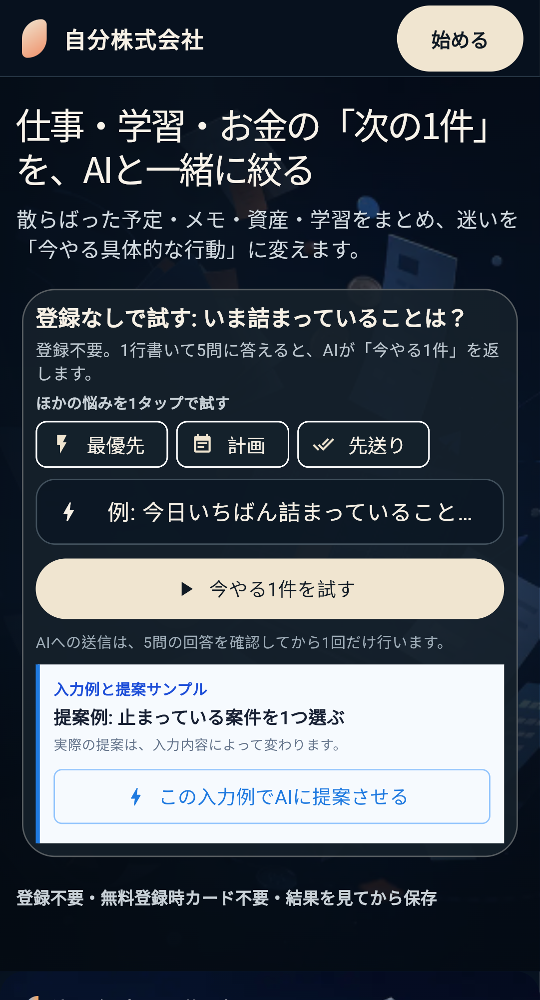

# Reddit r/SideProject launch packet — Issue #3750

Status: **READY FOR HUMAN REVIEW — NOT POSTED**

This packet prepares one small English-language community launch while keeping
publication under explicit human control. It must not be treated as evidence
that the acceptance criterion has been met until the canonical Reddit post URL
is added to Issue #3750 and production attribution is observed.

## Target and exclusions

- Target: `r/SideProject`, after checking its current rules, flair, account-age,
  karma, and self-promotion requirements from the posting account.
- Do not post this launch to `r/InternetIsBeautiful`: recent moderation notices
  reject several traits that apply here, including paid/freemium products,
  account or personal-information requirements, AI-driven content, and business
  tools. Do not evade those rules or repost after removal.
- Defer Show HN to Issue #3671 so the two launches do not collide. The product
  already has a no-signup trial, but Show HN should receive its own coordinated
  launch and title.

## Tracked production URL

<https://my-web-app-b67f4.web.app/?utm_source=reddit&utm_medium=community&utm_campaign=first_user_growth&utm_content=sideproject_launch_a>

The `reddit / community / first_user_growth / sideproject_launch_a` tuple is
allowlisted end to end. It records only the privacy-minimized visitor UUID,
optional authenticated user UUID, funnel stage, UTM tokens, and timestamps. It
does not store names, email addresses, prompts, answers, IP addresses, user
agents, or browser fingerprints.

## Proposed post

Title:

> I built a Japanese-first “personal CEO” app that turns a messy life problem
> into one next action — looking for blunt feedback

Body:

> I kept bouncing between separate tools for work, learning, money, and health,
> so I built Jibun Inc.: a Japanese-first Flutter web app that treats you as the
> CEO of your own life.
>
> You can try one AI-generated next action without creating an account; signup
> is only needed to save it. The UI is currently Japanese, and I’d especially
> value feedback on whether the “personal CEO” framing makes sense outside Japan
> and what would stop you from trying it.
>
> Try it:
> https://my-web-app-b67f4.web.app/?utm_source=reddit&utm_medium=community&utm_campaign=first_user_growth&utm_content=sideproject_launch_a
>
> Built with Flutter Web + Supabase. I’m the maker and will answer questions
> here.

Attachment:

The screenshot was captured from production by the Playwright public evidence
workflow at commit `5bb7742b8563a50f680b4d6e1dad2a0bb38f3c07` on 2026-09-03.

## Human publication checklist

1. Review the English wording, production screenshot, and tracked URL.
2. From the intended Reddit account, read the current `r/SideProject` rules and
   confirm that posting history, karma, flair, and self-promotion requirements
   are satisfied. If not, stop; do not work around moderation controls.
3. Publish once. Do not solicit votes, cross-post repeatedly, or use alternate
   accounts to manufacture engagement.
4. Add the canonical post URL and the UTC publication time to Issue #3750.
5. After deployment of the migration and `growth-hub`, run the operator-only
   `acquisition.first_user_funnel` report with:

   - `utmSource`: `reddit`
   - `utmMedium`: `community`
   - `utmContent`: `sideproject_launch_a`
   - `campaignStartedAt`: the UTC publication time

6. Record the report output or artifact link in Issue #3750. A zero-visit result
   is valid evidence but does not prove tracking unless the production request
   path was exercised successfully.

If moderators remove the post or request changes, record the removal URL/reason,
stop the campaign, and revise the packet before considering another community.

## Review sources

- Show HN guidance: <https://news.ycombinator.com/showhn.html>
- Example recent `r/InternetIsBeautiful` automated moderation notice:
  <https://www.reddit.com/r/InternetIsBeautiful/comments/1ruydju/removed/>
- `r/SideProject` promotion discussion used only as community context:
  <https://www.reddit.com/r/SideProject/comments/1spnjkl/how_do_you_guys_even_promote_your_projects/>
