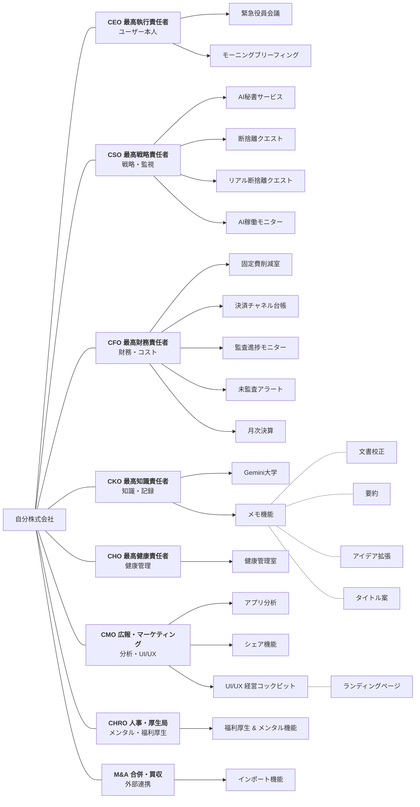

```mermaid
graph LR
    Root[自分株式会社]
    
    %% --- 役員定義 ---
    CEO[<b>CEO 最高執行責任者</b><br/>ユーザー本人]
    CSO[<b>CSO 最高戦略責任者</b><br/>戦略・監視]
    CFO[<b>CFO 最高財務責任者</b><br/>財務・コスト]
    CKO[<b>CKO 最高知識責任者</b><br/>知識・記録]
    CHO[<b>CHO 最高健康責任者</b><br/>健康管理]
    CMO[<b>CMO 広報・マーケティング</b><br/>分析・UI/UX]
    CHRO[<b>CHRO 人事・厚生局</b><br/>メンタル・福利厚生]
    MA[<b>M&A 合併・買収</b><br/>外部連携]

    Root --- CEO
    Root --- CSO
    Root --- CFO
    Root --- CKO
    Root --- CHO
    Root --- CMO
    Root --- CHRO
    Root --- MA

    %% --- CEOの機能 ---
    CEO --> CEO_1[緊急役員会議]
    CEO --> CEO_2[モーニングブリーフィング]

    %% --- CSOの機能 ---
    CSO --> CSO_1[AI秘書サービス]
    CSO --> CSO_2[断捨離クエスト]
    CSO --> CSO_3[リアル断捨離クエスト]
    CSO --> CSO_4[AI稼働モニター]

    %% --- CFOの機能 ---
    CFO --> CFO_1[固定費削減室]
    CFO --> CFO_2[決済チャネル台帳]
    CFO --> CFO_3[監査進捗モニター]
    CFO --> CFO_4[未監査アラート]
    CFO --> CFO_5[月次決算]

    %% --- CKOの機能 ---
    CKO --> CKO_1[Gemini大学]
    CKO --> CKO_2[メモ機能]
    CKO_2 -.- CKO_2a[文書校正]
    CKO_2 -.- CKO_2b[要約]
    CKO_2 -.- CKO_2c[アイデア拡張]
    CKO_2 -.- CKO_2d[タイトル案]

    %% --- CHOの機能 ---
    CHO --> CHO_1[健康管理室]

    %% --- CMOの機能 ---
    CMO --> CMO_1[アプリ分析]
    CMO --> CMO_2[シェア機能]
    CMO --> CMO_3[UI/UX 経営コックピット]
    CMO_3 -.- CMO_3a[ランディングページ]

    %% --- CHROの機能 ---
    CHRO --> CHRO_1[福利厚生 & メンタル機能]

    %% --- M&Aの機能 ---
    MA --> MA_1[インポート機能]
```