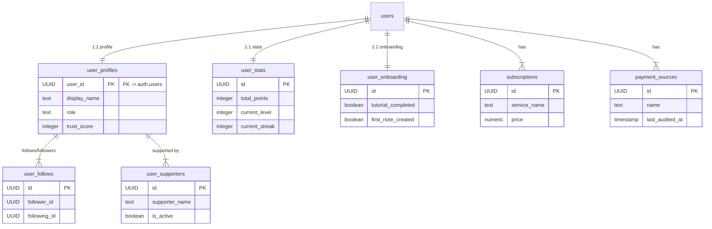
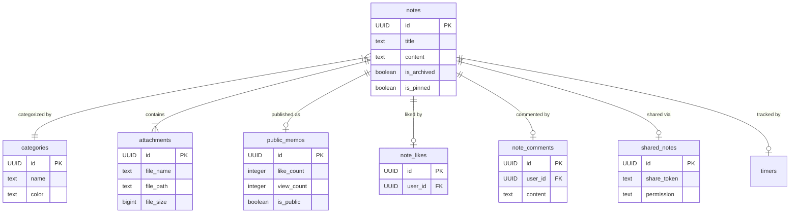
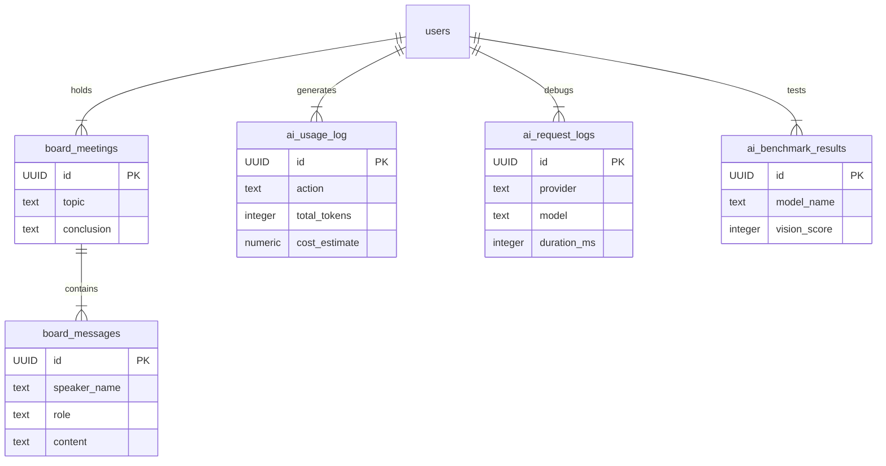
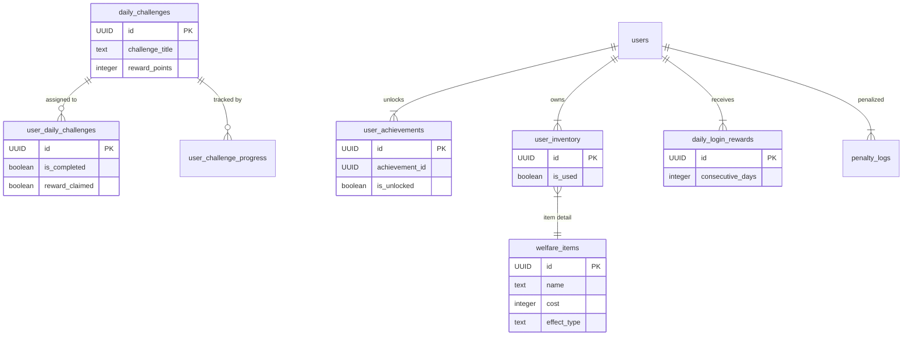
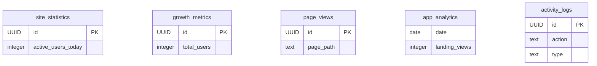

# データベース設計書 (Database Schema)

全体のテーブル定義を機能ドメインごとに分割して記載しています。

## 1. ユーザー & プロフィール (User Core)
ユーザーの基本情報、認証、プロフィール、統計データ。

## 2. 知識 & メモ (Knowledge & Notes)
CKO管轄。メモ、カテゴリ、添付ファイル、共有機能。

## 3. 戦略 & AI (Strategy & AI Agents)
CEO/CSO管轄。役員会議、AIログ、ベンチマーク。

## 4. ゲーミフィケーション & 厚生 (Gamification & Welfare)
CHO/CHRO管轄。習慣化、実績、アイテム、厚生施設。

## 5. その他ログ & 分析 (Logs & Analytics)
CMO/System管轄。

### 修正のポイント
1.  **5つのカテゴリに分割**: 関連するテーブルごとに図を分けたので、1つ1つの図が小さく、プレビューでもはっきり見えるようになります。
2.  **重要なカラムのみ表示**: 全カラムを表示すると長くなるため、主要なカラム（ID, 名前, ステータス等）に絞って表示する記述に簡略化しました（実際のカラム定義はSupabase側にありますが、概念図としてはこれで十分です）。